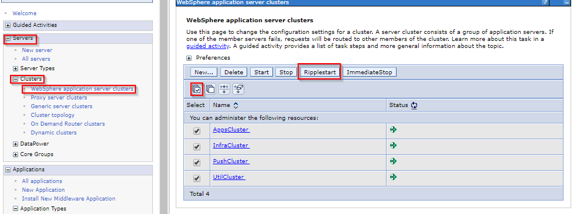

The clusters must be restarted for the widget configuration changes to take effect.

### Restart the Clusters

Login to the Integrated Solution Console

Navigate to Servers → Clusters → WebSphere Application Server Clusters

Select all of the Connections Clusters

Click Ripplestart.

