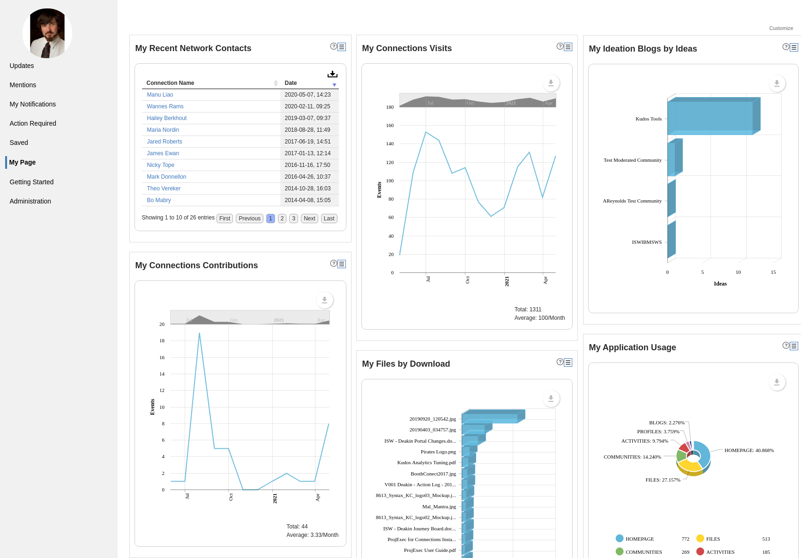
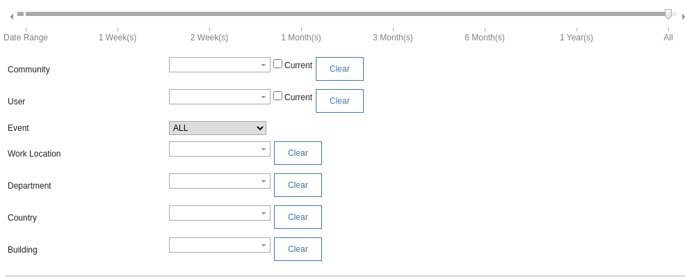
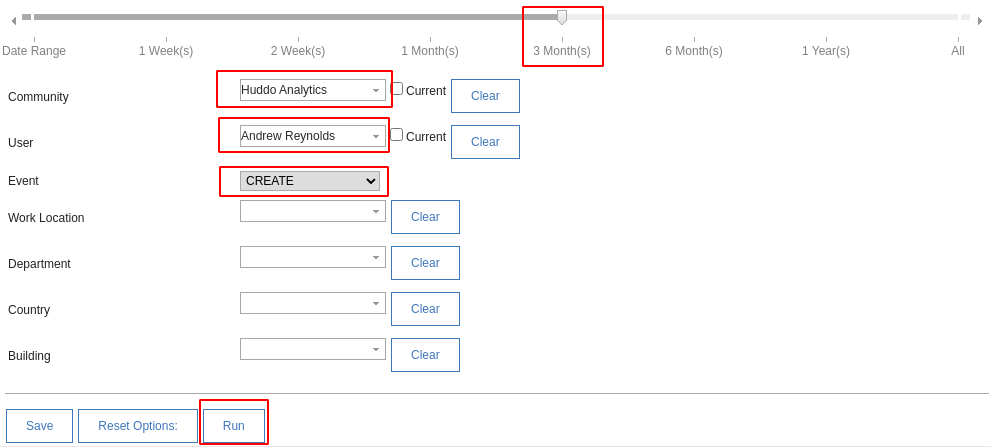
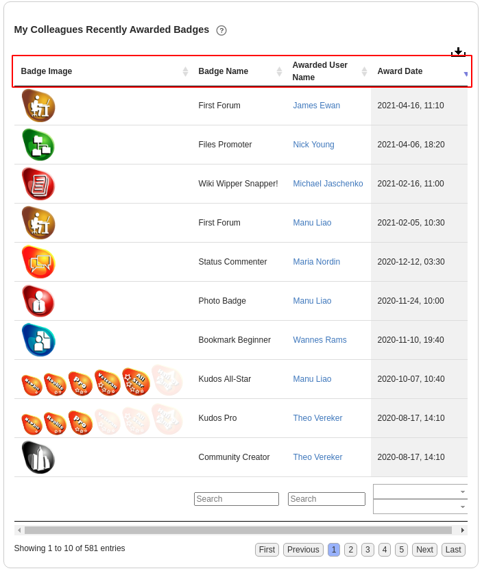
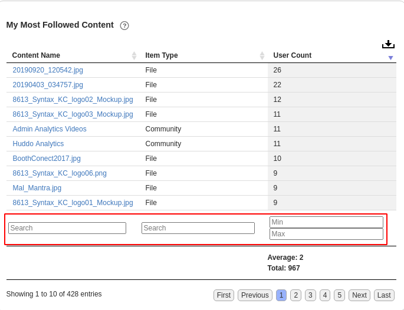
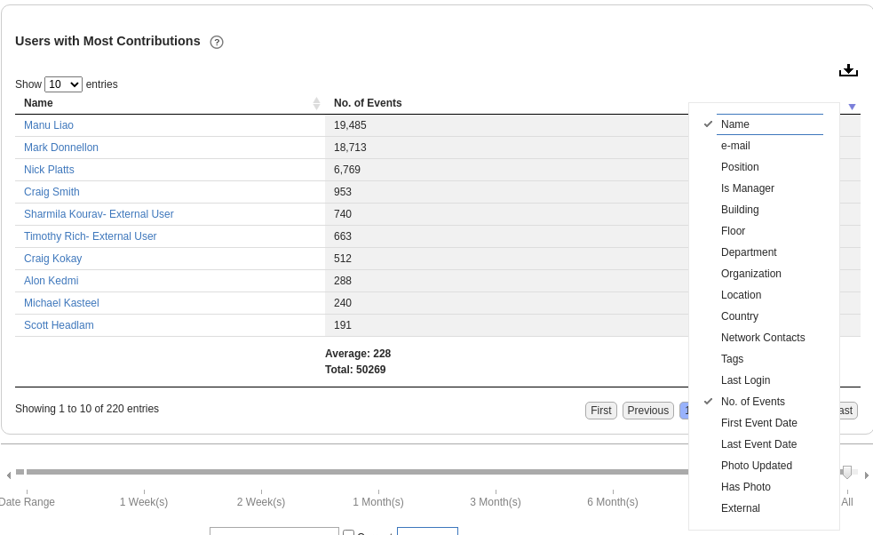

### Analytics Dashboard

The Analytics Widget can be used to create and position multiple reports on a single page. Reports can be previewed and customised before being saved for ongoing use.
This enables users to create a personalised dashboard of their favourite/most-viewed reports for easy, repeat access.

### Customise Reports to Answer Specific Questions

A Report also provides the capability to customise the query underlying its data to answer more specific questions. There are 4 main customisation options;

#### Customise Query Parameters
Make reports more specific by specifying parameters such as who, when, where,
what, etc. using filters for Community, User, Application, Time Period, Event Type,
etc.

After you have set the parameters you desire, press 'Run' to apply them and update the report data.

#### Sort Columns
Tabular reports allowing sorting column data (ascending/descending) by clicking on the header name.

#### Filter/Search table results (keyword, min/max)
Search report table columns by Keywords, Min/Max values and Start/End dates.

#### Enable/Disable columns
Some tabular reports allow you to hide unwanted columns to focus on the data you’re interested in by right-clicking on the column header.

