The Huddo Application is provided as a .war file that is to be installed as a WebSphere Application in your Connections server environment.
The application provides the Huddo Badges & Analytics engines that drives the reward and recognition of user performance, as well as the widgets for user
interaction.

### Login to the WebSphere Integrated Solution

Login to the WebSphere Integrated Solution Console for your Connections environment via a webbrowser.

Enter your administrator User ID and Password, then click the “Log in” button.

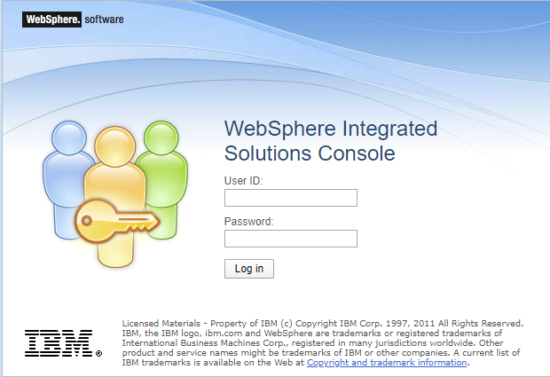

### Install the Huddo.war file

Navigate to Applications → Application Types → WebSphere enterprise applications

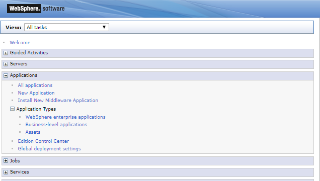

Click the Install button

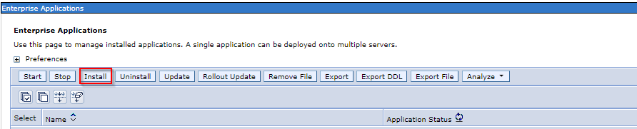

Browse the Local File System Path for the downloaded Huddo.war file then Click Next

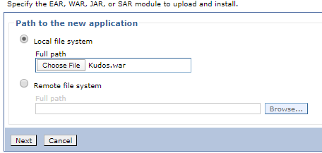

Check the Fast Path Option then Click Next

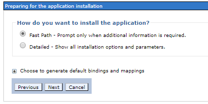

Change the Application name to Huddo then Click Next

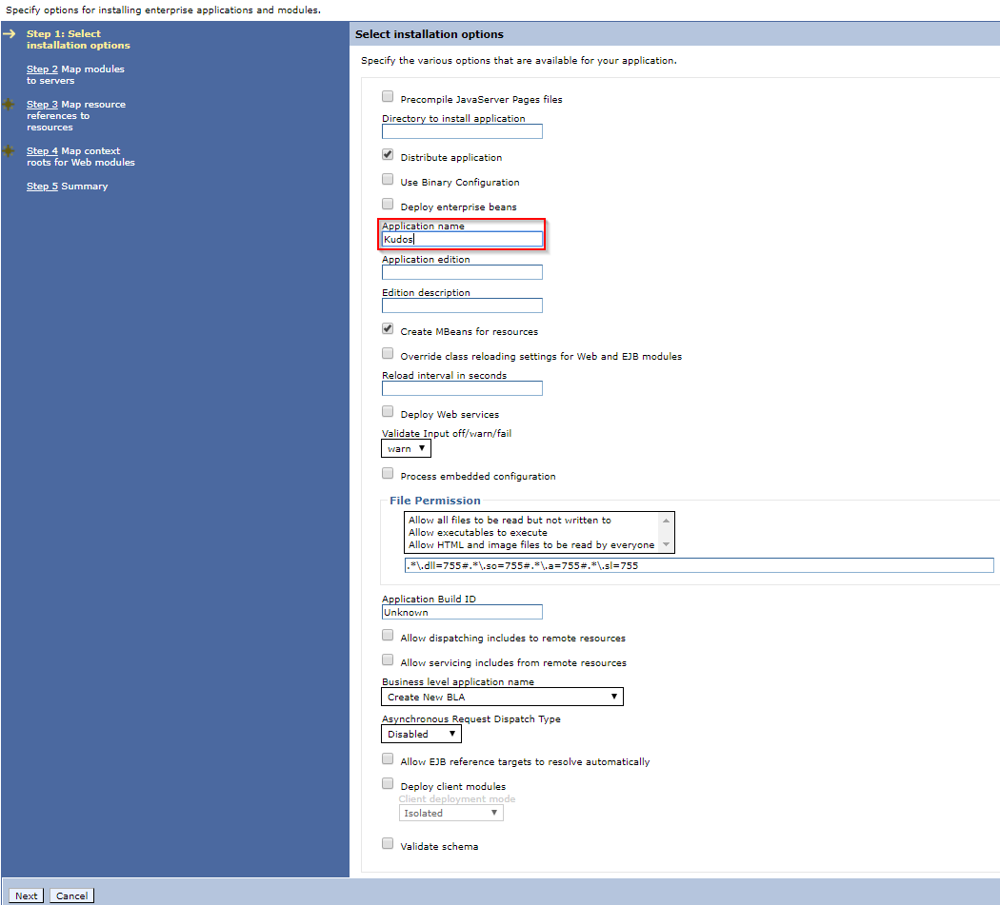

Highlight the Nodes for the Application, including the IHS Node. Select the Badges Module, click Apply then Next.

**_Please Note:_** _It’s recommended that you create a separate cluster for Huddo if your Connections install is bigger than 10,000 users. You can do this via the ISC by clicking on_ **_Servers > Clusters > WebSphere_** _application server clusters and then clicking New._

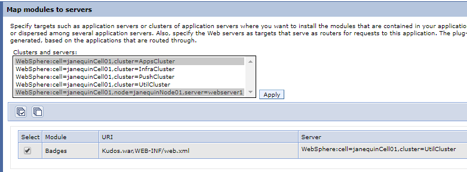

Click on Browse and map the default resources as shown. Click Next.

<!--- //cluster??? -->

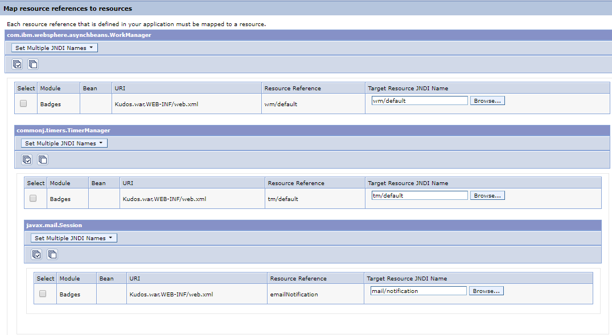

Enter Huddo as the Context Root, then click Next.

**_Please Note:_** _The Huddo Installation guide assumes that the Context Root is set as ‘/Huddo’. If you set the Context Root to something other than ‘/Huddo’, then make sure that you replace ‘/Huddo’ with your Context Root when entering addresses._

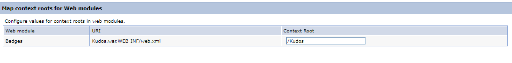

Review the Installation Summary. Click Finish.

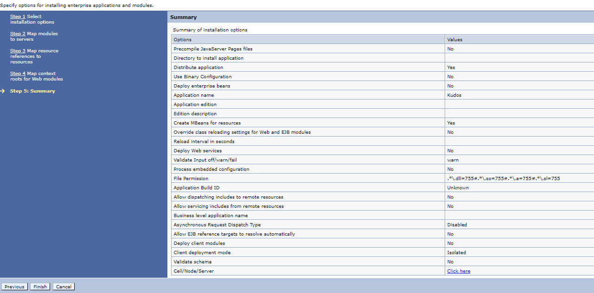

Review the Installation Results. Click Save.

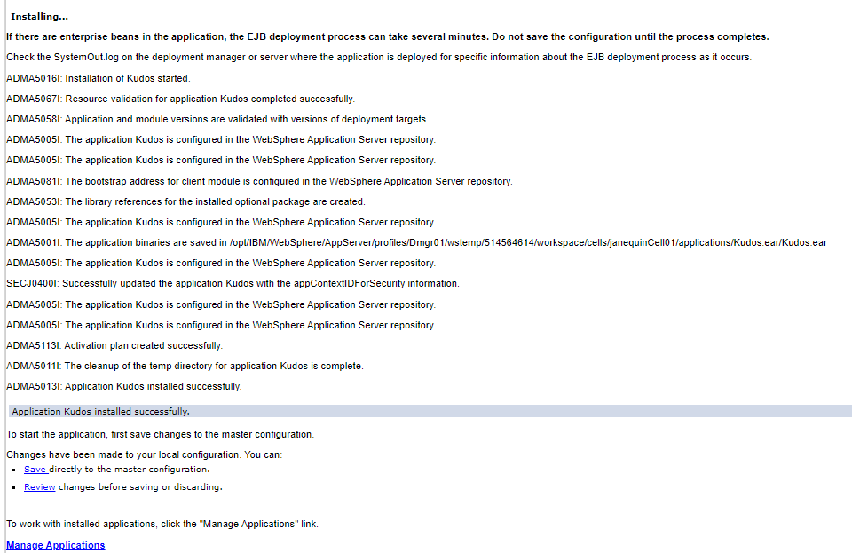

Review the Synchronisation Summary. Click OK.

You have now successfully installed Huddo as a WebSphere Enterprise Application. Next, you will need to edit the security settings.

### Modify the Huddo Application Security Role assignments

During this step, we will be defining the authenticated users/groups for each Security Role.

Find Huddo in the list of enterprise applications and click on Huddo to open the application configuration screen

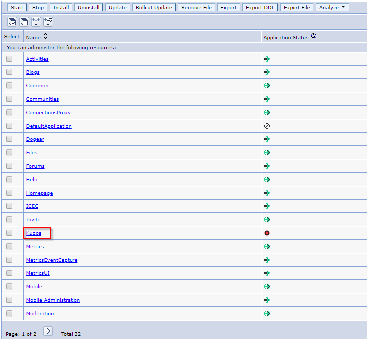

Click Security role to user/group mapping

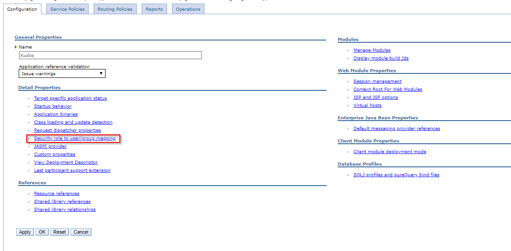

To ensure that only authorised users have access to Huddo and its data, modify the mapping of the AllServlets and Reader roles to the Special Subjects: **All Authenticated in Application/Trusted Realm**, then Click OK

**_Please note:_** _You may set the Reader role to Everyone to grant read-only access to Huddo widget data to unauthenticated users._

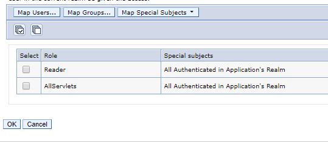

### Ensure the Signer Certificate for the Connections URL is Trusted

In order for Huddo to post entries into the Homepage Activity Stream, WebSphere must trust the certificate for the secure URL of your Connections
Environment. During this step, we will be importing the environment certificate into the CellDefaultTrustStore.

Navigate to **_Security_** → **_SSL certificate and key management_** and then select **_Key stores and certificates_**

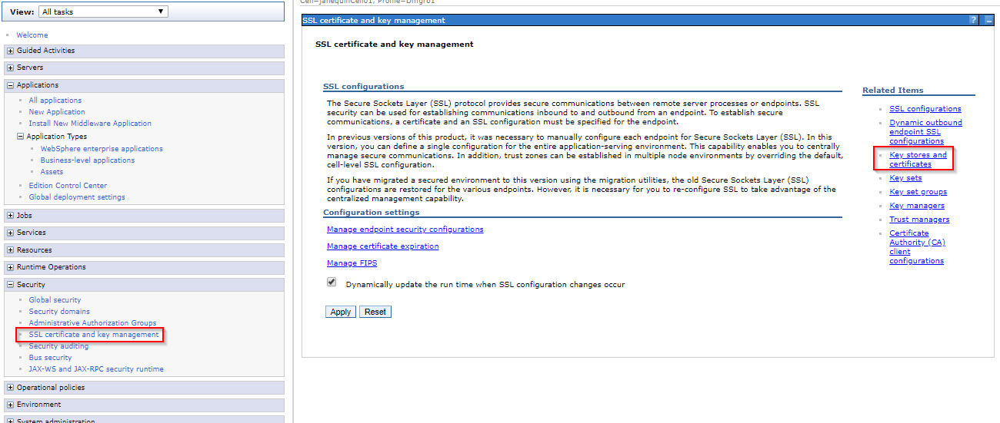

Select **_CellDefaultTrustStore_**

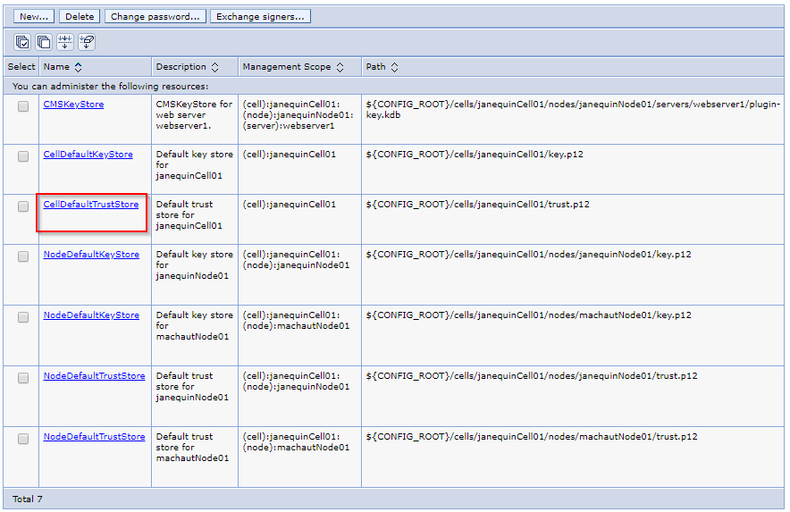

Select **_Signer certificates_**

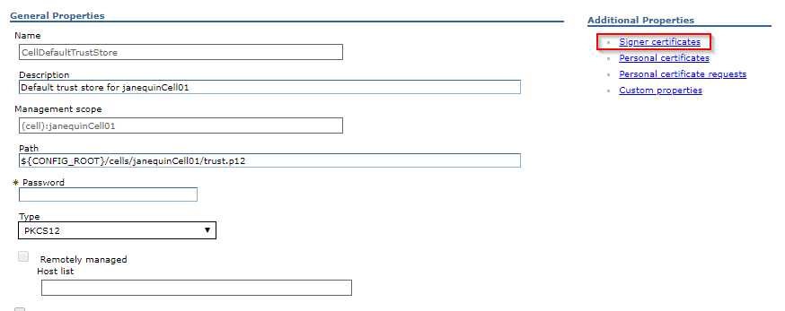

You will now see a list of all trusted certificates.

**If the URL of your Connections Environment is listed, skip to [Add Huddo Related Strings to Connections](#add-huddo-related-strings-to-connections)**

We will now import the public certificate from the IBM HTTP Server to the default trust store in IBM WebSphere Application Server

Click Retrieve from port

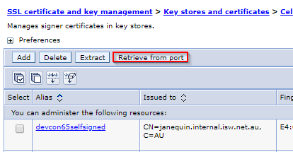

Enter the following details of the web server, then click Retrieve Signer Information:

-   **Host** (e.g. connections.company.com)
-   **SSL Port** (443)
-   **Alias**

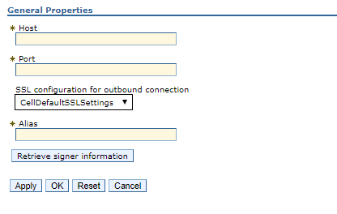

The certificate will now be retrieved. Please confirm the details of the certificate, Click **OK**.
The root certificate is then added to the list of signer certificates.

### Add Huddo Related Strings to Connections

This change will not be picked up by Connections until the servers are restarted. This will be performed at the end of the configuration.

Copy the .properties files from the folder Huddo.ear/Kudos.war/installFiles to the Connections strings customisation directory:
<CONNECTIONS_CUSTOMIZATION_PATH>/strings
Where **CONNECTIONS_CUSTOMIZATION_PATH** is defined by the WebSphere variable.
e.g. /opt/Connections/data/shared/customization/strings

**IMPORTANT: If a file of the same name already exists, merge the contents into the existing file.**

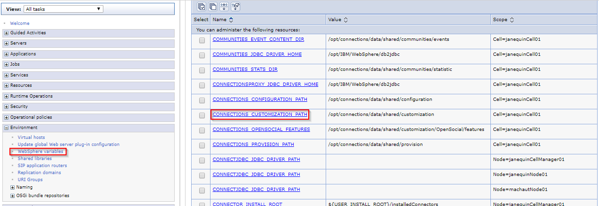
