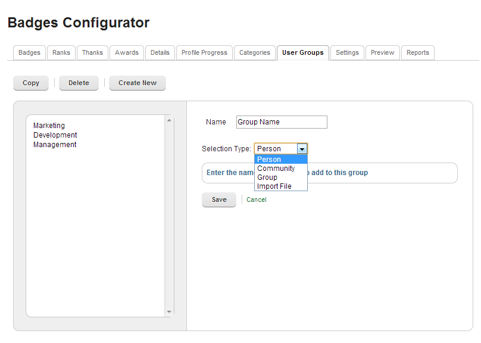
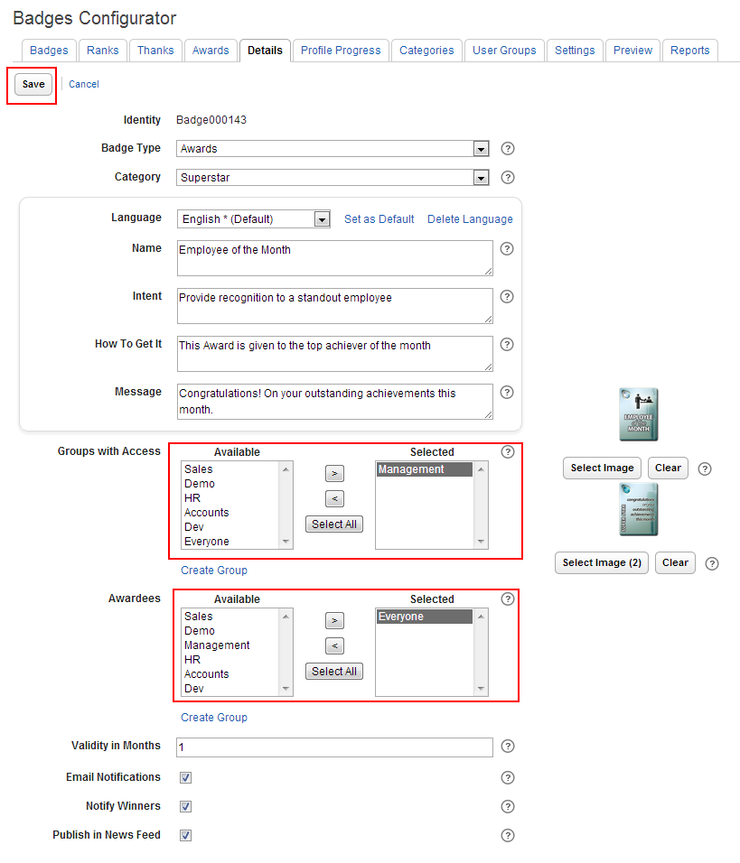

Within Huddo Awards, each Award is configurable to only allow a selected group of people to award and receive the award, allowing for better control of Awards. To this effect the Award definitions contain two fields – **Groups with Access** : Groups who have access to award this badge; and **Awardees:** Groups who can be awarded this badge. As part of this step you will need to configure these attributes for each Award definition for your environment.

### Create groups for access control via the Badge Configurator

Open the User Groups Tab in the Badges Configurator widget and create groups required to set access control permissions for Awards.

Groups can now be created by selecting people, Communities, other groups, importing a CSV file of emails or advanced profile attributes.

Examples:

- Create a _Management_ Group to award the _Employee of the year Award_
- A _Sales_ Group to add as the Awardees to the _Salesman of the Year_ Award; etc.

### Set the access groups for each of the Awards

Open the Awards Tab in the Badges Configurator widget and for each of the Award definitions listed in the table perform the following steps:

1. Click on the Award definition to open it for editing.
2. Set the **Groups with Access** field: Select the groups who you wish to grant permissions to Award this badge; i.e. Who can award this badge?
    
    **_Note_** _: Users selected in this step will need to add the Huddo Awarder widget to their widgets page as per_

3. Set the **Awardees** field: Select the groups who you wish this Award to be made applicable to, i.e. Who can be awarded this badge. The people selected in this step will see this Award under the **HuddoAwards** tab in their Profiles as an achievable award.

    **_Note_** _: If you wish to disable a badge, so that it doesn’t appear in anyone’s profile, simply remove all groups from the Awardees field._

4. Click **Save** to save your changes.

