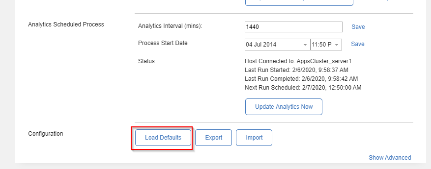
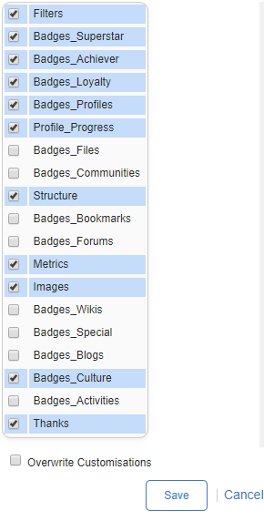

Huddo Badges is supplied with a set of default metrics and badges to kickstart performance measurement and reward within your organisation. This step loads the supplied metrics and badge definitions into your Connections database, where the widgets and gamification engine can access the definitions to measure and reward.

### Load Defaults

Login to Connections and navigate to the Badges Configurator Community

Select the Settings tab in the BadgesConfigurator widget, scroll to the bottom and click the 'Load Defaults' button

Select:

- Badges_Achiever
- Badges_Culture
- Badges_Loyalty
- Badges_Thanks (or) Thanks
- Badges_Profiles
- Badges_Superstar
- Profile_Progress
- Images
- Filters
- Metrics
- Structure
- any other Badge Categories you wish to install (most installations would select all)

**Note:** You will need to have the corresponding Connections Applications installed. As well as have a Standard or Enterprise Licence for Huddo.

Click Save

There is a lot of data that needs to be copied to the database at this point. Therefore this operation may take a couple of minutes, please be patient.
