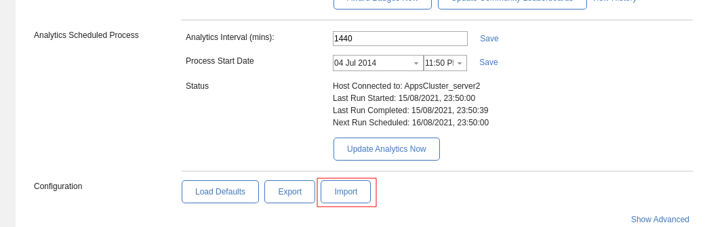
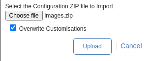

## Update Kudos Images to Huddo Images

Huddo Badges is supplied with a set of images for the default Badges, Thanks and Awards. There are updated images available to go with rebrand of Kudos -> Huddo. These will be available as the defaults in the rebranded version of Huddo Badges but existing clients can update these now.

### Load Updated Images

Download the updated [Huddo Images](huddo-images/images.zip)

Login to Connections and navigate to the Badges Configurator Community

Select the Settings tab in the BadgesConfigurator widget, scroll to the bottom and click the 'Import' button

Select the downloaded images.zip file and select 'Overwrite Customisations', then 'Upload'

You will get a prompt indicating that 281 records will be updated, press 'OK'

The images will now be updated.