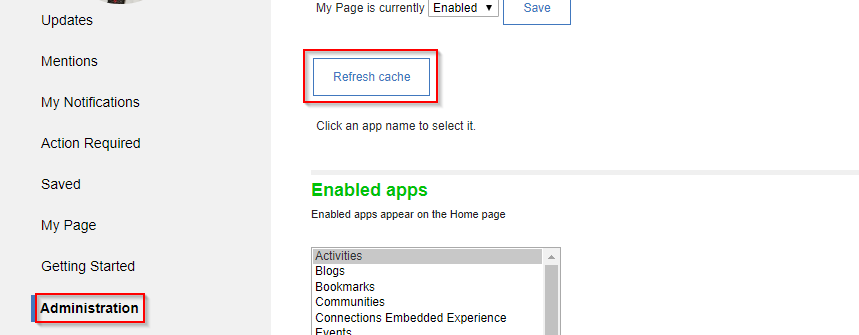

There are two methods to perform this. Using wsadmin by following [the documentation](https://help.hcltechsw.com/connections/v65/admin/admin/t_admin_clear_widget_cache.html?hl=clearing%2Cwidget%2Ccache) or through the homepage administration. It is recommended that if you have more than one node to use wsadmin.

Access the Homepage -> Administration setting. Click the ‘Refresh cache’ option. This may need to be done on each server running Huddo to ensure that each of the node’s caches are properly refreshed.

In order to access Administration section, please ensure the logged in user is in the Homepage ‘admin’ security role.

