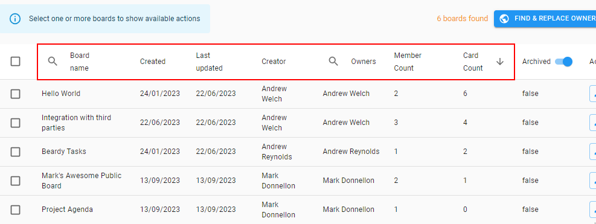

# Boards Content and Member Management

Organisation administrators can view a list of all boards in their organisation, with actions available to manage these boards and their members.  To access the new view in

- a) Boards Cloud

    On the Huddo Boards homepage / My Boards page, click your organisation on the left sidebar, then click the `Boards` tab to view the list of boards:

    

- b) Boards On-Premise

    Open `Admin Settings`, then your organisation

    

    Under `Content management` click `Boards`

    

## Sorting
The boards data can be sorted by clicking on the column headers:

## Searching
Boards can be searched by board name or by owner.

Click the search icon to the left of the column name to search:

### By Board Name
Type a board name to filter the results:

### By Owner
Search for a group or user and then select an entity to show only boards that have that owner:

## Show/hide archived boards
Archived boards can be shown or hidden by using the switch in the `Archived` column header:

## Edit members of a board
Members for each individual board can be viewed and modified by clicking the `Edit Members` button on the right of the board row:

## Selected board options
Clicking on a board in the list will select it. All boards can be selected using the top-most checkbox in the header. 
Once boards are selected, options become available to action on those boards:

### Archive
Archive the selected boards.

### Restore 
Restore boards that are archived.

### Manage Ownership
This action will show a dialog allowing new owners to be added and/or existing owners removed from the boards that are selected:

### Delete

!!! danger

    Use this action cautiously and at your own risk.

Delete the selected boards and all their data permanently.

## Find and replace owner on all boards
It may be necessary to replace a board owner with someone else across all boards in the organisation, for example if an employee has left the company and the boards data needs to be accessed by their replacement. To do this:

1. Click the `Find and replace owner on all boards` button to bring up a dialog:

    

1. Search for and select the current owner to replace and the new/replacement owner. Groups can be selected:

    

1. Click the `Replace Owner` button to confirm the owner replacement:

    

    !!! note

        an undo action will temporarily appear at the bottom left of screen if you wish to cancel this action
