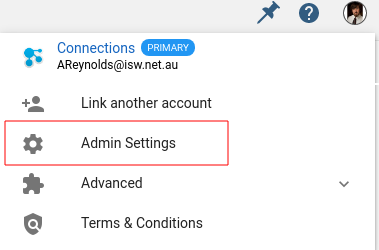
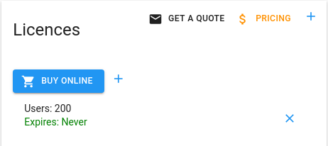
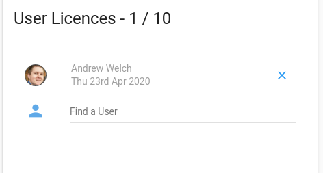
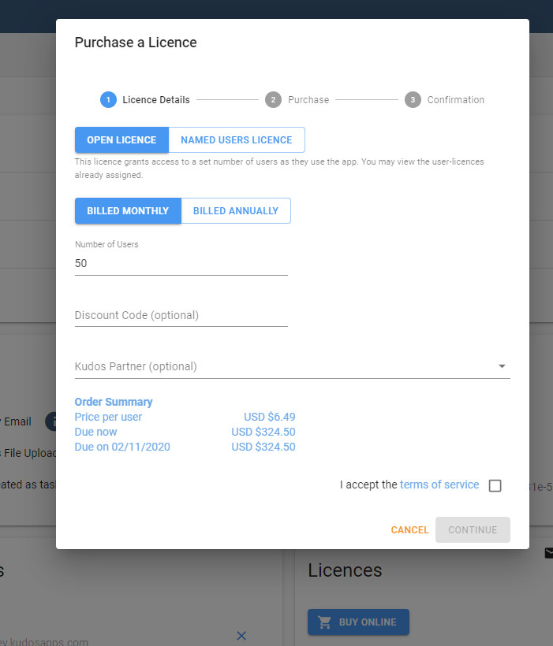
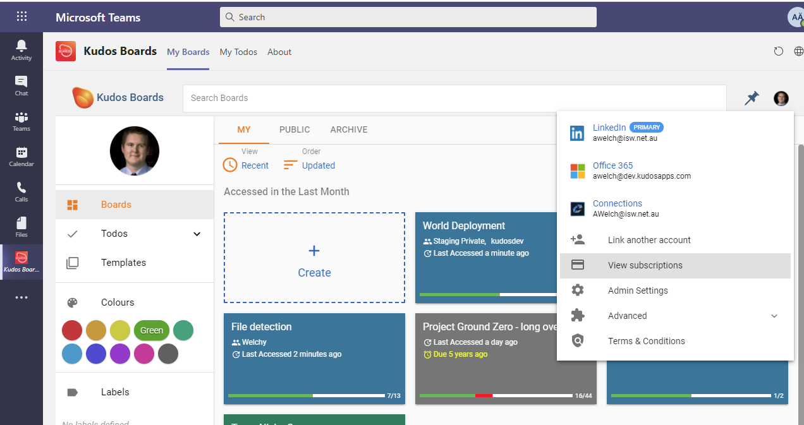
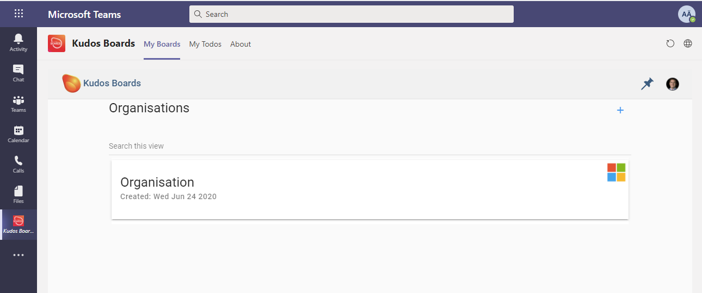
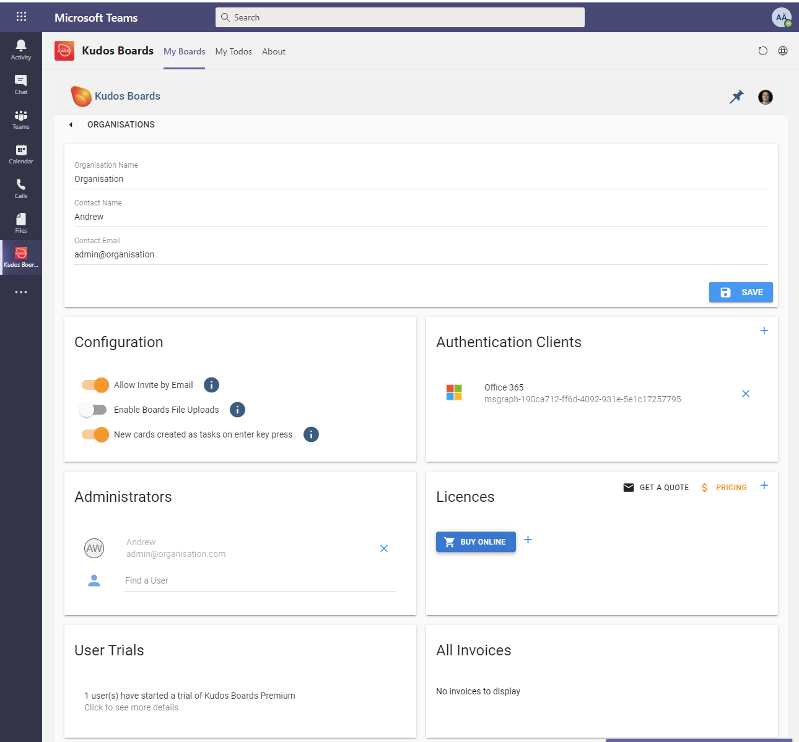
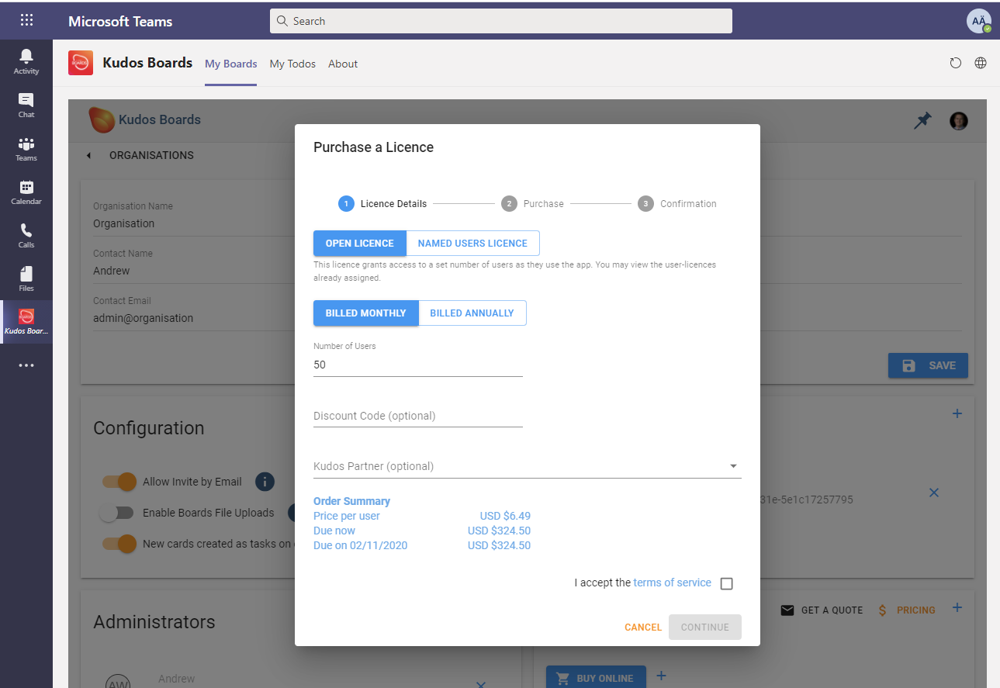

{ style="float: right" width=200 }

# Manage Licences

Licence management is available at an organisation level for Huddo Boards.

To access these settings, sign in to Huddo Boards as an administrator of your organisation.
Click your profile image and then `Admin Settings`:

The licence(s) for your org will be shown, each one can be opened for more information.

Here you can see all the users who have been assigned a licence.

'Named Users' licences can be specifically added, removed or reassigned.
'Open Licence' is available to any user in an organisation on a first come first serve basis. These can also be reassigned if required.

Note that Org Configs are created automatically for all orgs with default settings.

## Buy Huddo Boards via Admin Settings

For users accessing Huddo Boards via O365, HCL Connections (hybrid and collab.cloud), Apple ID, Google, LinkedIn and Facebook, subscriptions can be purchased via the Huddo Boards Admin Settings in your web browser.

Navigate to `Admin Settings` and then select to 'Buy Online'.

- Specify your type of licence - Named Users Licence or Open Licences.
- Select your billing preference - Monthly or Annually
- Quantity of licences to purchase
- Review your order summary, agree to the terms and conditions and select Continue, to move to the online check out.

Your subscription will be updated automatically.

## Buy Huddo Boards via Microsoft Teams

As an O365 administrator, you can buy Huddo Boards for your organisation via Microsoft Teams.

Navigate to Huddo Boards MyBoards Dashboard via More Added Apps in Microsoft Teams and under your profile image locate `Admin Settings.`

Click Organisation to see your org details.

Under 'Licences' select to 'Buy Online.'

- Specify your type of licence - Named Users Licence or Open Licences.
- Select your billing preference - Monthly or Annually
- Quantity of licences to purchase
- Review your order summary, agree to the terms and conditions and select Continue, to move to the online check out.

## Request a Quote or Invoice for Payment

On-premise Huddo Boards installs can contact us for quote requests and licence activation keys at `hello@huddo.com`

Huddo Boards cloud users can request a quote via Huddo Boards Admin Settings in web or Microsoft Teams, or via email at `hello@huddo.com`. Please do not hesitate to ask questions or request a call to discuss your subscription requirements further.

In addition to online check out, we can receive purchase orders and provide invoices for payment.

Pricing can be found here https://www.huddo.com/pricing

---
