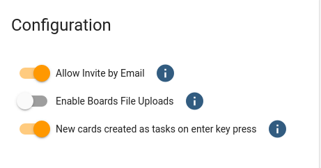

{ style="float: right" width=200 }

# Manage Organisation Config

Configuration options are available at an organisation level for Huddo Boards. Changing these settings will affect all Huddo Boards users in your organisation.

To access these settings, sign in to Huddo Boards as an administrator of your organisation.
Click your profile image and then `Admin Settings`:

The config for your org will be shown, hover on the info (i) icons for more information on each setting

Changing a setting will immediately save/update the Org Config for all users.

---

**Note:** Org Configs are created automatically for all orgs with default settings.
