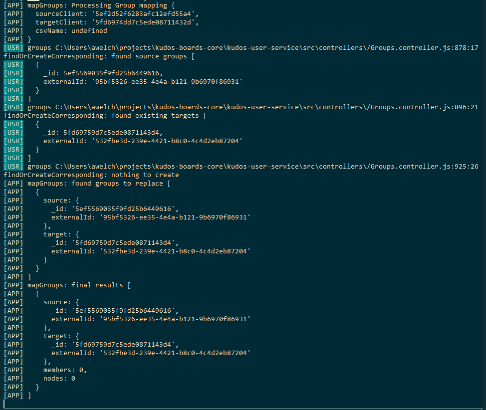

# Replacing Group Membership
**Note: admins only - on premise**

This service is designed to replace Board memberships for groups in one login client with replacement groups in another login client.

For example; in order to remove login via Connections but still retain access to all your boards, you will need to replace the group based memberships with replacement groups. For example Sharepoint sites instead of Communities.

## Important Notes

  - Please be aware that the `target` ID below should be set as the ID for your intended login method (ie Microsoft), and the `source` that of the login method being removed (ie Connections). These IDs are visible in the URL of the admin page.
  - The process is run immediately on the next deployment of the boards app.
  - Only run one replica to avoid conflicts, hence `replicaCount: 1`
  - You can view the logs of the `boards-app` microservice to see an output of changes to source/target groups
  - The command is safe to run multiple times. There will be no new changes unless more group memberships have been imported into the Boards DB.

## Prerequisites
You have created replacement groups in the target system and have records of the old ID to the new ID.

## Process

1. Create CSV Map File

    This process utilises a CSV file to define a map between the old ID and new ID, in the format:

        <NAME_OF_GROUP>,<COMMUNITY_ID>,<SHAREPOINT_SITE_ID>

    For example:

    `group-map.csv`

        Huddo Team,95bf5326-ee35-4e4a-b121-9b6970f86931,532fbe3d-239e-4421-b8c0-4c4d2eb87204

1. Secret with CSV

    Create a secret in the Boards namespace (ie boards) from your CSV file

        kubectl create secret generic group-map-secret --from-file=./group-map.csv -n boards

1. Environment variables

    Set the following environment variables to mount the secret created above at a file path in the pod.

    ```yaml
    app:
      replicaCount: 1
      volumes:
        - name: group-map-volume
          secret:
            secretName: group-map-secret
      volumeMounts:
        - name: group-map-volume
          mountPath: /usr/share/groupmapsecret
      env:
        GROUP_MAP_CSV: groupmapsecret/group-map.csv
        GROUP_MAP_TARGET_CLIENT: 5fd6974dd7c5ede08711432d
        GROUP_MAP_SOURCE_CLIENT: 5ef2d52f6283afc12efd55a4
    ```

1. Redeploy the Helm chart

    For example:

        helm upgrade huddo-boards https://docs.huddo.com/assets/config/kubernetes/huddo-boards-1.0.0.tgz -i -f ./boards.yaml --namespace boards

1. Review the logs

    The logs should output in this format. See that each group was mapped from a `Source` to a `Target` and how many `members`/`nodes` were updated with the new value.

    

1. Remove Environment variables above and redeploy the Helm chart
