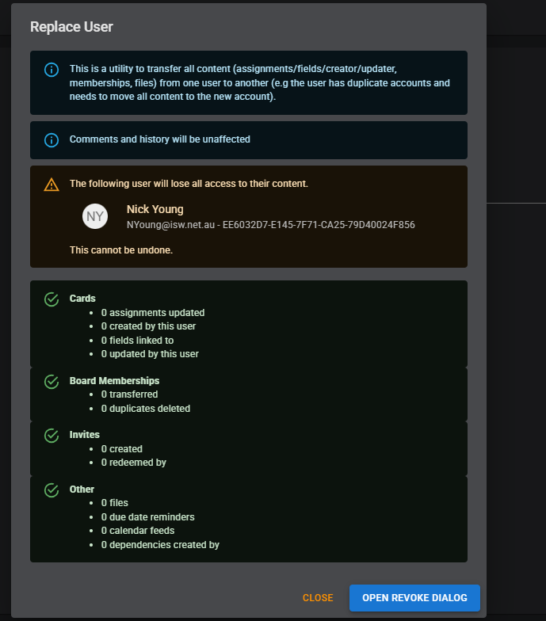

# Admin user management - replace user

This is a utility to transfer all content (assignments/fields/creator/updater, memberships, files) from one user to another (e.g the user has duplicate accounts and needs to move all content to the new account).

## Details

New "Replace User" button in the Org admin page.

Dialog to explain the purpose and search for users

Warning message when selected

Results view - with new action button to go to Revoke dialog

Pre-select same user in Revoke dialog (for logging out/unlinking/anonymising):

