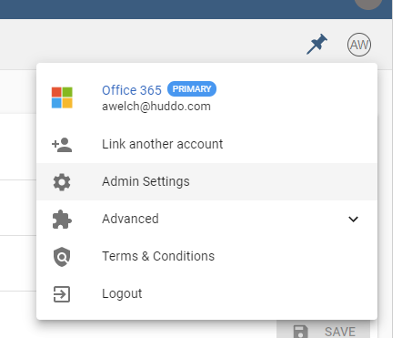
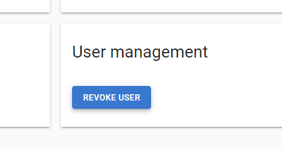
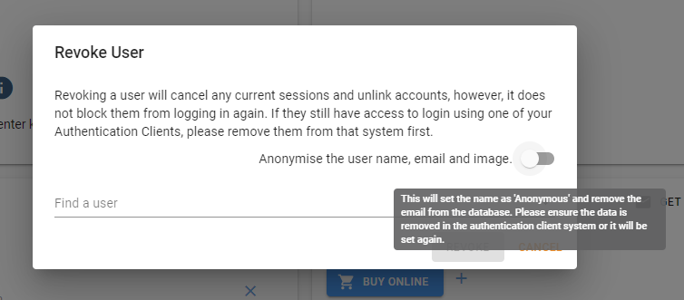
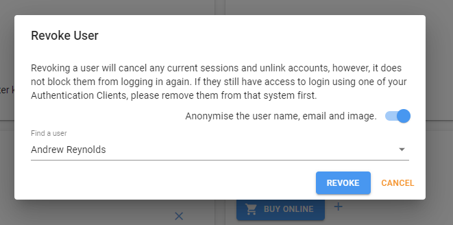

# Revoke Users

When a user leaves the organisation, you may want to deactivate their current login sessions with Boards. You may also need to remove their private information (name, email and image) from the Boards database. This can be achieved with the following steps:

1. Open `Admin Settings`, then your `Organisation`

1. Under `User management` click `Revoke`

1. Select whether to `Anonymise the user name, email and image`

1. Search and select the user to revoke, click `Revoke`

