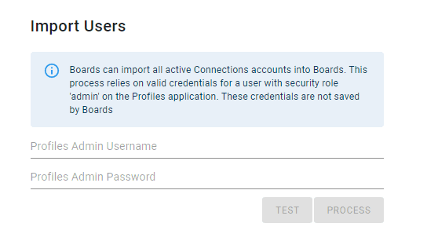

# Synchronise User Profiles

This process ensures that all users in your Connections/Microsoft accounts exist in the Boards database.
> Note: this is only necessary if you are linking user accounts in bulk

## Connections

You can now synchronise all user profiles from Connections by opening the `Admin => Org => Connections` client page (e.g. `/admin/5eeff4a3b7adaab62352362f/client/5fd6974dd7c5ede08711432d`)
This service utilises the Connections Profiles Admin API which is only basic auth, so you need to add credentials for a user (eg `wasadmin`) who has the Admin role on the Profiles application.

## Microsoft

Similarly, on the Microsoft client page there is another UI control for synchronising users; this uses the current user OAuth session (assuming Advanced Features have been approved)

## Process
Both of these controls allow you to run a 'test' which reports back how many new users it found, before running the process for real.
