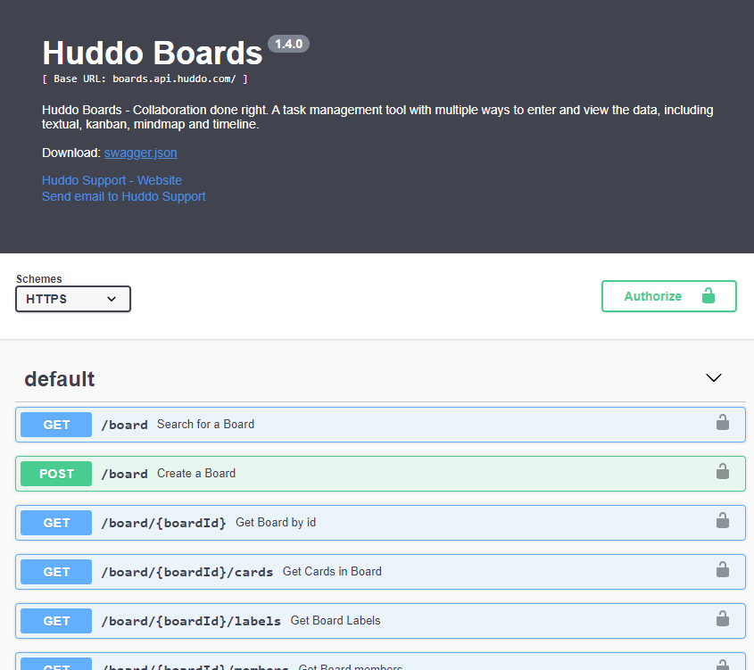
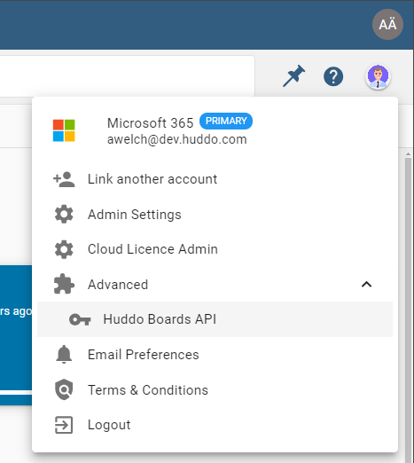
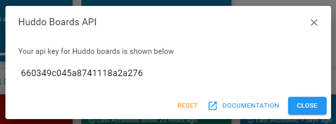
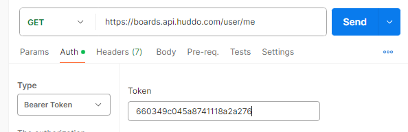

# Using the Boards API

Boards has a REST API that allows you to access and manage your boards data. The API documentation is available online from [Boards Cloud](https://boards.api.huddo.com) and also from your Boards deployment (including in-built Swagger documentation).

The API is documented using OpenAPI (Swagger) and can be explored using the Swagger UI.

<!--  -->
<iframe src="https://boards.api.huddo.com" width="100%" height="800px" ></iframe>

## Determine your API URL

The API URL is based on your Boards deployment:

-   Boards Cloud - [https://boards.api.huddo.com](https://boards.api.huddo.com)
-   On-Premise - for example:

    -   https://connections.company.com/api-boards/
    -   https://boards-api.company.com

## Authentication

The API requires authentication via the user's API Token. To get your API Token:

1. login to your Boards environment

1. open the user menu, expand `Advanced`, and click `Huddo Boards API`

    

1. copy the token

    

1. include this token to requests to the Boards API in the `Authorization` header

    For example:

    - Method: `GET`
    - URL: `https://<BOARDS_URL>/user/me`
    - Headers: `Authorization: Bearer <token>`

    
