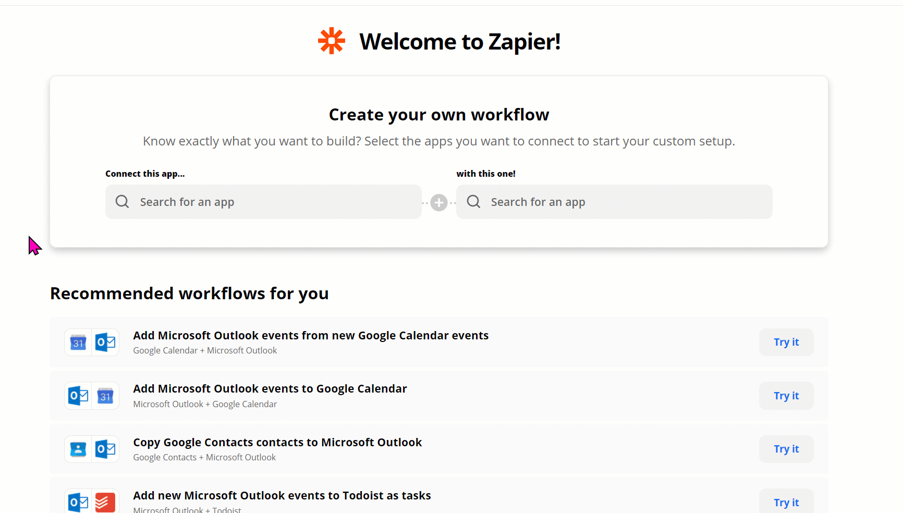

# Huddo Boards Zapier Integration

!!! tip

    This feature is only available for [Huddo Boards Cloud](https://boards.huddo.com).

## What is Zapier?

[Zapier](https://zapier.com/) is a platform which allows end users to set up "Zaps" which are workflows that connect two or more applications (like Huddo Boards). Each Zap consists of a "Trigger" and one or more "Actions". When the trigger event occurs, Zapier automatically performs the actions.

## Huddo Boards Zaps

See the [Huddo Boards Zapier Integration](https://zapier.com/apps/huddo-boards/integrations) on the Zapier website.

## Triggers

Huddo Boards provides a Zapier integration that allows you to trigger Zaps based on events in Boards. The following are some of the triggers which are available:

| Trigger               | Description                                             |
| --------------------- | ------------------------------------------------------- |
| New Board             | Triggers when a new board is created.                   |
| New Card              | Triggers when a new card is created.                    |
| Assigned Task         | Triggers when a task is assigned to a user.             |
| Task Completed        | Triggers when a task is completed.                      |
| Member added to Board | Triggers when a member is added to a board.             |
| My Task Completed     | Triggers when a task assigned to the user is completed. |

## Actions

Huddo Boards provides a Zapier integration that allows you to perform actions in Boards. The following are some of the actions which are available:

| Action                                     | Description                                      |
| ------------------------------------------ | ------------------------------------------------ |
| Create Board                               | Creates a new board.                             |
| Create Card                                | Creates a new card (entry/task in a Board).      |
| Create Comment on Card                     | Adds a comment to a card.                        |
| Assign Task to Member                      | Assigns a task to a member of the board.         |
| Complete Task                              | Completes a task.                                |
| Add Member to Board                        | Adds a member to a board.                        |
| Find a Task by name and mark as complete   | Finds a task by name and marks it as complete.   |
| Find a Task by name and mark as incomplete | Finds a task by name and marks it as incomplete. |
| Move Card                                  | Moves a card to a different list or subtask.     |
| Change Card or Board Dates                 | Change Start, End or Due dates on a Card / Board |

## Searches

Huddo Boards provides a Zapier integration that allows you to search for data in Boards. The following are some of the searchs which are available:

| Search                                      | Description                                   |
| ------------------------------------------- | --------------------------------------------- |
| Find a Board by name                        | Finds a board by name.                        |
| Find a Card in a Board by name              | Finds a card in a board by name.              |
| Find a Task assigned to Me by name          | Finds a task assigned to the user by name.    |
| Find Board Members                          | Gets all members of a board.                  |
| Find a Board Member by name                 | Finds a member of a board by name.            |
| Find all Cards in a Board                   | Gets all cards in a board.                    |
| Find Comments on a Card                     | Gets all comments on a card.                  |
| Find Me                                     | Gets the user details.                        |
| Find User by name                           | Finds a user by name.                         |
| Find a Board or Card URL in a block of text | Finds a Board or Card URL in a block of text. |
