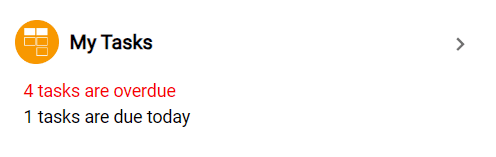
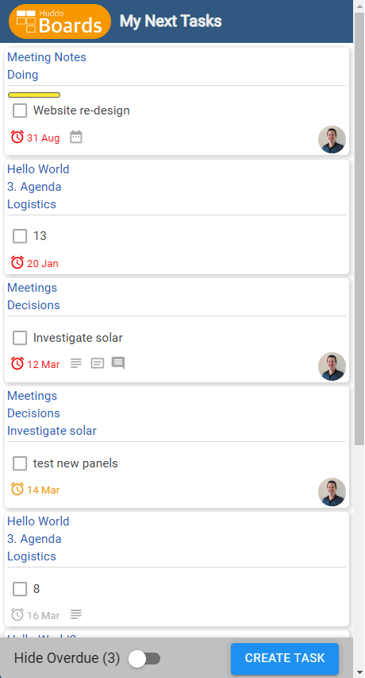
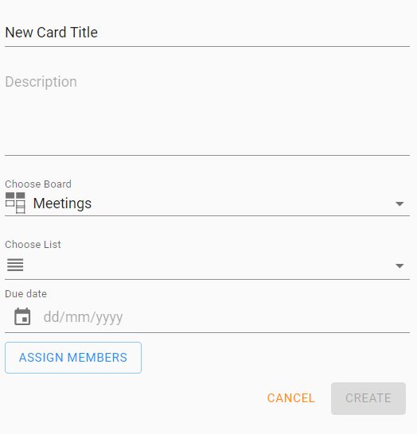
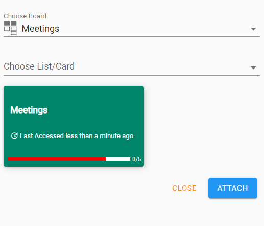
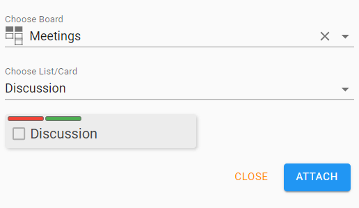
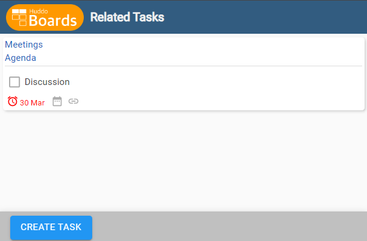

# Boards Micro Apps

Huddo Boards includes a number of micro applications that can be used to integrate the functionality of Boards within other systems. If you have a specific requirement that is not covered by the micro apps below, please [contact us](mailto:support@huddo.com) to discuss.

## Typical Integration

To integrate a micro app into your system, you can use an iframe. It is best practice to include authentication details required for your environment. For example:

`<iframe src="https://<BOARDS_URL>/auth/<PROVIDER>/<CLIENTID>?redirect_to=<APP_URL>" width="600" height="800px"/>`

## Available Apps

### My Next Tasks Summary

This app displays a summary of the user's next tasks in a compact format.

APP_URL: `/app/tasks/summary`

### My Next Tasks

This app displays the user's next tasks in a list format.

APP_URL: `/app/tasks/next`

### Create Card

This app allows users to create a new card in a specific board.

APP_URL: `/app/createcard`

### Attach Card

This app allows users to attach a link to a board, list or card. This integration is useful in applications sending email (e.g. Outlook/Verse).

APP_URL: `/app/attachcard`

Board:

Card:

### Linked Cards

This app displays a list of cards which have links (bookmarks) of the URL specified in the query parameter.

APP_URL: `/app/linkedcards?url=<URL>`

