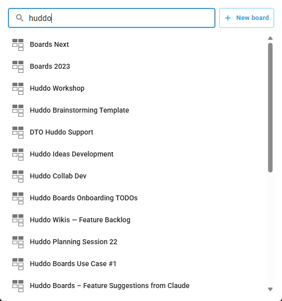
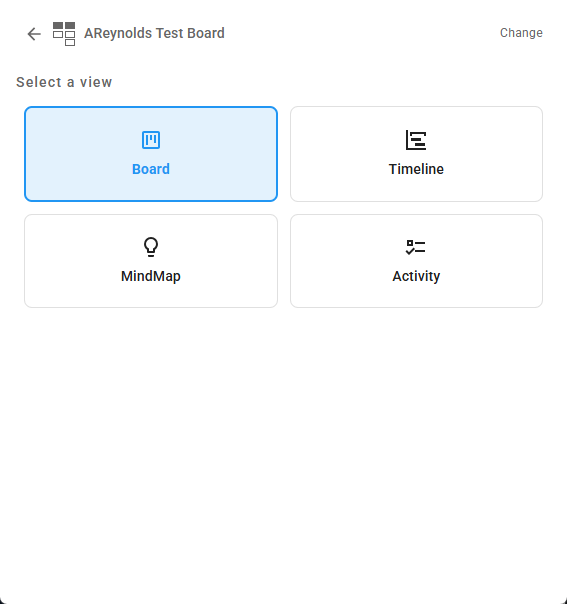
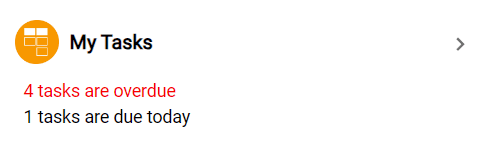
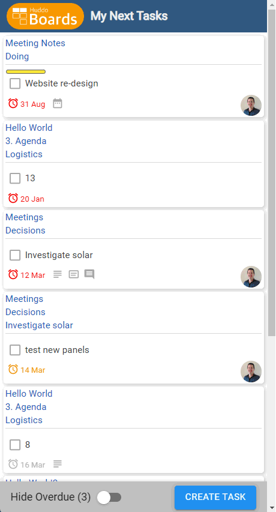
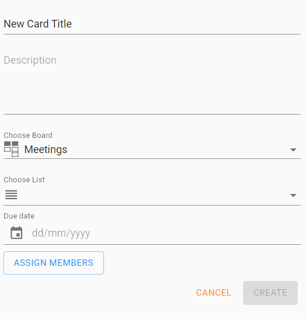
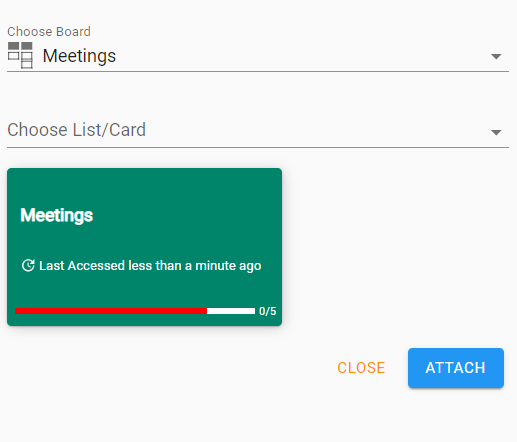
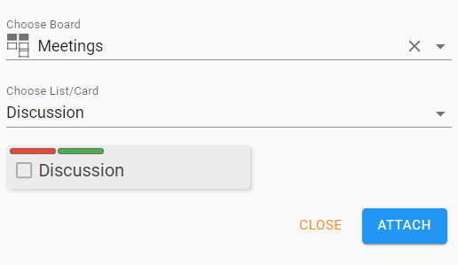
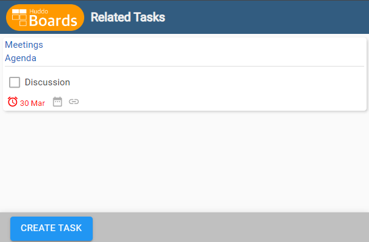

# Boards Micro Apps

Huddo Boards includes a number of micro applications that can be used to integrate the functionality of Boards within other systems. If you have a specific requirement that is not covered by the micro apps below, please [contact us](mailto:support@huddo.com) to discuss.

## Typical Integration

To integrate a micro app into your system, you can use an iframe. It is best practice to include authentication details required for your environment. For example:

`<iframe src="https://<BOARDS_URL>/auth/<PROVIDER>/<CLIENTID>?redirect_to=<APP_URL>" width="600" height="800px"/>`

## Available Apps

### Select Board

APP_URL: `/app/selectboard`

This app is useful in an iframe to select a board and post a message to the parent window. This is typical when integrating with third party applications that do not have a direct integration with Huddo Boards.

 

The format sent to the parent window is:

```typescript
{
  type: 'select-board',
  boardId: string,
  boardName: string,
  view: 'kanban' | 'timeline' | 'activity' | 'mindmap',
}
```

### My Next Tasks Summary

APP_URL: `/app/tasks/summary`

This app displays a summary of the user's next tasks in a compact format.



### My Next Tasks

APP_URL: `/app/tasks/next`

This app displays the user's next tasks in a list format.



### Create Card

APP_URL: `/app/createcard`

This app allows users to create a new card in a specific board.



### Attach Card

APP_URL: `/app/attachcard`

This app allows users to attach a link to a board, list or card. This integration is useful in applications sending email (e.g. Outlook/Verse).

Board:



Card:



### Linked Cards

APP_URL: `/app/linkedcards?url=<ENCODED_URL>`

This app displays a list of cards which have links (bookmarks) of the URL specified in the query parameter.

Where `<ENCODED_URL>` is the `encodeURIComponent(url)` of the URL to search for,

e.g. `/app/linkedcards?url=https%3A%2F%2Fgoogle.com`


