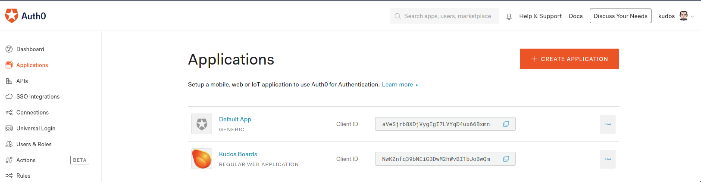

### Migrating your Auth0 tenant from Kudos to Huddo

To start using your Auth0 tenant in Huddo Boards, you need to make a few changes to allow login at the new address.

Login to [Auth0](https://auth0.com/) and go to the applications list

Click your Kudos Boards application and change the following fields

> In the table below, copy your auth0 domain (listed at the top of the page) into the relevant fields, replacing &lt;domain&gt; with 'your-domain.au.auth0.com' where applicable

  | Field                                | Value                                                       |
  | ------------------------------------ | ----------------------------------------------------------- |
  | Application Logo                     | https://boards.huddo.com/img/logo-small.png                 |
  | Token Endpoint Authentication Method | Post                                                        |
  | Allowed Callback URLs                | https://boards.huddo.com/auth/auth0/&lt;domain&gt;/callback |
  | Allowed Web Origins                  | https://boards.huddo.com                                    |
  | Allowed Origins (CORS)               | https://\*.huddo.com                                        |

