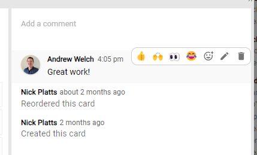

# Boards Cloud Updates

Please see here for recent changes to [Huddo Boards Cloud](https://boards.huddo.com)

## 2024

### June

2024-06-19

Fixes:

-   Parse email to card when dragging from HCL Notes

2024-06-13

Improvements:

-   Mobile: save/cancel buttons when creating comments
-   Mobile (Android): fix for keyboard covering input fields

Fixes:

-   loading wrong page/route when logging in with multiple windows (e.g. Community widget & Related Tasks)

### May

2024-05-31

Improvements:

-   only allow link on card to bookmark (not uploaded files)
-   performance of data selection from redux
-   mobile: always show rich text editor toolbar in comments (to access @mentions)

Fixes:

-   issue where dual tooltips in collapsed Board sidebar
-   Assign Member list overflowing on phone
-   issue with text overflow in card links
-   issue with center alignment of login page on small extra screen devices
-   issue with toolbar position for comments (balloon) under header when adding new comment in sidebar

2024-05-27

Features:

-   Drag and drop of cards between browser tabs/windows
-   Drag and drop bookmarks into Board lists/cards

2024-05-17

Accessibility fixes:

-   Focus highlighting overrides
-   use focus outline rather than background colour
-   Fix for keyboard access to CreateCard app clear buttons to choose board/list
-   MenuHelper.jsx - pass the disabled prop to the button
-   position of assign members menu
-   better focus styling for add board tile button
-   better contrast when focusing on boards logo
-   board tiles sort dropdowns - use defined focus bg and colours
-   minor fixes for focused input controls

2024-05-07

Improvements:

-   Collab Cloud header integration for Cnx8

2024-05-06

Usability improvements:

-   Timeline: add zoom -+ controls that increment zoom levels
-   Mindmap accessibility

    -   1st tab selects board node, allow arrow key nav, and tab to access actions from there
    -   sidebar controls - use mui checkboxes + ensure hover effects on buttons
    -   clear node selection on escape keypress
    -   fix text cutoff/ensure ellipsis on longer node titles
    -   add help link to sidebar
    -   allow keyboard pan and zoom using shift+arrow and +- keys

-   add contact support button to error catch page
-   add severity levels when showing toasts, fade transition
-   ensure board creator is displayed as a non-editable owner on board/template creation
-   ensure board tile labels are sorted in selection menu
-   make 'Recent' heading in sidebar look less like other actionable items
-   use delete icon (bin) for remove actions for member tiles, dates, tags, and board tile labels

Fixes:

-   Board tile label delete - ensure tile label is deleted from the label object in store

2024-05-03

Features

-   Card and Board recent updates feed - filter to show all or comments/updates only

Improvements

-   add a permanent but closable info level toast when board is read-only
-   update rich text editor to latest version

### April

2024-04-29

Fixes:

-   update material-ui libraries to fix date picker display issues on small screens
-   ensure card header theme displays correctly when card is opened via direct link

2024-04-24

Improvements:

-   card details view improvements
    -   show card fields/data in defined sections in a grid formation with headings and add buttons
    -   change "add a comment" action to start as a button

Fixes:

-   minor styling fix for dependencies section on a node
-   board/activity lists - more precise and consistent footer spacing/padding
-   create card and add comment actions - ensure entered text persists on unfocus + other focus related fixes

2024-04-17

Fixes:

-   issue with exporting a board in Teams client
-   date picker error on mobile/touch devices

2024-04-11

Improvements

-   tooltips on date picker
-   add invalid date error message
-   primary session expired message - show as info alert
-   tab color and style improvements
-   more consistent use of primary/secondary action colours on buttons
-   no collapse for empty lists activity todo pivot views
-   auto collapse empty lists initially and after a card is dragged out of them
-   New Board Wizard - more specific label for board name and template name
-   Activity view improvements

    -   styling (shadows, spacing, border edges when expanded/collapsed)
    -   drop cards on list header (highlight like shadow)
    -   add card at top hides the bottom add card

Fixes:

-   issue with format of dates in date picker
-   issues in list header title - not full width, no-wrap ellipsis, use correct cursors
-   don't show grab cursor on lists in todos / pivoted views
-   issue saving tags when creating new template
-   ensure tags are copied from template/source

2024-04-02

Improvements:

-   Streamlined `/todos/assigned` & `/todos/created` API, separating out the Board labels to `/board/labels` & `/board/{boardId}/labels` endpoints
-   Loading feedback when creating a board

Fixes:

-   Issue with board label history
-   create board from template when opened and only a reader

### March

2024-03-25

Features:

-   Emoji reactions on comments

    -   Quick selection

        

    -   Picker

        

Improvements:

-   Editing of comments on mobile (focus at end of text, save/cancel buttons)

Fixes:

-   Creating Board in group restricts to the group's Organisation
-   Better handling of authentication when provider session changes user account
-   Visibility of 'Embed Link' when viewing Boards by Group
-   Creation of Board in Group when using /group/{groupId} route (embedded)

2024-03-21

[API Documentation](https://boards.api.huddo.com):

-   /todos/next
-   /todos/summary
-   /board/{boardId}/labels
-   /board/labels
-   /user/auth/{provider}/{externalId}/apitoken

2024-03-20

Fixes:

-   View cards in fullscreen on small screens

2024-03-15

Features:

-   My Tasks Summary micro app
-   My Next Tasks micro app

Fixes:

-   Issue when deleting all Boards tile colors
-   Links to card ancestors (Todo view)
-   Prevent date selection incorrectly showing today when no date set

2024-03-06

Fixes:

-   Issue with communication between Boards and Collab Cloud

2024-03-05

Fixes:

-   Upload files to Teams private channel OneDrive

2024-03-04

Improvements:

-   Loading feedback of recent boards sidebar
-   Card link opening behavious (links to other boards open in same tab)
-   Teams board links open tabs
-   Show loading spinner while waiting on clicked link to open in a teams tab

### February

2024-02-28

Improvements:

-   Add copy/paste list option in list menu
-   Add duplication list option in list menu
-   More comprehensive history feed details for moving or reordering cards

Fixes:

-   Scroll to bottom of a list when creating a new card
-   Delete action in card dialog / in archive view
-   Add card section in a list delays retract/height change to prevent card drag issues
-   Dragging empty colour labels in Firefox
-   Filter/search by list name

2024-02-22

Fixes:

-   Unauthorised error when adding existing board as Teams tab
-   Fix potential onEnter errors in rich text editor
-   Prevent overflow on file preview
-   Load board members on fullscreen list view (for @mentions)

2024-02-16

Fixes:

-   Fix potential onBlur errors in rich text editor
-   Don't show iCalendar feed options in Teams

2024-02-14

Fixes:

-   Translation fixes
    -   Move translations inside functions to help prevent premature translate calls
    -   Use date-fns locales to show months in user's language
    -   German translation amendments
    -   Other translation fixes and improvements

2024-02-08

Fixes:

-   Microsoft Teams private channels
    -   Link to File will now show the private channel's files.
    -   Owner/Author access level was setting all members to Author.
-   Microsoft Teams Mobile: Removed licence related cards in org admin view.
-   Microsoft Teams: Removed obsolete "Disable Notifications" button.
-   Rich text editor dialog - allow scroll on overflow

### January

2024-01-25

Fixes:

-   Use SMTP email address before using Exchange address when parsing email attachments
-   Don't show organisation admin links from Boards sidebar menu in Teams on a mobile device

2024-01-17

Fixes:

-   Activity view scrolling issue

2024-01-09

Improvements:

-   Microsoft Teams integrations

    -   UI redesign when adding new Boards tab
    -   Onboarding Tours

-   faster opening of cards
-   allow clicking links in description when content locked for editing
-   allow reordering private cards
-   US English updates
-   organisation plan loading feedback

Fixes:

-   issue where completing a new task showed incorrect icon
-   issue where Board content deleted when hovered and press Ctrl+Alt+Delete
-   issue when opening a card by link, then a subcard within that card
-   issue when reordering cards with filtered (hidden) content
-   visibility of card title in header breadcrumb (Component Pack)

2024-01-04

Fixes:

-   RichText saving when used @symbol (but not an @mention)
-   @mentions keyboard navigation improvements (home/end, up to bottom, down back to top), escape without closing modal
-   @mentions only considered new on first save

## 2023

### December

2023-12-22

Fixes:

-   issue where mentions popup partially hidden at top
-   issue where could not mention users when opening a card directly by link
-   hide private cards when viewing board by assignments
-   create card from Outlook/Verse - fix toggle of attach body, ordering of recent boards
-   drag dependency links in Firefox

2023-12-18

Improvements:

-   Accessibility (keyboard navigation - colors/members dialog, aria-labels, popover, html.lang attribute, improved roles, aria-selected, aria-expanded, hover/focus on cards)
-   Drag email to card - attach .eml and .msg file
-   Positioning of unscheduled cards in Timeline
-   Improved document titles based on context
-   Smoother drag scroll on Kanban
-   Ensure grab cursor for Kanban drag scroll
-   Update childcounts in activity lists when filtering
-   Visibility of selected board filters
-   Searching for a board includes the description

Fixes:

-   Card label overflow issue when 5 lines
-   Issue where comment events sent to mentioned users

2023-12-13

Improvements:

-   API documentation for /user/{userId}, /user/group/{groupId} etc
-   Support for latest MongoDB (v7)

2023-12-12

Fixes:

-   Link to File dialog options

Fixes:

2023-12-07

Fixes:

-   Issue saving card name when editing it directly on the card

2023-12-04

Feature:

-   Drag emails from Outlook to create as card

2023-12-01

Fixes:

-   Issue when focusing on boards search input

### November

2023-11-29

Feature:

-   Support for Domino by [REST API](./../domino/cloud.md)

Fixes:

-   Debounce User/Group searching

2023-11-28

Fixes:

-   Issue where menu buttons in the open card view were not overflowing to the 'more' menu correctly and causing a flickering effect
-   Issue where lists in board view could not easily be dragged to re-order
-   Issue with board title button long text overflowing
-   Issue with card background images

Improvements:

-   Minor accessibility improvement - add aria-labels

2023-11-23

Fixes:

-   Fix template description not showing in new board wizard

2023-11-13

Improvements:

-   Accessibility

    -   more consistent tooltips (for screen readers and better explanation of functionality)
    -   Keyboard navigation (particularly in the Board Tiles, Kanban view, Card dialog) - (vision & motor impaired)
    -   better screen reader information (vision impaired)
    -   improved colour contrast (low vision users)

2023-11-09

Improvements:

-   API for Member deletion

Fixes:

-   Email for mentions missing fields

### October

2023-10-31

Improvements:

-   Translations (German and English US)
-   Use https protocol for iCal feed instead of webcals
-   Hide unusable Colors button when read-only access when sidebar collapsed
-   Consistency of Board colour feature naming

Fixes:

-   Issue where iCal feed dates off by 1 due to timezone differences
-   Issue where page blank in Firefox when loading with Connections 7 header via SSO

2023-10-25

Improvements:

-   Show Member/Labels buttons in collapsed sidebar
-   added translations to missing fields

Fixes:

-   Issue where page crashed when reloaded page with Card open, then opening member dialog

2023-10-23

Features:

-   [Board iCalendar feed](../howto/ical/board.md)
-   [Personal iCalendar feed](../howto/ical/personal.md)

2023-10-20

Fixes:

-   Collab header regression

2023-10-19

Improvements:

-   loading of Board task stats on tiles as required
-   performance of loading My Boards
-   redirect in place for expired session of Collab/Connections with SSO header

### September

2023-09-29

Improvements:

-   More German language translations

Fixes:

-   Ability to paste images into descriptions

2023-09-22

Improvements:

-   API security, added 'Strict-Transport-Security' & 'X-Content-Type-Options'

Fixes:

-   (regression) encoding of file names when uploading special charactors (e.g. Japanese)
-   issue where deleting a dependency changes the current view

2023-09-19

-   update of `busboy` dependency used for file upload (includes security patches, node support etc)

2023-09-14

Improvements:

-   consistency of sidebar icon positioning when collapsed/expanded
-   allow case insensitive Collab login
-   update to teams-js v2
-   open filesin Teams in-place (deep links)

Fixes:

-   public member creation when creating Board
-   whitespace of cards in Activity list
-   HCL Connections 8 CR3 whitespace

2023-09-12

Improvments:

-   loading speed of the 'My Boards' data

2023-09-08

Fixes:

-   membership role options when created inside a Team/Community

2023-09-07

Features:

-   [Organisation content administration & membership management](../admin/content-member-management.md)
-   Labels pivot view for Board and Activity views

Improvements:

-   Pasting URLs into description and comments automatically converted to clickable link

Fixes:

-   issues in dependency arrow positioning
-   auto reschedule dependencies when dates change
-   selecting the same file to upload after cancelling
-   expand/collapse lists when pivoted by dates/assignment

### August

2023-08-15

Fixes:

-   Reload loop during login with Firefox

2023-08-09

Fixes:

-   Ensure assignments are duplicated when copying and pasting tasks

2023-08-07

Improvements:

-   Users with the author role now have full edit access on cards that are assigned to them (rather than complete and comment access only)

Fixes:

-   Prevent cards from being moved to another list at the same time they are archived by dragging to the archive button
-   Ensure the current user has the correct actions available according to their board role when opening cards from the My Todos view

### July

2023-07-14

Fixes:

-   Drag & Drop from rich email clients onto a list

2023-07-12

Fixes:

-   Activity list missing action menu

2023-07-05

Fixes:

-   Ability to edit nodes when opened directly

2023-07-04

Fixes:

-   Assignments to non-primary aliases

2023-07-03

Improvements:

-   Improved author experience - restrict to allowed actions
-   Board title/board options button - styling and usability improvements
-   Current member role now highlighted in members dialog and links added to member permissions documentation
-   Improved randomisation and readability of Assignment Role colours
-   Added tooltips to Assignment Role avatars
-   Microsoft Teams

    -   detect members in private sub channels (OAuth Admin consent must be certified again)
    -   fix for creating Board in private sub channels
    -   loading spinner positioning

Fixes:

-   Connections 8 styling fixes
-   Fixed coloured role borders when assigning member roles
-   Fix URLs pointing to old docs pages
-   Issue detecting highest licence when multiple
-   Minor fixes to Welcome and Plan Selection dialogs

---

### June

2023-06-26

Improvements:

-   Readers can now select text in descriptions
-   General reader experience

Fixes:

-   Tours appearing incorrectly
-   Template role assignment on touch devices

2023-06-21

Fixes:

-   Move button now appears again

2023-06-19

Fixes:

-   Timeline group-by colours

2023-06-15

Improvements:

-   Readers no longer see actions they cannot perform

Fixes:

-   Getting members from private sub-channels

2023-06-06

Improvements:

-   Member promotion emails - add invite and membership details to give more context
-   New configuration option to enable/disable member promotion requests
-   Do not clear edited name/description when changing templates
-   Ability to create new organisation from guest is reader popup

Fixes:

-   Issue with exporting Board as CSV with special characters (e.g. Umlaut)
-   Issue affecting Org config when user has multiple orgs
-   Color selection/editing on small screens (e.g. mobiles)
-   German translations with extra '}' character
-   Issues with Role Assignments (duplicates etc)
-   Collab - fix for offering user org trial
-   Issue in create first board tour

---

### May

2023-05-26

Features:

-   Organisation Guests are now treated as Reader
-   Ability for guest to request a promotion to member, sent to admins via email & socket

2023-05-23

Improvements:

-   Drag and drop of lists

    -   drag by header
    -   fix blank list when scrolled and dragged
    -   prevent scrolling of list in drag mode

-   Cards can be Archived+Deleted from the card modal toolbar.
-   Enable "Assign to Roles" when creating a new Board via 'Create Template from Board' button.
-   More compact Board Members view on small (phone) screens.

Fixes:

-   Issue with blank tile label
-   Issue with empty Assign Roles in new Board wizard
-   Board Tiles sidebar shadow regression bug
-   Card drag and drop

    -   issue where a duplicate card appears when drag to end
    -   issue where card jumps back to top when dragging a card to end of same list

-   Button for copying a template says "Copy Template" instead of "Copy Board"
-   Fixed loading of template description in to board description field in the new board wizard.
-   Deleting an open template now redirects to template list instead of board list.
-   Fixed "Assign to Roles" screen appearing in Board wizard without any roles to assign members.
-   When creating a new Board, edited name and description fields are not lost when changing the selected template.

2023-05-16

Improvements:

-   Organisation view of members & groups

    -   loading feedback
    -   virtualised scroll for faster render
    -   show membership of linked aliases
    -   prevent duplicates of invites to org

-   localised format of dates in CSV export

Fixes:

-   Security issue affecting external users and public communities (Connections)
-   issue where Organisation invites not visible if members with linked aliases

2023-05-05

Features:

-   Drag card to archive

Improvements:

-   Auto-move dependency parent
-   Expand all in activity view
-   Hide edit options on archived card
-   Performance improvements related to icons used on Template Roles
-   Show count of tasks assigned to Role in Board Members view

Fixes:

-   Dragging card from assigned user created user image as card
-   Sending duplicate due date reminders

---

### April

2023-04-21

Features:

-   Button to assign all sub-tasks as dependencies of parent
-   Template Roles - base functionality

Fixes:

-   Removed Connections community members not removed from Board membership
-   Deleting an assigned label

2023-04-12

Features:

-   Custom Colours. Colours and tags have been merged. You are now able to create as many colours as you like in a Board

---

### March

2023-03-20

Fixes:

-   Group member changes not being picked up

2023-03-17

Improvements:

-   Timeline card title always visible

2023-03-15

Improvements:

-   UI for member adding on Mobile

Fixes:

-   Kanban Printing
-   Timeline calendar shifting when opening a card

2023-03-10

Features:

-   [Template Rescheduling](../howto/templates/global.md#template-scheduling)
-   Drag & Drop assignments from parent to sub-cards in modal

Fixes:

-   Assign users to a named licence

---

### February

2023-02-20

Fixes:

-   Attachments are moved in child nodes when the parent is moved
-   Updated attachments to correctly show when their parent had been moved

---

### January

2023-01-31

Features:

-   New Organisation summary view

Improvements:

-   Outlook attachments using plugin
-   Copy/Paste functionality

2023-01-24

Improvements:

-   Styling for HCL Connections 8 new UI
-   Handling of default profile images in Connections
-   Detect language from Connections dropdown
-   Security updates (node 18)

---

## 2022

### December

2022-12-14

Improvements:

-   synchronise dependencies in real time
-   faster creation of multi cards
-   presence of users open on card without board open
-   adding dependencies between private cards
-   handling of dependencies where not accessible
-   make associated comments public when card is made public
-   synchronise my private tasks between my windows

Fixes:

-   issue opening board "Error: Minified React error #185"
-   issue where Community widget shows 'my' boards incorrectly
-   issue where someone online in board remained online if page reloaded
-   issue where lists hidden when previewing Kanban view while creating a Board
-   issue where page crashed on logout in Node view
-   issue where page crashed on logout in Timeline view
-   issue where files couldn't be downloaded
-   issue where page reloaded in admin view

### November

2022-11-29

Improvements:

-   synchronise dependencies in real time
-   faster creation of multi cards
-   presence of users open on card without board open
-   link to API documentation
-   adding dependencies between private cards
-   handling of dependencies where not accessible
-   make associated comments public when card is made public
-   synchronise my private tasks between my windows

Fixes:

-   issue where someone online in board remained online if page reloaded
-   issue where lists hidden when previewing Kanban view while creating a Board
-   issue where page crashed on logout in Node view
-   issue where page crashed on logout in Timeline view
-   issue where files couldn't be downloaded
-   issue where page reloaded in admin view

2022-11-08

Features:

-   installable web app

Performance:

-   faster load
-   added virtual scroll for Kanban
-   smoother drag and drop
-   faster filtering/searching inside a Board

Improvements:

-   improved new user experience in integrations
-   hide dependency lines while dragging & resizing
-   usability of tile color label edit/selection
-   stop auto redirecting expired account

Fixes:

-   fix for drag scrolling lists on mobile
-   fix editing link titles
-   fix positioning of timeline arrows caused by swimlane animations
-   fix double click to add list

---

### October

2022-10-17

-   Updates for Timeline

    -   animate expand/collapse of scheduled lanes
    -   fix for hidden cards on timeline when duplicated (eg multiple colors/assignments)
    -   highlight multiple instances of same card on hover
    -   remember last view (list/color/members)
    -   live updates of list names, color labels and members
    -   show color labels

2022-10-05

-   Fix for opening 'Owners Only' community boards

2022-10-04

-   Fix for timeline lists not scrolling
-   Updated translations

### September

2022-09-27

-   Fix for not being able to close date picker on mobile

2022-09-05

-   Updated translations including notifications

### July

2022-07-08

-   Compatibility for private channels in Teams

### June

2022-06-23

-   Print feature for Board View
-   Fix for loading ToDo View with deleted groups
-   Fix for 'View' by 'Groups'
-   Fix for description not saving in certain window changing scenarios
-   Fix for character encoding in update streams

2022-06-21

-   Fix for viewing user presence
-   Fix for viewing card title when user presence is also displayed
-   Fix for 'Commented on' recent updates not syncing in real-time
-   Fix for displaying changes made in Activity View
-   Updated Recent Boards in side toolbar
-   Fix for auth loop when using Connections Header

2022-06-10

-   Fix for card toolbar on smaller resolutions
-   Community widget now works if user has no email
-   Highlights widget fix for opening fullpage
-   Fix for visibility of Owners Only group Boards

2022-06-07

-   Fix for readers not being able to complete cards
-   Fix for dependencies in Todos view

### May

2022-05-20

-   NEW [Dependencies feature](../howto/dependencies/index.md)

2022-05-10

-   Fix for Microsoft admin approval

2022-05-09

-   Can no longer close a page when editing a description
-   Description locking alert moved for better visibility
-   Authors no longer appear to be able to edit descriptions when unable to
-   Fix for opening links in description
-   Fix for comment truncation issue in rare circumstances
-   Fix for new line @mentions
-   Fix for focused description loss when immediately moving to comments
-   Fix for showing editor toolbar when selecting all using keyboard

---

### April

2022-04-28

-   Updated RTE to latest
-   New Teams welcome message card
-   New Teams notification cards
-   Fix for email attachments not attaching

2022-04-19

-   Updated fix for Moderated Community access
-   Fix for crash when updating Board title
-   Fix for description locking in communities

2022-04-07

-   Fix for Moderated Community access

2022-04-06

-   NEW linked-cards micro-app
-   Fix for comment stream entry for Orient Me
-   Fix for updating card title from Boards view in FireFox
-   Fix for deeplinked Connections Community widgets
-   Fix for Boards Search styling
-   Fix for opening filters via icon
-   Fix for Teams login popup not closing

---

### March

2022-03-21

-   Improve file upload feedback (eg when socket unavailable)
-   Fix duplicates appearing in history from live events
-   Fix first comments not live displaying

2022-03-11

-   Fix for timeline cards sometimes showing a day off
-   Fix when loading a Community widget where the Board has been deleted causing an inifinite loop

2022-03-09

-   Fix for pasting into edited comment clears comment
-   Fix for loading subscriptions
-   Reducing browser console noise

2022-03-03

-   Fix for crashing when tours are dismissed
-   Fix for private card toggle

---

### February

2022-02-17

-   Ability to change Private cards to Public
-   Updated Date pickers with month/year selection
-   Updated Material UI library to latest
-   Fix for saving description on modal closure
-   Fix for transfer membership

---

### January

2022-01-31

-   Fix for welcome message in Microsoft Teams Bot
-   Fix for lost descriptions on first edit when pasting an image
-   Improved file upload feedback
-   Fix where you could not upload the full 50MB for a file
-   Fix for going to the Boards homepage not group list when in group context
-   Performance improvements

2022-01-14

-   Fix link format in card history
-   Fix opening URL from MS-Office add-in
-   Update SunEditor to latest

2022-01-04

-   Fix for notifications on comments to other commenters
-   Fix for emails when users are no longer Board members

---

## 2021

2021-12

-   Fix for child nodes not loading when loading a node directly
-   Fix for completing tasks when multi-assign has been removed
-   Fix for breadcrumbs not displaying when opening a card node directly
-   Adding generic Create Card functionality
-   Fix for requesting too many Connections community members at once
-   Fix for adding tags with the same starting letter
-   Mindmap move card & Board name overflow fixes
-   Update comment count when deleting comment
-   Syncing when description is deleted
-   Board history max card title height
-   Updated Arabic translations

2021-11

-   Fix for background when RTE in fullscreen mode
-   Fix for opening cards with a theme set
-   Updated Arabic translations
-   Fix for drag&drop assignments creating extra cards
-   Added Recent Updates Feed

2021-10

-   Updated German translations
-   Microsoft Teams login fix
-   Fix for issue where link is inserted at start of description
-   Fix for issue when changing user account tries to loads the previous open Board
-   Fix for issue when adding group as board member
-   Added user images by API
-   Fix for copy/paste lists in Activity view
-   Fix for compatibility with Visual Update One (Collab Cloud)
-   Fix for issue where multiple toasts in quick succession never auto closed
-   Fix for starting Zaps/Flows with Huddo Boards
-   Auto Premium Trial
-   Enhancement for msgraph groups which are not teams (owner != member)
-   Unsubscribe emails link
-   Fix for logout/login socket issue
-   Fix for Activity view interact to create list
-   Fix for adding Connections/Collab Cloud Communities as members
-   Improved performance by reducing page load size
-   User Presence on cards
-   Improved Activities View performance
-   Improved private card creation process

2021-09

-   Adding undo/redo buttons to description toolbar
-   Fix for trial dialog opening
-   Better caching and performance of my/public groups
-   Integromat integration
-   User search performance
-   Community name search improvements
-   Admin page crash fix
-   Fix for Teams notifications turning back on when they are disabled

2021-08

-   Private Card feature
-   Fix for group membership for private groups
-   Improved invite handling
-   Ability to set group permissions for a Board on create in the group
-   More granular user permissions for group membership
-   Fix for ToDo view filtering
-   Update to user subscriptions allowing emails to be applied
-   User subscriptions now default to purchasing user
-   User subscriptions are now named, not first-come-first-serve
-   Better management options for user subscriptions
-   Fix for error thrown when assigning colours in a Board
-   Small screen icon positions, in particular for attached files
-   Various performance updates

2021-07

-   Fix for access to Boards in Teams
-   Fix for issue where you could not change level of community members
-   Fix for issue when accepting email invites for guest/external users
-   Performance relating to loading times

2021-06

-   Initial version of this page
