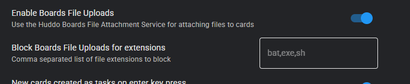
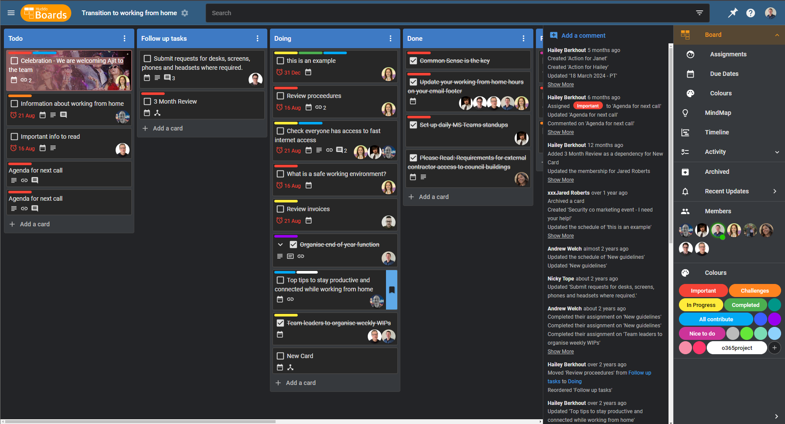
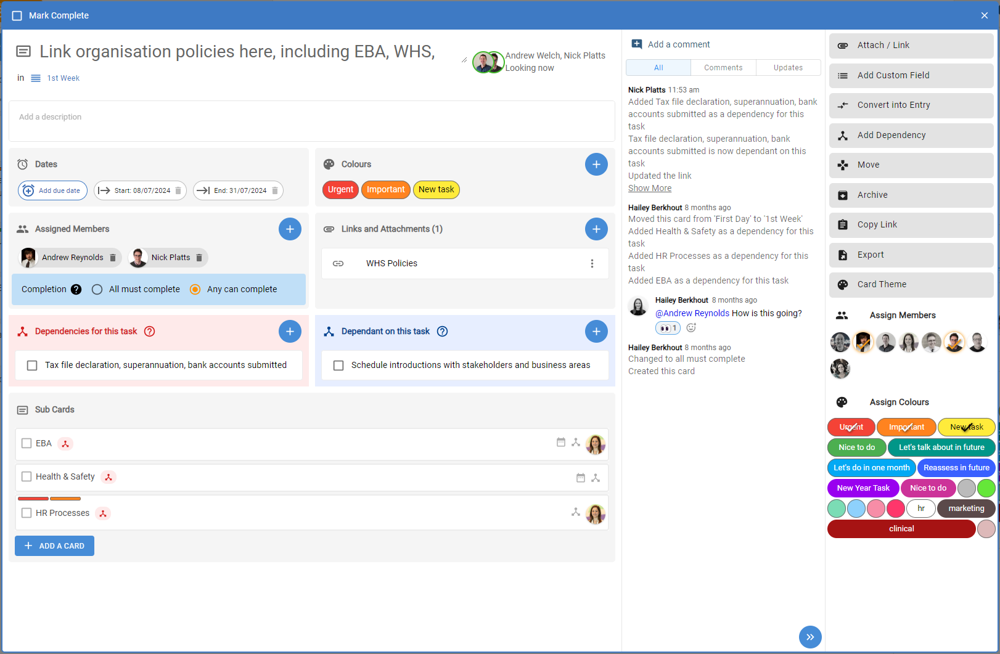
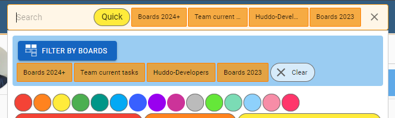

# Boards Cloud Updates

Please see here for recent changes to [Huddo Boards Cloud](https://boards.huddo.com)

## 2025

### December

2025-12-16

Fixes:

- Issue where pasting note using list menu created a list

### November

2025-11-24

Features:

- Ability for Organisation to block upload of files by extension

    

Improvements

- Node search API - return object with paging information. Better structure

Fixes:

- Rebuild Search app for Connections Search integration
- Add invite as selected (dont find user with similar email)
- Issue with checkbox/toggle not working with Cnx8 css (Archived button on content admin page)

### September

2025-09-22

Features:

- Org Admin user management - [replace user functionality](../admin/replace-user/index.md)

Improvements:

- Member dialog icons

    - change user section icon from search to filter
    - add search icon to main input

- Replace deprecated `ldapjs` with `ldapts` (used for MSAD)

Fixes:

- auth popup - fallback to open in tab if new window cannot be opened

### August

2025-08-26

Improvements:

- Allow user to add themself to a Board (if high enough access via group)

2025-08-20

Fixes:

- Issue with Community Files
- Issue with posting to Community Activity Stream

2025-08-08

Improvements:

- Performance of Calendar feeds

    - faster ical generator
    - less memory usage (smaller data selection, downscale/reuse assignment images)
    - add assignment initial avatars when no profile image set
    - Personal feed - include tasks created by me but not assigned to anyone

2025-08-01

Improvements:

- Support for @mentions in brackets
- Reduce data selection in DueDate reminders (less memory usage)

Fixes:

- Issue with text color in dark mode with HCL Connections 8.0 CR10
- Race condition sending DueDate reminders (prevent sending duplicates)
- Issue with user not attached when checking taskstat org acl

### July

2025-07-07

Fixes:

- Issue where 'my' comments not loaded correctly in Board after home page loads other users comments in the Boards dashboard feed (Latest Activity)

### May

2025-05-14

Fixes:

- Drag and drop cards between windows
- Handling of failed request on Organisation Board admin page

2025-05-02

Improvements:

- Organisation Board admin performance - opt-in to showing card count
- My Board History performance - better query/indexes

2025-05-01

Improvements:

- Better error boundaries to prevent entire page crashes

Fixes:

- Webhook trigger when completing 'my' task which is also assigned to you
- Add missing string for history - mark assignment as incomplete
- Issue with default tile colors (prevent deleting default, fix out of bounds exception)

### April

2025-04-28

Fixes:

- Ensure correct member role select options for group/community owned boards
- @mentions - pop up member list - show board members even if they do not have a user profile link/URL

2025-04-08

Improvements:

- Activity Feed updates

    - add new default filter level of "my boards"
    - badge showing the number of unread items
    - save feed expansion state

Fixes:

- Issue where incorrectly returned 400 error on history when no boards found

2025-04-07

Improvements:

- Reduce data stored in redis to improve stability in large environments
- Reduce page size requested of HCL Connections Communities (to improve stability of Communities in large environments)

Fixes:

- Issue with detection of Domino admins (REST API)
- Minor updates for Dutch translations

### March

2025-03-13

Improvements:

- Performance of redis usage to emit user presence events

2025-03-07

Improvements:

- Allow collapse/expand of the new Boards dashboard feed (Latest Activity)
- [API](../api/index.md) - `node.links` documentation added

2025-03-05

Improvements:

- Comments - show save/cancel action buttons while editing
- Performance - reduce lookups of board members
- [API](../api/index.md)

    - Streamline `node`/`board` objects - remove duplicate `id`
    - Boards: `currentMember`|`userPreference`|`template`|`view`
    - Nodes: `assignments`|`fields`|`start`|`due`|`creator`|`created`|`updated`|`updater`

Fixes:

- Mindmap - show color labels on cards when no text labels set in board
- Dragging colors/labels onto Board tile

### February

2025-02-26

Improvements:

- Performance - remove lookups of `assignments.user` in API layer
- [API](../api/index.md)

    - Streamline `node.assignments.user` - return string id instead of object

2025-02-24

New Feature:

- Boards dashboard feed (Latest Activity)

    - 'Latest Activity' across all your boards
    - Overdue tasks
    - Assigned to me

2025-02-13

Improvements:

- Board search quality - use new $text index with sort by score relevance
- Remove duplicate data on comments (do not need name from parent)
- Search Communities by name - allow partial matches
- Performance - improve loading public groups

2025-02-06

Improvements:

- Enable Bookmark URL editing
- User Options & Assign Members Accessibility
- Performance

    - reduce load times of group (e.g. community) with large number of members
    - reduce group member lookups

Fixes:

- Issue with editing list title in Activities View breaks expanding
- Create Board button missing in small community widget

2025-02-05

Improvements:

- Performance

    - reduce load times of Boards/Cards with large datasets (e.g. comments) in Board, Todos view, Archive, Dependencies etc
    - reduce load times of comment feed (improved pagination)
    - reduce data lookups during ACL checks

- Content Admin

    - allow searching Boards by ID
    - exclude archived boards on page load (default)
    - remove unused data returned to improve responsiveness

Improvements:

- Ability to sort Board tiles by creation date

Fixes:

- Styling of Search component integrated into CR8 (min-width etc)

### January

2025-01-14

Improvements:

- Licence encryption - use `crypto.createCipheriv` for enhanced security and to replace the deprecated `createCipher` function

2025-01-07

Fixes:

- Issue with live events inside framed CORs page (e.g. Microsoft Teams)
- Fix positioning of node modal assign user alert when drag and drop assignment
- Styling of scrollbar in card modal
- Card modal date section heading and action alignment
- Issue where Collab clients with invalid cnxfronturl overwrites Client.providerURL

## 2024

### December

2024-12-19

Improvements:

- Performance improvements (ACL, caching, reduced database queries)
- Prevent main thread blocking causing readiness probe failure
- Improved handling of large data sets
- Date chip (start/end date) - fix minor date selection issue, more descriptive tooltip labels

2024-12-17

Fixes:

- Deep linking to Board/Card in a Community
- Issue in Attach Card micro app when selecting a Board.
- Issue with Connections notification flyout blocking UI in Firefox

2024-12-11

Improvements:

- lookup performance of groups (e.g. Communities, Teams, etc)

2024-12-09

Fixes:

- Personal iCal feed, include cards with only due date (no start date)

2024-12-03

Fixes:

- Issue where card history and comments were not updating when switching between cards/sub cards

### November

2024-11-29

Improvements:

- Add locale support/text translations for date pickers
- Minor DE translation improvements

2024-11-20

Fixes:

- Regression bug: direct links to cards (e.g. in emails) renders blank screen
- Upload to MSGraph 'My' files
- Issue with text color in rich text editor

2024-11-14

Features:

- My Todos Timeline - show your tasks for each of your Boards in one central, visual place

Improvements:

- New 'Completed' Boards tab, split from the archive
- Limit Completed/Archived to last modified 100 Boards)

Fixes:

- Issue where creating Board tile labels overwrites the last label
- CNX8 header integration: notification popover issue
- CNX8 header integration: positioning of create board floating button overlapping right menu

2024-11-05

Improvements:

- Upgrade socket.io to latest, change to default polling then upgrade to websockets, add more backend error logging, allow custom headers
- Better style support when using extensions injecting dom elements (eg. grammerly)
- Accessibility: use mui button groups for mindmap layout controls (hover/focus styles), add outline on focus to colour labels and member icons, fix padding and add focus outline to complete button
- Kanban lists - move padding down a level so scrollbar is right aligned

### October

2024-10-21

Improvements:

- update to the latest version (v6.xx) of Material-UI
- improved flex layout of card icons and assignments + enable assigment avatar stacking

Fixes:

- minor UI fixes in board and card detail views

2024-10-17

Improvements:

- add a card from the top of a list in board view
- create board from template - make this action more prominent, highlight and add as a floating action when viewing a template

Fixes:

- close nav drawer when todos is clicked
- card details title textarea - make auto width with no resize to avoid overflow or small width issues
- assignment roles
    - role icon search issue
    - colours used based on colour scheme
- drag and drop
    - touch drag and view/list scroll issues
    - prevent dragging anchor and images when read only
    - prevent touch drag opening context menu
    - timeline - orange border for drag preview
- dependency arrow calculation fix for bordering cards

### September

2024-09-30

Improvements:

- Members and colours can be assigned to a card by dragging from the sidebar within the card options dialog view
- Tasks with a due date only (no start date) will now appear in the timeline view
- Minor style, position calculation and other improvements to the timeline view

Fixes:

- Themed card title appearing in the background in card details dialog

2024-09-11

Features:

- PDF zoom/paging controls

Improvements:

- Allow caching of uploaded files based on unique etag
- Simplification of task/entry. Add icons to their create buttons to clearly differentiate. Allow setting dates and dependencies on entry, auto converts to task
- Simplification of dates. 'End Date' has been merged into 'Due Date'
- Styling of recent updates loading progress bar
- better grid spacing for board members and colours
- Rename entry to note for clarity
- Performance improvements for kanban list scrolling

Fixes:

- Positioning of rich text toolbar when card title long
- Export Board with creator/updater null (data imported from Activities)
- Protection against assignments to user null (data imported from Activities)
- Dark mode styling of transfer ownership dialog

### August

2024-08-28

Improvements:

- Organisation logo - show white background in dark mode for images with transparency

2024-08-27

Features:

- Dark mode!

    

- Welcome Tours in

    - Bulgarian (bg)
    - Catalan (ca)
    - Chinese (Simplified) (zh)
    - Chinese (Traditional) (zh-TW)
    - Czech (cs)
    - Danish (da)
    - Dutch (nl)
    - French (fr)
    - German (de)
    - Italian (it)
    - Japanese (ja)
    - Polish (pl)
    - Portuguese (pt)
    - Romanian (ro)
    - Russian (ru)
    - Slovak (sk)
    - Slovenian (sl)
    - Spanish (es)

Fixes:

- Issue with Board tile height in Connections since grid size change (18 Aug)
- Issue moving cards by DnD in Kanban in Firefox with Linux OS

2024-08-26

Improvements:

- Onboarding for Microsoft Teams customers - allow selecting simple plan (free or enterprise)
- Onboarding for users starting in micro apps (e.g. Verse, Outlook)
- Create a Card button spans full width of list

Fixes:

- Issue with reloading data in Teams tab settings if no personal or team boards

2024-08-22

Improvements:

- Organisation content administration.

    - Delete functionality for Boards which user is not an owner of
    - Search by board name - case insensitive
    - Sort by Archive column
    - Select all only selects visible

2024-08-16

Fixes:

- Issue with webhooks

2024-08-15

Improvements:

- Board tile grid auto-sizing

Fixes:

- Content Admin - scrolling issues (wobbling and while filtered)
- MindMap - dont show edit option on hover while creating new card

2024-08-02

Improvements:

- Cache theme colour palettes for faster rendering
- Added missing translations for the following languages:

    - Bulgarian (bg)
    - Catalan (ca)
    - Chinese (Simplified) (zh)
    - Chinese (Traditional) (zh-TW)
    - Czech (cs)
    - Danish (da)
    - Dutch (nl)
    - French (fr)
    - Italian (it)
    - Japanese (ja)
    - Polish (pl)
    - Portuguese (pt)
    - Romanian (ro)
    - Russian (ru)
    - Slovak (sk)
    - Slovenian (sl)
    - Spanish (es)

Fixes:

- Issue when selecting an uploaded image as theme from new dialog removing other non-image bookmarks
- Text overflow issue in Activity view 'add a card' at top button
- Issue with incorrect number of Microsoft users in organisation admin view

### July

2024-07-29

Improvements:

- use bolder Roboto fonts to emphasise headings and actions
- use more contrasting (darker) colours for card title and icons

Fixes:

- fix a bug where the card updates sidebar will incorrectly initiate as closed
- reinstate create template from board action

2024-07-18

Improvements:

- remove margins on images in comments so they make better use of available space

Fixes:

- en-AU locale using incorrect date format
- bug when pasting an image in a new comment

2024-07-17

Improvements:

- reduce themed card title image height on extra small and small height screen sizes
- use card theme colours for multi-assignments section
- minor changes to icons and tooltips when selecting colours on a card
- always show remove buttons on fields and dependencies when using a touch screen

Fixes:

- due date translation for NL

2024-07-10

Features:

- Ability to add/remove board members/colours from card details action bar

Improvements:

- Card details refresh (new styling & theme updates)

    

- Todos filtering by Board - move under filter options

    

Fixes:

- Issue when filtering todos by selected Boards, showing cards outside of the selected Boards if also filtering by text/color with "Match All Filters" disabled

2024-07-08

Improvements:

- Board autocomplete - search boards immediately, show in drop down, dont filter by current selection

Fixes:

- support Drag-N-Drop transitions from touch to mouse devices and back again
- show number of comments on private cards

---

### June

2024-06-27

Improvements:

- list menu - show for authors/readers (hide menu options per access)
- restrict the selectable roles available in the dropdown when creating new/editing existing members

Fixes:

- Regression bug causing @mentions to not send in comments
- bug where possible to reduce role of other member with higher privelleges than current member
- fix wrap/styling issues for board calendar feed section

2024-06-25

Features:

- Click on images in comments to preview

Improvements:

- caching of API requests (features & login methods)

Fixes:

- auto authenticate regression in Collab Cloud

2024-06-24

Improvements:

- responsive design of cards in Activity view and modal (small screen)
- card display - cursor & border updates
- create card - don't hide input/buttons on blur if text has been entered

Fixes:

- card link in node view on small screen
- fix rich text fullscreen issue

2024-06-19

Fixes:

- Parse email to card when dragging from HCL Notes

2024-06-13

Improvements:

- Mobile: save/cancel buttons when creating comments
- Mobile (Android): fix for keyboard covering input fields

Fixes:

- loading wrong page/route when logging in with multiple windows (e.g. Community widget & Related Tasks)

---

### May

2024-05-31

Improvements:

- only allow link on card to bookmark (not uploaded files)
- performance of data selection from redux
- mobile: always show rich text editor toolbar in comments (to access @mentions)

Fixes:

- issue where dual tooltips in collapsed Board sidebar
- Assign Member list overflowing on phone
- issue with text overflow in card links
- issue with center alignment of login page on small extra screen devices
- issue with toolbar position for comments (balloon) under header when adding new comment in sidebar

2024-05-27

Features:

- Drag and drop of cards between browser tabs/windows
- Drag and drop bookmarks into Board lists/cards

2024-05-17

Accessibility fixes:

- Focus highlighting overrides
- use focus outline rather than background colour
- Fix for keyboard access to CreateCard app clear buttons to choose board/list
- MenuHelper.jsx - pass the disabled prop to the button
- position of assign members menu
- better focus styling for add board tile button
- better contrast when focusing on boards logo
- board tiles sort dropdowns - use defined focus bg and colours
- minor fixes for focused input controls

2024-05-07

Improvements:

- Collab Cloud header integration for Cnx8

2024-05-06

Usability improvements:

- Timeline: add zoom -+ controls that increment zoom levels
- Mindmap accessibility

    - 1st tab selects board node, allow arrow key nav, and tab to access actions from there
    - sidebar controls - use mui checkboxes + ensure hover effects on buttons
    - clear node selection on escape keypress
    - fix text cutoff/ensure ellipsis on longer node titles
    - add help link to sidebar
    - allow keyboard pan and zoom using shift+arrow and +- keys

- add contact support button to error catch page
- add severity levels when showing toasts, fade transition
- ensure board creator is displayed as a non-editable owner on board/template creation
- ensure board tile labels are sorted in selection menu
- make 'Recent' heading in sidebar look less like other actionable items
- use delete icon (bin) for remove actions for member tiles, dates, tags, and board tile labels

Fixes:

- Board tile label delete - ensure tile label is deleted from the label object in store

2024-05-03

Features

- Card and Board recent updates feed - filter to show all or comments/updates only

Improvements

- add a permanent but closable info level toast when board is read-only
- update rich text editor to latest version

---

### April

2024-04-29

Fixes:

- update material-ui libraries to fix date picker display issues on small screens
- ensure card header theme displays correctly when card is opened via direct link

2024-04-24

Improvements:

- card details view improvements
    - show card fields/data in defined sections in a grid formation with headings and add buttons
    - change "add a comment" action to start as a button

Fixes:

- minor styling fix for dependencies section on a node
- board/activity lists - more precise and consistent footer spacing/padding
- create card and add comment actions - ensure entered text persists on unfocus + other focus related fixes

2024-04-17

Fixes:

- issue with exporting a board in Teams client
- date picker error on mobile/touch devices

2024-04-11

Improvements

- tooltips on date picker
- add invalid date error message
- primary session expired message - show as info alert
- tab color and style improvements
- more consistent use of primary/secondary action colours on buttons
- no collapse for empty lists activity todo pivot views
- auto collapse empty lists initially and after a card is dragged out of them
- New Board Wizard - more specific label for board name and template name
- Activity view improvements

    - styling (shadows, spacing, border edges when expanded/collapsed)
    - drop cards on list header (highlight like shadow)
    - add card at top hides the bottom add card

Fixes:

- issue with format of dates in date picker
- issues in list header title - not full width, no-wrap ellipsis, use correct cursors
- don't show grab cursor on lists in todos / pivoted views
- issue saving tags when creating new template
- ensure tags are copied from template/source

2024-04-02

Improvements:

- Streamlined `/todos/assigned` & `/todos/created` API, separating out the Board labels to `/board/labels` & `/board/{boardId}/labels` endpoints
- Loading feedback when creating a board

Fixes:

- Issue with board label history
- create board from template when opened and only a reader

---

### March

2024-03-25

Features:

- Emoji reactions on comments

    - Quick selection

        

    - Picker

        

Improvements:

- Editing of comments on mobile (focus at end of text, save/cancel buttons)

Fixes:

- Creating Board in group restricts to the group's Organisation
- Better handling of authentication when provider session changes user account
- Visibility of 'Embed Link' when viewing Boards by Group
- Creation of Board in Group when using /group/{groupId} route (embedded)

2024-03-21

[API Documentation](https://boards.api.huddo.com):

- /todos/next
- /todos/summary
- /board/{boardId}/labels
- /board/labels
- /user/auth/{provider}/{externalId}/apitoken

2024-03-20

Fixes:

- View cards in fullscreen on small screens

2024-03-15

Features:

- My Tasks Summary micro app
- My Next Tasks micro app

Fixes:

- Issue when deleting all Boards tile colors
- Links to card ancestors (Todo view)
- Prevent date selection incorrectly showing today when no date set

2024-03-06

Fixes:

- Issue with communication between Boards and Collab Cloud

2024-03-05

Fixes:

- Upload files to Teams private channel OneDrive

2024-03-04

Improvements:

- Loading feedback of recent boards sidebar
- Card link opening behavious (links to other boards open in same tab)
- Teams board links open tabs
- Show loading spinner while waiting on clicked link to open in a teams tab

---

### February

2024-02-28

Improvements:

- Add copy/paste list option in list menu
- Add duplication list option in list menu
- More comprehensive history feed details for moving or reordering cards

Fixes:

- Scroll to bottom of a list when creating a new card
- Delete action in card dialog / in archive view
- Add card section in a list delays retract/height change to prevent card drag issues
- Dragging empty colour labels in Firefox
- Filter/search by list name

2024-02-22

Fixes:

- Unauthorised error when adding existing board as Teams tab
- Fix potential onEnter errors in rich text editor
- Prevent overflow on file preview
- Load board members on fullscreen list view (for @mentions)

2024-02-16

Fixes:

- Fix potential onBlur errors in rich text editor
- Don't show iCalendar feed options in Teams

2024-02-14

Fixes:

- Translation fixes
    - Move translations inside functions to help prevent premature translate calls
    - Use date-fns locales to show months in user's language
    - German translation amendments
    - Other translation fixes and improvements

2024-02-08

Fixes:

- Microsoft Teams private channels
    - Link to File will now show the private channel's files.
    - Owner/Author access level was setting all members to Author.
- Microsoft Teams Mobile: Removed licence related cards in org admin view.
- Microsoft Teams: Removed obsolete "Disable Notifications" button.
- Rich text editor dialog - allow scroll on overflow

---

### January

2024-01-25

Fixes:

- Use SMTP email address before using Exchange address when parsing email attachments
- Don't show organisation admin links from Boards sidebar menu in Teams on a mobile device

2024-01-17

Fixes:

- Activity view scrolling issue

2024-01-09

Improvements:

- Microsoft Teams integrations

    - UI redesign when adding new Boards tab
    - Onboarding Tours

- faster opening of cards
- allow clicking links in description when content locked for editing
- allow reordering private cards
- US English updates
- organisation plan loading feedback

Fixes:

- issue where completing a new task showed incorrect icon
- issue where Board content deleted when hovered and press Ctrl+Alt+Delete
- issue when opening a card by link, then a subcard within that card
- issue when reordering cards with filtered (hidden) content
- visibility of card title in header breadcrumb (Component Pack)

2024-01-04

Fixes:

- RichText saving when used @symbol (but not an @mention)
- @mentions keyboard navigation improvements (home/end, up to bottom, down back to top), escape without closing modal
- @mentions only considered new on first save

---

## 2023

### December

2023-12-22

Fixes:

- issue where mentions popup partially hidden at top
- issue where could not mention users when opening a card directly by link
- hide private cards when viewing board by assignments
- create card from Outlook/Verse - fix toggle of attach body, ordering of recent boards
- drag dependency links in Firefox

2023-12-18

Improvements:

- Accessibility (keyboard navigation - colors/members dialog, aria-labels, popover, html.lang attribute, improved roles, aria-selected, aria-expanded, hover/focus on cards)
- Drag email to card - attach .eml and .msg file
- Positioning of unscheduled cards in Timeline
- Improved document titles based on context
- Smoother drag scroll on Kanban
- Ensure grab cursor for Kanban drag scroll
- Update childcounts in activity lists when filtering
- Visibility of selected board filters
- Searching for a board includes the description

Fixes:

- Card label overflow issue when 5 lines
- Issue where comment events sent to mentioned users

2023-12-13

Improvements:

- API documentation for /user/{userId}, /user/group/{groupId} etc
- Support for latest MongoDB (v7)

2023-12-12

Fixes:

- Link to File dialog options

Fixes:

2023-12-07

Fixes:

- Issue saving card name when editing it directly on the card

2023-12-04

Feature:

- Drag emails from Outlook to create as card

2023-12-01

Fixes:

- Issue when focusing on boards search input

### November

2023-11-29

Feature:

- Support for Domino by [REST API](./../domino/cloud.md)

Fixes:

- Debounce User/Group searching

2023-11-28

Fixes:

- Issue where menu buttons in the open card view were not overflowing to the 'more' menu correctly and causing a flickering effect
- Issue where lists in board view could not easily be dragged to re-order
- Issue with board title button long text overflowing
- Issue with card background images

Improvements:

- Minor accessibility improvement - add aria-labels

2023-11-23

Fixes:

- Fix template description not showing in new board wizard

2023-11-13

Improvements:

- Accessibility

    - more consistent tooltips (for screen readers and better explanation of functionality)
    - Keyboard navigation (particularly in the Board Tiles, Kanban view, Card dialog) - (vision & motor impaired)
    - better screen reader information (vision impaired)
    - improved colour contrast (low vision users)

2023-11-09

Improvements:

- API for Member deletion

Fixes:

- Email for mentions missing fields

### October

2023-10-31

Improvements:

- Translations (German and English US)
- Use https protocol for iCal feed instead of webcals
- Hide unusable Colors button when read-only access when sidebar collapsed
- Consistency of Board colour feature naming

Fixes:

- Issue where iCal feed dates off by 1 due to timezone differences
- Issue where page blank in Firefox when loading with Connections 7 header via SSO

2023-10-25

Improvements:

- Show Member/Labels buttons in collapsed sidebar
- added translations to missing fields

Fixes:

- Issue where page crashed when reloaded page with Card open, then opening member dialog

2023-10-23

Features:

- [Board iCalendar feed](../howto/ical/board.md)
- [Personal iCalendar feed](../howto/ical/personal.md)

2023-10-20

Fixes:

- Collab header regression

2023-10-19

Improvements:

- loading of Board task stats on tiles as required
- performance of loading My Boards
- redirect in place for expired session of Collab/Connections with SSO header

### September

2023-09-29

Improvements:

- More German language translations

Fixes:

- Ability to paste images into descriptions

2023-09-22

Improvements:

- API security, added 'Strict-Transport-Security' & 'X-Content-Type-Options'

Fixes:

- (regression) encoding of file names when uploading special charactors (e.g. Japanese)
- issue where deleting a dependency changes the current view

2023-09-19

- update of `busboy` dependency used for file upload (includes security patches, node support etc)

2023-09-14

Improvements:

- consistency of sidebar icon positioning when collapsed/expanded
- allow case insensitive Collab login
- update to teams-js v2
- open filesin Teams in-place (deep links)

Fixes:

- public member creation when creating Board
- whitespace of cards in Activity list
- HCL Connections 8 CR3 whitespace

2023-09-12

Improvments:

- loading speed of the 'My Boards' data

2023-09-08

Fixes:

- membership role options when created inside a Team/Community

2023-09-07

Features:

- [Organisation content administration & membership management](../admin/content-member-management.md)
- Labels pivot view for Board and Activity views

Improvements:

- Pasting URLs into description and comments automatically converted to clickable link

Fixes:

- issues in dependency arrow positioning
- auto reschedule dependencies when dates change
- selecting the same file to upload after cancelling
- expand/collapse lists when pivoted by dates/assignment

### August

2023-08-15

Fixes:

- Reload loop during login with Firefox

2023-08-09

Fixes:

- Ensure assignments are duplicated when copying and pasting tasks

2023-08-07

Improvements:

- Users with the author role now have full edit access on cards that are assigned to them (rather than complete and comment access only)

Fixes:

- Prevent cards from being moved to another list at the same time they are archived by dragging to the archive button
- Ensure the current user has the correct actions available according to their board role when opening cards from the My Todos view

### July

2023-07-14

Fixes:

- Drag & Drop from rich email clients onto a list

2023-07-12

Fixes:

- Activity list missing action menu

2023-07-05

Fixes:

- Ability to edit nodes when opened directly

2023-07-04

Fixes:

- Assignments to non-primary aliases

2023-07-03

Improvements:

- Improved author experience - restrict to allowed actions
- Board title/board options button - styling and usability improvements
- Current member role now highlighted in members dialog and links added to member permissions documentation
- Improved randomisation and readability of Assignment Role colours
- Added tooltips to Assignment Role avatars
- Microsoft Teams

    - detect members in private sub channels (OAuth Admin consent must be certified again)
    - fix for creating Board in private sub channels
    - loading spinner positioning

Fixes:

- Connections 8 styling fixes
- Fixed coloured role borders when assigning member roles
- Fix URLs pointing to old docs pages
- Issue detecting highest licence when multiple
- Minor fixes to Welcome and Plan Selection dialogs

---

### June

2023-06-26

Improvements:

- Readers can now select text in descriptions
- General reader experience

Fixes:

- Tours appearing incorrectly
- Template role assignment on touch devices

2023-06-21

Fixes:

- Move button now appears again

2023-06-19

Fixes:

- Timeline group-by colours

2023-06-15

Improvements:

- Readers no longer see actions they cannot perform

Fixes:

- Getting members from private sub-channels

2023-06-06

Improvements:

- Member promotion emails - add invite and membership details to give more context
- New configuration option to enable/disable member promotion requests
- Do not clear edited name/description when changing templates
- Ability to create new organisation from guest is reader popup

Fixes:

- Issue with exporting Board as CSV with special characters (e.g. Umlaut)
- Issue affecting Org config when user has multiple orgs
- Color selection/editing on small screens (e.g. mobiles)
- German translations with extra '}' character
- Issues with Role Assignments (duplicates etc)
- Collab - fix for offering user org trial
- Issue in create first board tour

---

### May

2023-05-26

Features:

- Organisation Guests are now treated as Reader
- Ability for guest to request a promotion to member, sent to admins via email & socket

2023-05-23

Improvements:

- Drag and drop of lists

    - drag by header
    - fix blank list when scrolled and dragged
    - prevent scrolling of list in drag mode

- Cards can be Archived+Deleted from the card modal toolbar.
- Enable "Assign to Roles" when creating a new Board via 'Create Template from Board' button.
- More compact Board Members view on small (phone) screens.

Fixes:

- Issue with blank tile label
- Issue with empty Assign Roles in new Board wizard
- Board Tiles sidebar shadow regression bug
- Card drag and drop

    - issue where a duplicate card appears when drag to end
    - issue where card jumps back to top when dragging a card to end of same list

- Button for copying a template says "Copy Template" instead of "Copy Board"
- Fixed loading of template description in to board description field in the new board wizard.
- Deleting an open template now redirects to template list instead of board list.
- Fixed "Assign to Roles" screen appearing in Board wizard without any roles to assign members.
- When creating a new Board, edited name and description fields are not lost when changing the selected template.

2023-05-16

Improvements:

- Organisation view of members & groups

    - loading feedback
    - virtualised scroll for faster render
    - show membership of linked aliases
    - prevent duplicates of invites to org

- localised format of dates in CSV export

Fixes:

- Security issue affecting external users and public communities (Connections)
- issue where Organisation invites not visible if members with linked aliases

2023-05-05

Features:

- Drag card to archive

Improvements:

- Auto-move dependency parent
- Expand all in activity view
- Hide edit options on archived card
- Performance improvements related to icons used on Template Roles
- Show count of tasks assigned to Role in Board Members view

Fixes:

- Dragging card from assigned user created user image as card
- Sending duplicate due date reminders

---

### April

2023-04-21

Features:

- Button to assign all sub-tasks as dependencies of parent
- Template Roles - base functionality

Fixes:

- Removed Connections community members not removed from Board membership
- Deleting an assigned label

2023-04-12

Features:

- Custom Colours. Colours and tags have been merged. You are now able to create as many colours as you like in a Board

---

### March

2023-03-20

Fixes:

- Group member changes not being picked up

2023-03-17

Improvements:

- Timeline card title always visible

2023-03-15

Improvements:

- UI for member adding on Mobile

Fixes:

- Kanban Printing
- Timeline calendar shifting when opening a card

2023-03-10

Features:

- [Template Rescheduling](../howto/templates/global.md#template-scheduling)
- Drag & Drop assignments from parent to sub-cards in modal

Fixes:

- Assign users to a named licence

---

### February

2023-02-20

Fixes:

- Attachments are moved in child nodes when the parent is moved
- Updated attachments to correctly show when their parent had been moved

---

### January

2023-01-31

Features:

- New Organisation summary view

Improvements:

- Outlook attachments using plugin
- Copy/Paste functionality

2023-01-24

Improvements:

- Styling for HCL Connections 8 new UI
- Handling of default profile images in Connections
- Detect language from Connections dropdown
- Security updates (node 18)

---

## History

See the [full history](./history.md) of updates for 2022 and earlier.
