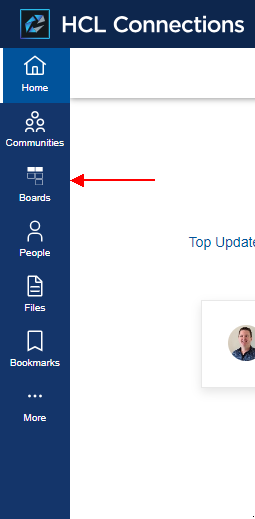
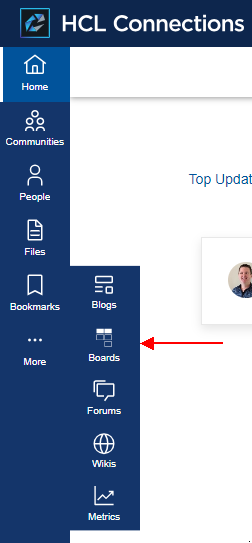
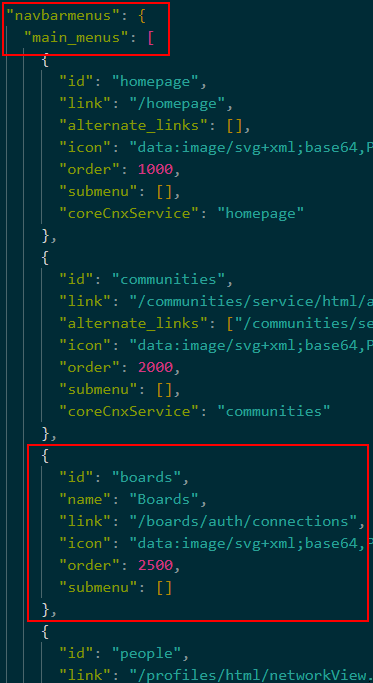
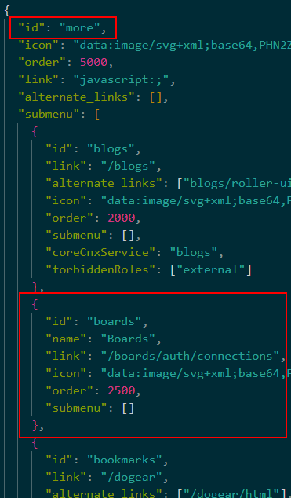
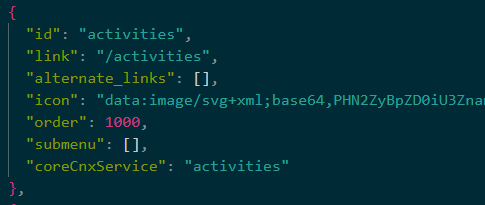
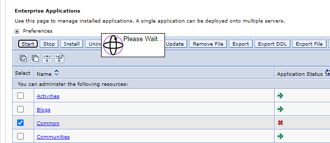
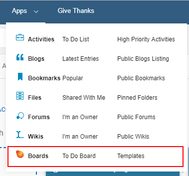

# Apps Menu / Navigation

!!! note

    This guide is very similar to the [on-premise version](./on-prem.md) but with a different URL:
    `https://boards.huddo.com/auth/connections/[CONNECTIONS_HOSTNAME_BASE64]`

## HCL Connections 8.0

There are a few ways to achieve this in HCL Connections 8.0 with the new theme.

| Top Level                               | More Popout                     |
| --------------------------------------- | ------------------------------- |
|  |  |

### Customizer

Please see the [full customizer extensions documentation](../customizer/integrations.md) for our package of default customisations. The [HCL documentation](https://opensource.hcltechsw.com/connections-doc/v8/admin/customize/customizing-side-navigation.html) also highlights how to add `customEntries` to the side navigation.

### Customise nav json file

!!! tip

    This is the recommended approach for environments that do not have Customizer installed.

The side navigation is customisable as per the [official documentation](https://github.com/HCL-TECH-SOFTWARE/connections-ui-docs/blob/master/main-areas/side-navigation/README.md).

1.  Download the default [react-nav.json](https://github.com/HCL-TECH-SOFTWARE/connections-ui-docs/blob/master/main-areas/side-navigation/resources/react-nav.json) file.

1.  Rename this file to `react-nav-entries.json`

1.  Edit this file to add `Boards`

    Huddo Boards can be added in any place in the navigation. Typically this would either be at the top level in the `navbarmenus.main_menus` array between Communities and People. Alternatively under the `More` popout section. Simply add the following JSON object in the corresponding section of the file:

    ```json
    {
      "id": "boards",
      "name": "Boards",
      "link": "https://boards.huddo.com/auth/connections/[CONNECTIONS_HOSTNAME_BASE64]",
      "link": "https://boards.huddo.com/img/logo-white.svg",
      "order": 2500,
      "submenu": []
    },
    ```

    Where `[CONNECTIONS_HOSTNAME_BASE64]`is

    -   your Connections hostname base64 encoded. E.g.</br>
        `connections.example.com` => `Y29ubmVjdGlvbnMuZXhhbXBsZS5jb20=`</br>

    For example:

    | Top Level                                | More                             |
    | ---------------------------------------- | -------------------------------- |
    |  |  |

1.  _(Optional)_ Remove `Activities` menu item

    Once Huddo Boards (Activities Plus) is installed you may choose to remove the Activities menu item. This can be done by removing the following `Activities` section from the `more.submenu` array in the json file.

    

1.  Place this customised file on your Shared Drive at this location:

        <SHARED_DRIVE>/customization/common/ui/cnx8-react/react-nav-entries.json

    For example:

        /nfs/data/shared/customization/common/ui/cnx8-react/react-nav-entries.json

1.  Restart the `Common` application via the ISC to apply the changes

    

---

## HCL Connections 7.0 and earlier

The following steps are for Connections 7 and earlier (6.5, 6.0, 5.5, 5.0 etc) and use the apps.jsp file to add the Huddo Boards app links to the Apps Menu.



1.  If you have not customised the apps.jsp file for your connections environment, please make a copy of the file.

    -   You can access the file from:

              <WAS_home>/profiles/<profile_name>/installedApps/<cell_name>/Homepage.ear/homepage.war/nav/templates/menu

    -   Paste the copy into the common\nav\templates subdirectory in the customization directory:

              <installdir>\data\shared\customization\common\nav\templates\menu\apps.jsp

1.  To add the Huddo Boards App Link add the following lines towards the bottom of the apps.jsp file before the `</table>` element

        --%><tr><%--
          --%><th scope="row" class="lotusNowrap"><%--
            --%><%--
            --%><a href="https://boards.huddo.com/auth/connections/[CONNECTIONS_HOSTNAME_BASE64]"><%--
              --%><strong><fmt:message key="connections.component.name.kudos.boards" /></strong><%--
            --%></a><%--
          --%></th><%--
          --%><td class="lotusNowrap lotusLastCell"><%--
            --%><a href="https://boards.huddo.com/auth/connections/[CONNECTIONS_HOSTNAME_BASE64]?redirect_to=/todos/assigned"><%--
              --%><fmt:message key="label.menu.kudos.boards.todos" /><%--
            --%></a><%--
          --%></td><%--
          --%><td class="lotusNowrap lotusLastCell"><%--
            --%><a href="https://boards.huddo.com/auth/connections/[CONNECTIONS_HOSTNAME_BASE64]?redirect_to=/templates/public"><%--
              --%><fmt:message key="label.menu.kudos.boards.templates" /><%--
            --%></a><%--
          --%></td><%--
        --%></tr><%--

    Where `[CONNECTIONS_HOSTNAME_BASE64]`is

    -   your Connections hostname base64 encoded. E.g.</br>
        `connections.example.com` => `Y29ubmVjdGlvbnMuZXhhbXBsZS5jb20=`</br>
        There are many free online services to do this, ie [here](https://www.base64encode.net/)</br></br>

1.  Save and close the file

1.  Add the Huddo Boards Strings for the Apps Menu

    -   Download the [strings files](./strings.zip) and extract the files to the Connections strings customisation directory:

              <CONNECTIONS_CUSTOMIZATION_PATH>/strings

    -   Note: Please append the lines to the files if they already exist. Extra languages can also be added

1.  The changes will take effect when the cluster(s) are restarted
