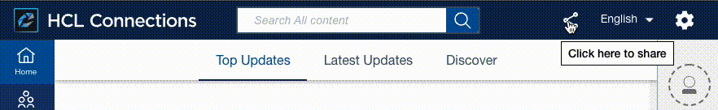

Boards adds multiple features to other HCL Connections applications via Connections Customizer. These include: 

- Related Tasks Pane <!-- INCLUDE LINKS TO USER DOCS -->
- Share to Boards <sup>_Connections 8_</sup>
- Boards in Search Results

!!! note 
    These features require your Connections envirionment to have Customiser installed. If you're new to Connections Customizer, here's a [great video introduction](https://www.youtube.com/watch?v=CvlpjIE-3TQ) and the [install documentation](https://help.hcltechsw.com/connections/v65/admin/install/cp_config_customizer_intro.html).

## Installation
1. Check the rules in your HTTP proxy that direct traffic to `mw-proxy` (customizer). See the [relevant section from the install documentation](https://help.hcltechsw.com/connections/v65/admin/install/cp_config_customizer_setup_nginx.html#:~:text=required%20Customizer%20URLs).

    Huddo Boards features appear on every page in Connections where the Connections header appears. Your rules should match every URL that appears in the browser address bar. As mentioned in the documentation above, you may want to avoid mathching some URLs (like API requests) for better performance.

    This example works well. If you have a suggestion for improvement, please [open a GitHub issue](https://github.com/isw-kudos/huddo-docs/issues/new?labels=hcl+connections,documentation).
    ```
    files/customizer|files/app|communities/service/html|forums/html|search/web|homepage/web|social/home|mycontacts|wikis/home|blogs|news|activities/service/html|profiles/html|viewer
    ```

1. Download and extract [`boards-extensions.tgz`](https://docs.huddo.com/boards/connections/boards-extensions.tgz) package to the `/pv-connections/customizations/boards-extensions` directory on your `mw-proxy` server.
```bash
cd /pv-connections/customizations
mkdir -p boards-extensions
curl -s https://docs.huddo.com/boards/connections/boards-extensions.tgz | tar xvf - -C ./boards-extensions
```

1. _If you have your own Boards deployment_, replace `https://boards.huddo.com` with your Boards URL (e.g. `https://connections.company.com/boards`) in settings files. 
   ```bash
   sed 's|https://boards.huddo.com|https://connections.company.com/boards|g' connectionsShare.settings.js | tee connectionsShare.settings.js
   ```

1. Add the app to Connections App Registry

    - Go to the Connections Customizer App Registry, e.g `https://connections.example.com/appreg`
    - Click 
    - Open _Code Editor_.
    - Import `connections-share-manifest.json` from `boards-extensions.tgz` into the code editor and click `Save`.


## Testing
Open a HCL Connections page and click the _Huddo Boards_ option in the Share menu. A dialog for creating a card based on the current page should open. 