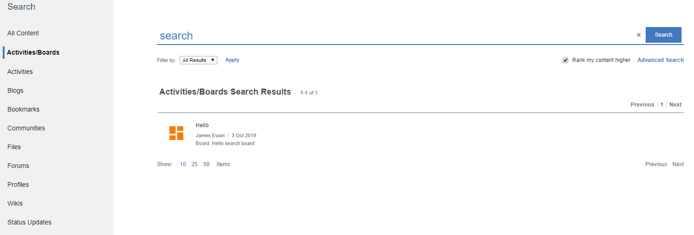

Customizer Integrations
=======================

Boards adds multiple features to other HCL Connections applications via Connections Customizer. For details about what features this adds, see the [usage documentation](../../howto/connections/connections-ui.md).

These features require your Connections envirionment to have Customiser installed. If you're new to Connections Customizer, here's a [great video introduction](https://www.youtube.com/watch?v=CvlpjIE-3TQ) and the [install documentation](https://help.hcltechsw.com/connections/v65/admin/install/cp_config_customizer_intro.html).

# Installation
## Customizer Reverse Proxy Configuration
Check the rules in your HTTP proxy that direct traffic to `mw-proxy` (customizer). See the [relevant section from the install documentation](https://help.hcltechsw.com/connections/v65/admin/install/cp_config_customizer_setup_nginx.html#:~:text=required%20Customizer%20URLs).

  Huddo Boards features appear on every page in Connections where the Connections header appears. Your rules should match every URL that appears in the browser address bar. As mentioned in the documentation above, you may want to avoid matching some URLs (like API requests) for better performance.

  This example works well. If you have a suggestion for improvement, please [open a GitHub issue](https://github.com/isw-kudos/huddo-docs/issues/new?labels=hcl+connections,documentation).
  ```
  files/customizer|files/app|communities/service/html|forums/html|search/web|homepage/web|social/home|mycontacts|wikis/home|blogs|news|activities/service/html|profiles/html|viewer
  ```

## Add Resources to `mw-proxy` Server
1. Get a terminal session to your `mw-proxy` server. e.g. via `ssh`
2. `mkdir /pv-connections/customizations/boards-extensions` if it doesn't exist.
3. `cd /pv-connections/customizations/boards-extensions`
4. In a web browser, download your custom Boards Extensions package from [Huddo Store](https://store.huddo.com/boards-extensions).
5. Extract this package to `/pv-connections/customizations/boards-extensions`.
6. `cat settings.js` and check that the "boardsURL" property has been set to the URL of your Boards deployment.

## <span id="appRegistry">Add the app to Connections App Registry</span>

1. In a web browser, open [https://connections.example.com/files/customizer/boards-extensions/manifest.json](https://connections.example.com/files/customizer/boards-extensions/manifest.json). You should see JSON similar to the screenshot below. Copy this JSON to the clipboard.
1. Open the Connections Customizer App Registry: [https://connections.example.com/appreg](https://connections.example.com/appreg)
1. Click 
1. Open _Code Editor_
1. Paste the JSON from the clipboard, in to the editor
1. Click _Save Changes_
1. Your screen should look something like this:
  
1. **Important**: Connections customizer only supports one extension that customizes the Connections Navigation (`"type": "com.hcl.connections.nav"`). If you already have nav customizations, you must remove the "Tasks Nav Button" extension from `manifest.json` and merge it in to your existing nav customization. Otherwise only one of your nav customisations will take affect.

### Disabling Extensions
Individual extensions within this package can be disabled using the _Extensions_ screen or by editing the JSON in the _Code Editor_. For example, if you're not using Connections 8, you may want to disable the extensions for Connections 8. There is no major issue in keeping these enabled. However, disabling extensions that are not compatible or needed will stop unnecessarily loading that extension's code.

Keep in mind that any changes made will be discarded when following the _Updating_ steps below.


# Updating
Repeat the above steps, overwriting the existing files and manifest in appreg.


<!-- ## Testing

TODO: Write user documentation for each of the integrations and refer to them for testing.


1. Use the Search Sidebar to search for content in Boards from different paths in Connections (e.g. homepage, profiles, activities, forums)


1. Use advanced search (`/search/web/jsp/advancedSearch.jsp`) to see Boards results integrated in the full search results page.



    > Note: you need to have content in Boards to see any results. -->