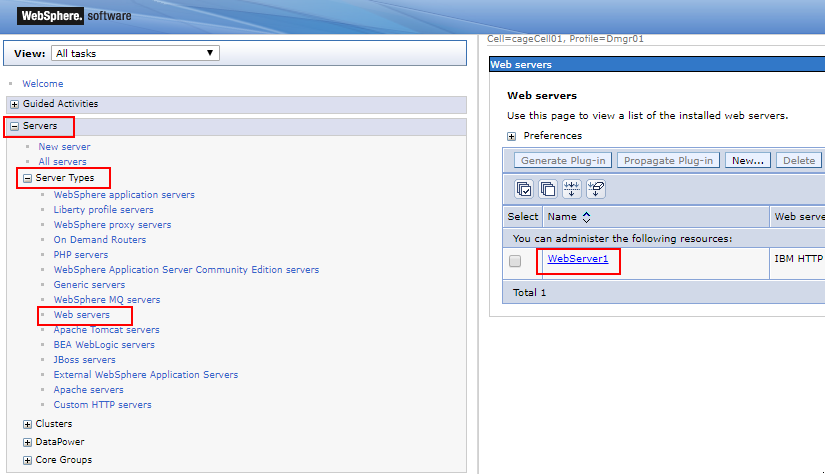
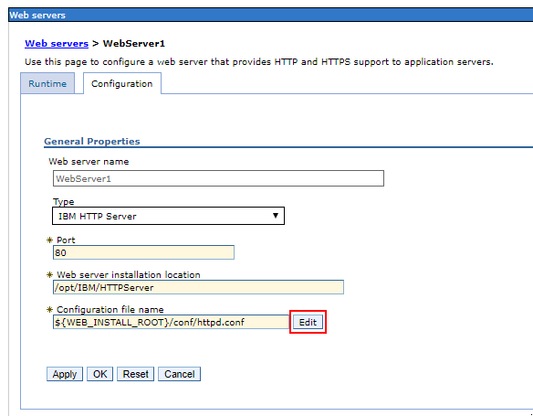

## Open Proxy Config

1.  Open WebSphere ISC

    This is usually accessible through a URL like:

        https://[DEPLOY_MANAGER_ALIAS]:9043/ibm/console/logon.jsp

    

1.  Open `Servers` -> `Server Types` => `Web servers`

    Click on the name of your web server

    

1.  Click `Edit` on the `http.conf`

    
