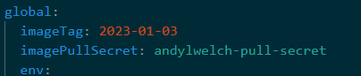

# Moving from your local HCL Connections repository to Huddo Boards latest releases

1. [Follow this guide](../images.md) to configure your Kubernetes with access to our images hosted in Quay.io.

1. Once confirmed by reply email, update your `boards-cp.yaml` file as per [this example](../../assets/config/kubernetes/boards-cp.yaml). At the top set

    - `global.imageTag` as the date of our latest [release](../releases.md)
    - `global.imagePullSecret` to the name of the secret you created

        e.g. `<USERNAME>-pull-secret`

        

1. Run the [helm upgrade command](../helm-charts.md)
