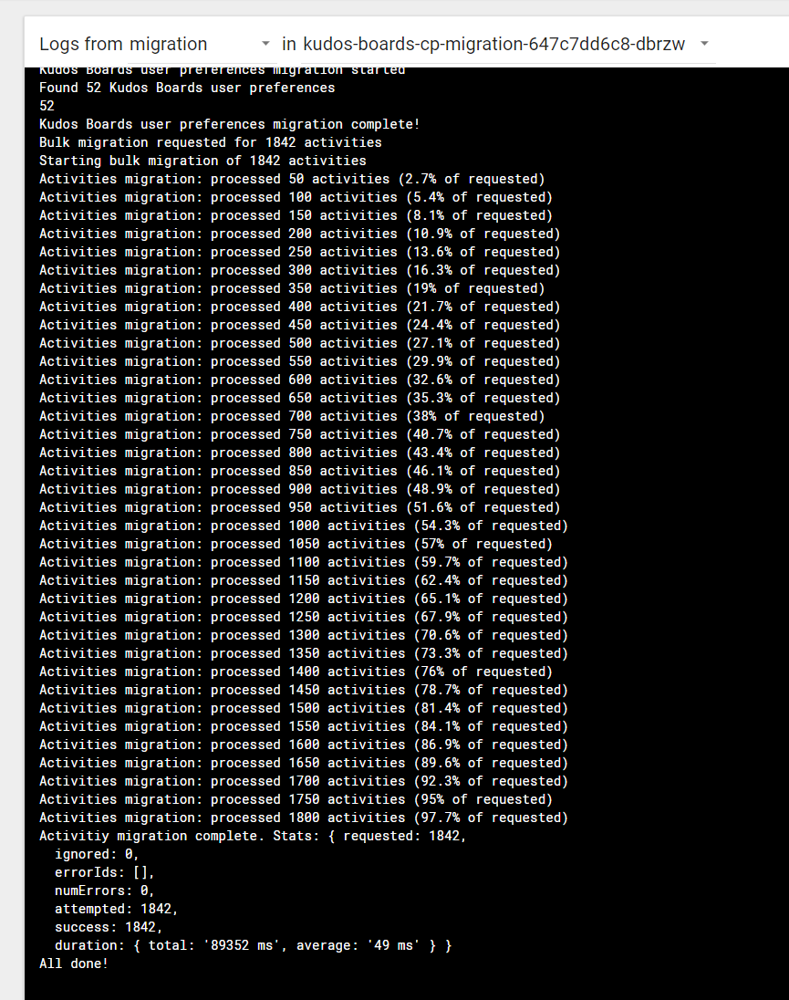

# Migration of Activities to Huddo Boards (with Component Pack)

!!! tip

    If you are not using Component Pack please follow [this guide](../../connections/migration.md)

As part of the installation process for Huddo Boards (Activities Plus) you must run the migration service to move the existing Activities into Huddo Boards.

!!! info

    Please review the [Roles page](../roles/index.md) for details on how Community Activity membership is interpreted & presented by Boards

## Process Overview

This service will:

1. access Activities data in the existing Connections SQL database
1. process the Activity into a Board
1. get file attachments and long descriptions via mounting the Connections shared drive
1. write Boards data into the Component Pack mongo database
1. write file attachments into S3 storage

Ensure you have updated the following variables as applicable in your `boards-cp.yaml` file downloaded previously

|                                              | Example                                                  | Description                                                                                                                                                                                                               |
| -------------------------------------------- | -------------------------------------------------------- | ------------------------------------------------------------------------------------------------------------------------------------------------------------------------------------------------------------------------- |
| `sharedDrive.server`                         | `192.168.10.1` or `websphereNode1`                       | IP or Hostname of the server with the Connections shared drive mount                                                                                                                                                      |
| `sharedDrive.path`                           | `/opt/HCL/Connections/data/shared` or `/nfs/data/shared` | Path on the mount to the Connections shared drive                                                                                                                                                                         |
| `sharedDrive.mountOptions`                   | `-nfsvers=4.1` (optional)                                | Any additional sharedDrive mountOptions. All yaml is passed through drive                                                                                                                                                 |
| `sharedDrive.storage`                        | `10Gi` (optional)                                        | The capacity of the PV and PVC                                                                                                                                                                                            |
| `sharedDrive.accessMode`                     | `ReadOnlyMany` (optional)                                | The accessMode of the PV and PVC                                                                                                                                                                                          |
| `sharedDrive.volumeMode`                     | `Filesystem` (optional)                                  | The volumeMode of the PV and PVC                                                                                                                                                                                          |
| `sharedDrive.persistentVolumeReclaimPolicy`  | `Retain` (optional)                                      | The persistentVolumeReclaimPolicy of the PV and PVC                                                                                                                                                                       |
| `sharedDrive.storageClassName`               | `manual` (optional)                                      | The storageClassName of the PV and PVC - useful for custom spec (e.g. hostPath)                                                                                                                                           |
| `sharedDrive.spec`                           | See [below](#custom-persistent-volume)                   | Using a fully custom spec - e.g. FlexVolume or hostPath                                                                                                                                                                   |
| `env.FILE_PATH_ACTIVITIES_CONTENT_STORE`     | `/data/activities/content`                               | Path of the Activities content store relative to the Connections shared drive. Must start with /data as the Connections shared drive is mounted at /data Ensure you set the IP and path for the NFS volume mount. |
| `env.API_GATEWAY`                            | `https://[CONNECTIONS_URL]/api-boards`                   | URL of the Boards API. Used by files attached to a board. URL.                                                                                                                                                        |
| `env.TZ`                                     | `Europe/London` or `Australia/Hobart` etc                | 'Local' Timezone Used for date interpretation. See full [list of supported timezones](https://en.wikipedia.org/wiki/List_of_tz_database_time_zones)                                                                   |
| `env.CONNECTIONS_ACTIVITIES_ADMIN_USERNAME`  | `connectionsadmin`                                       | Credentials for user with `admin` role  on the Activities application. See `ISC` => `Applications` =>  `Activities` =>  `Security role to user mapping`                                                   |
| `env.CONNECTIONS_ACTIVITIES_ADMIN_PASSWORD`  | `adminpassword`                                          | Password for the Activities administrator                                                                                                                                                                                 |
| `env.CONNECTIONS_DB_TYPE`                    | `db2` or `mssql` or `oracle`                             | SQL database type hosting Activities.                                                                                                                                                                                     |
| `env.CONNECTIONS_DB_HOST`                    | `dbserver.company.com`                                   | SQL Server hostname                                                                                                                                                                                                       |
| `env.CONNECTIONS_DB_PORT`                    | `50000` or `1433` or `1531`                              | SQL Server connection port                                                                                                                                                                                                |
| `env.CONNECTIONS_DB_USER`                    | `dbuser`                                                 | SQL Server user name                                                                                                                                                                                                      |
| `env.CONNECTIONS_DB_PASSWORD`                | `dbpassword`                                             | SQL Server user password                                                                                                                                                                                                  |
| `env.CONNECTIONS_DB_SID`                     | `DATABASE`                                               | SQL Server SID **Note: applicable to Oracle**                                                                                                                                                                         |
| `env.CONNECTIONS_DB_DOMAIN`                  | `domain`                                                 | SQL Server connection string **Note: applicable to Microsoft SQL**                                                                                                                                                    |
| `env.CONNECTIONS_DB_CONNECT_STRING`          | `HOSTNAME=<host>;PROTOCOL=...` or `<host>:<port>/<sid>`  | SQL Server connection string **Note: Optional Default is built from other values. Only applicable to DB2 and Oracle**                                                                                         |
| `env.PROCESSING_PAGE_SIZE`                   | `10` (default)                                           | Number of Activities to process  simultaneously. Value must not exceed  the connection pool size supported  by the SQL database                                                                               |
| `env.PROCESSING_LOG_EVERY`                   | `50` (default)                                           | The migration process logs every 50 Activities completed                                                                                                                                                                  |
| `env.IMMEDIATELY_PROCESS_ALL`                | `false` (default)                                        | Process ALL Activities on service startup.                                                                                                                                                                                |
| `env.COMPLETE_ACTIVITY_AFTER_MIGRATED`       | `false`                                                  | Mark the old Activity data as complete                                                                                                                                                                                    |
| `env.CREATE_LINK_IN_ACTIVITY_AFTER_MIGRATED` | `false`                                                  | Create link to new Board in old Activity                                                                                                                                                                                  |

### Custom Persistent Volume

The default chart values use an NFS mount. Below are examples custom configuration of the persisent volume definition for access to the Shared Drive using other methods.

!!! note

    We recommend running the helm chart with `--dry-run --debug` to confirm the yaml output

1.  Host path

    !!! tip

        This can be used in conjunction with existing linux methods (e.g. `cifs-utils`, `smbclient` etc) to mount a Windows Samba share directly onto the Kubernetes Node(s).

    Please read the [Kubernetes documentation](https://kubernetes.io/docs/tasks/configure-pod-container/configure-persistent-volume-storage/#create-a-persistentvolume).

        migration:
          sharedDrive:
            storageClassName: manual
            spec:
              hostPath:
                path: /data/shared

2.  Kubernetes CIFS Volume Driver (for Samba shares).

    Please read the [CIFS documentation](https://k8scifsvol.morimoto.net.br/)

        migration:
          sharedDrive:
            spec:
              flexVolume:
                driver: juliohm/cifs
                options:
                  opts: sec=ntlm,uid=1000
                  server: my-cifs-host
                  share: /MySharedDirectory
                secretRef:
                  name: my-secret

!!! question "Additional for Windows"

    This migration is designed to be a once-off operation. If you are using Windows SMB shares and neither option above is appropriate for your environment, we would recommend:

    1. Temporarily copy the Activity Store content directory at `<SHARED_DRIVE>/activities/content` (e.g. `/opt/HCL/connections/data/shared/activities/content`) to an existing Linux accessible drive (e.g. `/pv-connections/activitystore`).
    1. Set the standard `sharedDrive.server` & `sharedDrive.path` to mount this path at `/data` in the containers
    1. Set `migration.env.FILE_PATH_ACTIVITIES_CONTENT_STORE: "/data"`

---

## Deploy Helm Chart

Please deploy the following chart with the same configuration `boards-cp.yaml` file used to deploy the huddo-boards-cp chart

    helm upgrade huddo-boards-cp-activity-migration https://docs.huddo.com/assets/config/kubernetes/huddo-boards-cp-activity-migration-1.0.0.tgz -i -f ./boards-cp.yaml --namespace connections --recreate-pods

> **Note:** the configuration file has changed as of the v3 chart. Please add the new `sharedDrive` parameters described above

---

## Migrate Activities

The migration interface is accessible at `https://[CONNECTIONS_URL]/boards/admin/migration` to select which Activities to migrate (ie ignore completed/deleted). For some explanation of the interface, see [Activity Migration User Interface](interface.md).

You can also set the `env.IMMEDIATELY_PROCESS_ALL` if you wish to migrate every Activity without the UI.

---

## Logs

You can check the pod logs for the activity-migration to see progress of the running migration

For example

---

## After Migration Complete

1.  The Migration service can be removed. Please use the following command

        helm delete huddo-boards-cp-activity-migration --purge

1.  Turn off the Activities application in WebSphere ISC
