# Roles

## Member Roles

Boards has the following membership roles

| Role                 | Description                                                                                                                                                      | Applicable for Community Membership |
| -------------------- | ---------------------------------------------------------------------------------------------------------------------------------------------------------------- | ----------------------------------- |
| Owner                | All members have full control over the Board.                                                                                                                    | Shared with   Owned by           |
| Editor               | All members have access to create new content, and edit all content.                                                                                             | Shared with                         |
| Author               | All members have access to create new content, and edit content they created.                                                                                    | Shared with                         |
| Reader               | All members can only read content (no create or edit).   Any tasks they are assigned to, they can comment on and complete.                                    | Shared with                         |
| Owners & Editors     | Owners of the Community have `Owner` role.  Members of the Community have `Editor` role                                                                       | Owned by                            |
| Owners & Authors     | Owners of the Community have `Owner` role.  Members of the Community have `Author` role                                                                       | Shared with   Owned by           |
| Owners & Readers     | Owners of the Community have `Owner` role.  Members of the Community have `Reader` role                                                                       | Owned by                            |
| Community Owner Only | Owners of the Community have `Owner` role.   **Note: Community Members will see the title of the Board in the main list, but not be able to open/view/edit.** | Owned by                            |

## Community Membership Types

| Type        | Description                                                 | Applicable Role Options                                   |     |
| ----------- | ----------------------------------------------------------- | --------------------------------------------------------- | --- |
| Owned by    | Boards created from inside a Community                      | 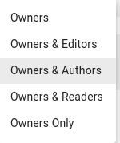          |
| Shared with | Boards created standalone, and then shared with a community | 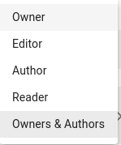 |

## Migration Examples

When migrating from Activities, the permissions will be maintained. Below are some examples of permissions set in Activities and their equivalent in Boards / Activities Plus after migration.

### Activity in Community

| Activities                                                               | Boards                                                                       |
| ------------------------------------------------------------------------ | ---------------------------------------------------------------------------- |
| Owners & Members assigned the Owner role 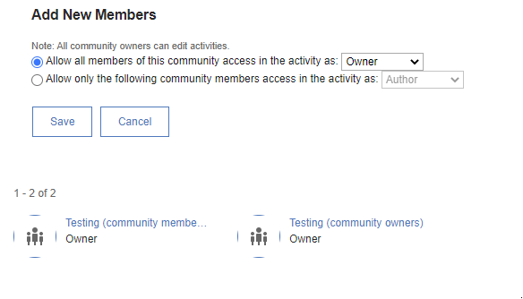 | Owner role is assigned to the entire community 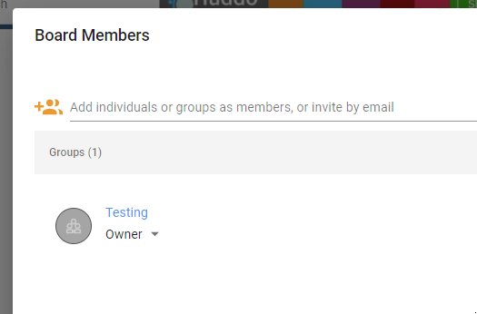  |
| Members are Authors 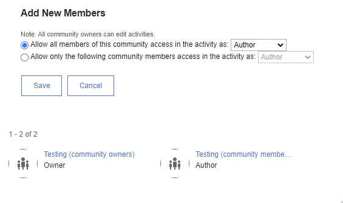                  | Role is `Owners & Authors` as per above 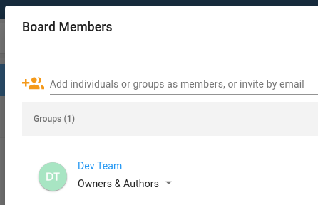     |
| Members are Readers 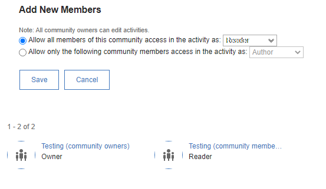                  | Role is `Owners & Readers` as per above 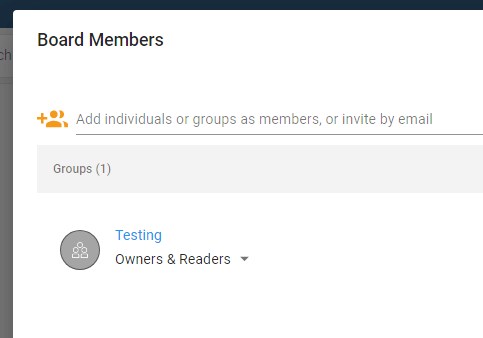     |
| As above, with users specified 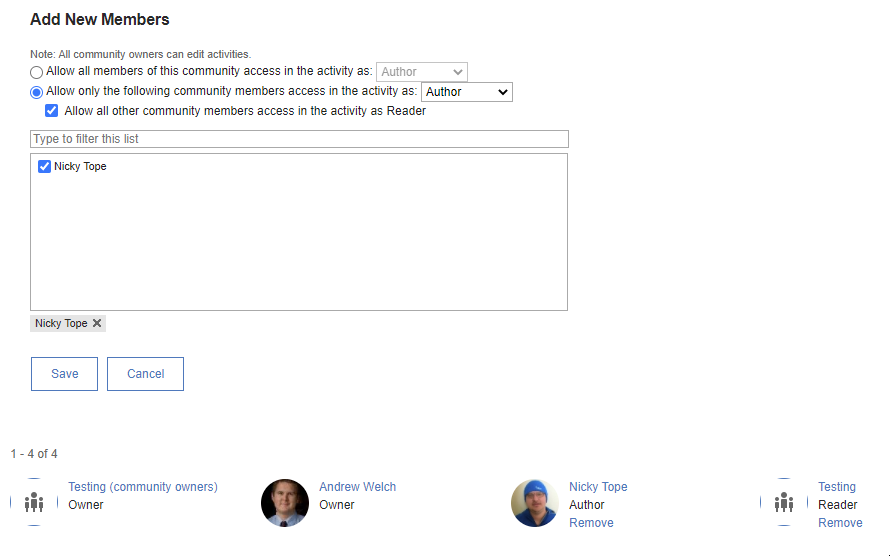 | Each user is migrated with their role 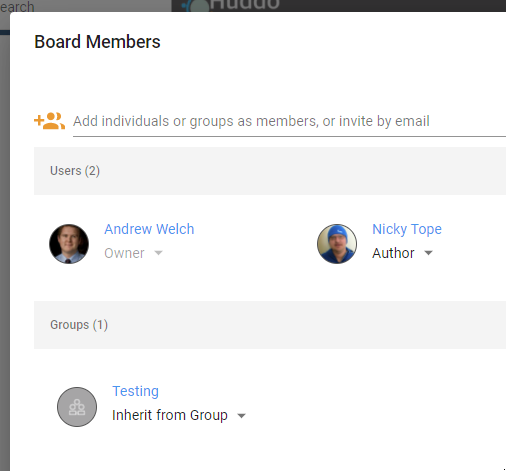 |
| Members have NO access 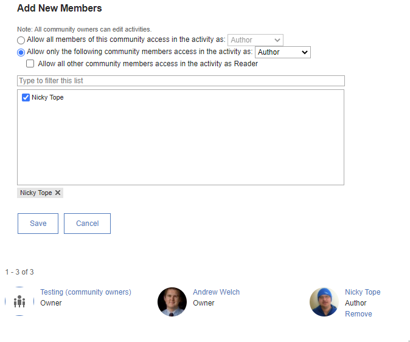                 | Role is `Community Owners Only` as per above 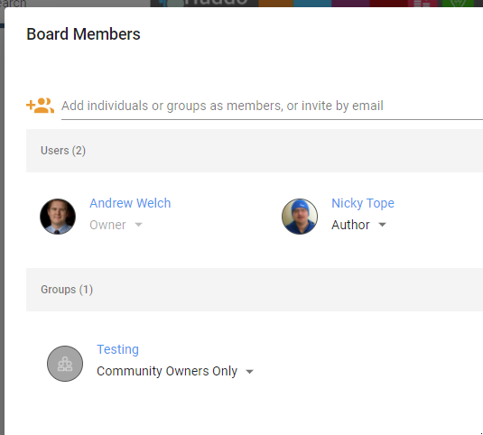  |

### Standalone Activity

| Activities                                | Boards                                 |
| ----------------------------------------- | -------------------------------------- |
| 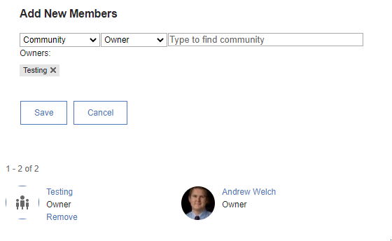 | 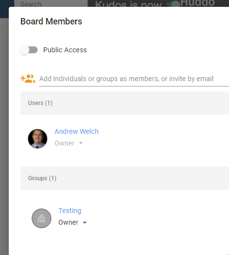 |
