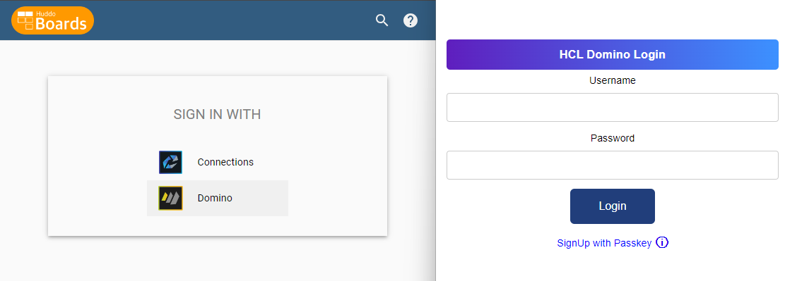
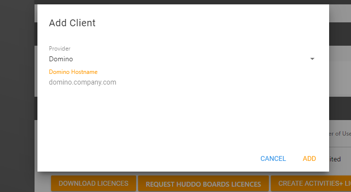

# Boards for HCL Domino (REST API)

Huddo Boards supports authentication, user and group lookup with HCL Domino.

---

!!! question "Using the old Proton configuration?"

    See our [migration guide](./migration/index.md).

---

## Prerequisites

1. [Domino REST API](https://opensource.hcltechsw.com/Domino-rest-api/tutorial/installconfig/index.html) installed and configured. Ensure you [setup the oauth.json](https://opensource.hcltechsw.com/Domino-rest-api/howto/VoltMX/configuring-keep-idplite-with-identity-service.html?h=oauth.json#set-up-domino-rest-api) file.
1. Enabled access to [names.nsf](https://opensource.hcltechsw.com/Domino-rest-api/howto/database/excludeddb.html?h=names.#procedure)

## Setup

1.  Configure OAuth

    **URLs**

    For an on premise installation the callback url & startup page is simple:

        https://<BOARDS_URL>/auth/domino/callback
        https://<BOARDS_URL>/auth/domino

    For example:

        https://boards.your.domain.com/auth/domino/callback
        https://boards.your.domain.com/auth/domino

        // if you have a context root (i.e. you would access boards application at /boards)
        https://your.domain.com/boards/auth/domino/callback
        https://your.domain.com/boards/auth/domino

    Please determine the URL for your environment and then [follow this guide](./oauth/index.md).

1.  [Configure Schema](./schema/index.md)

1.  [Configure Scope](./scope/index.md)

## Licence

Huddo Boards requires a licence key from the [Huddo Store](https://store.huddo.com). For more details [see here](../store/index.md).

1.  Register your account
1.  Create your Organisation
1.  Add client details for your Domino server

    

1.  Download licence key - this will be used in the environment variable `licence.env.LICENCE`

## Deployment

1. Deploy Boards using the [Domino values](../env/common.md#hcl-domino) in either:

    - [Kubernetes](../kubernetes/index.md) or
    - [Docker](../aio/index.md)
