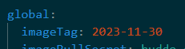
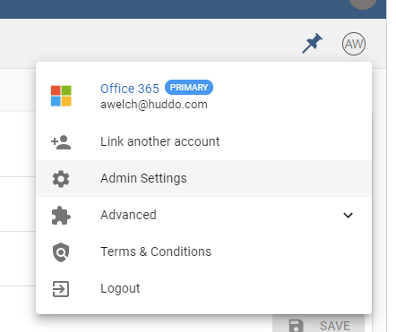
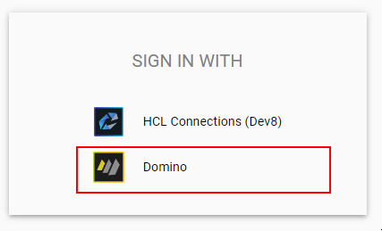

# Migration from Domino Proton to REST API

## Prerequisites

1. [Domino REST API](https://opensource.hcltechsw.com/Domino-rest-api/tutorial/installconfig/index.html) installed and configured. Ensure you [setup the oauth.json](https://opensource.hcltechsw.com/Domino-rest-api/howto/VoltMX/configuring-keep-idplite-with-identity-service.html?h=oauth.json#set-up-domino-rest-api) file.
1. Enabled access to [names.nsf](https://opensource.hcltechsw.com/Domino-rest-api/howto/database/excludeddb.html?h=names.#procedure)
1. Configured [Boards OAuth client](../on-prem.md)
1. Check Release date

    Ensure you are running images after 30 November 2023

    

## Migration Steps

### Edit Domino Client

!!! danger

    This step must be performed before any user tries to login with the new Domino OAuth client to ensure you maintain ownership of the current Boards data.

1.  Open `Admin Settings`, then your organisation

    

    

1.  Open Domino client

    

1.  Edit Domino client

    !!! tip

        Save a copy of the old values in case you need to reverse the changes.

    Change the old Proton values to new Domino REST API values [as configured](../oauth/index.md)

    |                                            | Comment                                                                                                           |
    | ------------------------------------------ | ----------------------------------------------------------------------------------------------------------------- |
    | **Domino URL**                             | `https://<NEW_DOMINO_REST_API>`                                                                                   |
    | **ExternalId**                             | base64 encoded value of the hostname part of Domino URL (this is automatically set when you change Domino URL) |
    | **Global OAuth**                           | ensure this box is checked                                                                                        |
    | **Domino Hostname - PROTON ONLY (LEGACY)** | delete this value - it must be empty to enable the new REST API functionality.                                    |

    For example:

    

    Click `Save`

### Deploy OAuth

1.  Open the `boards.yaml` configuration file which you have deployed
1.  Set environment variables for the user service as follows (substituting the values above)

        user:
            env:
                DOMINO_AUTH_URL: https://<NEW_DOMINO_REST_API>
                DOMINO_CLIENT_ID: <CLIENT_ID>
                DOMINO_CLIENT_SECRET: <CLIENT_SECRET>
                DOMINO_USE_PROFILE_IMAGE_ATTACHMENTS: 'true'

1.  Run your deploy command (e.g. `helm upgrade...`, `docker compose up`)

### Validation

!!! warning

    We recommend you perform the validation steps below in a new Incognito window (or different browser) to test without logging out of your existing session. This way you can reverse the client changes in your existing session if required.

1.  Open a new Boards session

    Click `Domino`

    

1.  Enter your credentials for the new REST API

    

1.  Once Authenticated, you should see the approval request

    Click `Allow`

    
