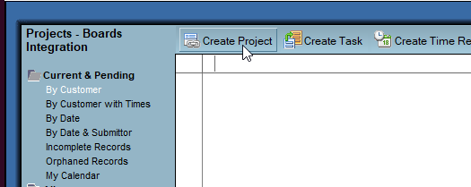

# Create board tasks from HCL Notes - Demo/Example

Use this Notes database as a example of how to create a task in Huddo Boards from a Notes document/form.
This is a copy of ISW's internal Projects Notes database, with a new action button added to the Task form.
This action will use the Huddo Boards API to create a task in a board.

Download [projects_boards_integration_demo.nsf](../../../assets/boards/projects_boards_integration_demo.nsf)

The database is empty and has manager access by default. You will need to create a configuration doc as a first step.

1. Open the database in HCL Notes.

1. Create a new configuration document in the database:

    1. Click the `Actions` menu at the top, then `Configuration`.

    

    The fields you need to set are highlighted below:

    

    1. **Boards API URL** - leave this as the default to use the Boards Cloud API

    1. **API Token** - Get your Boards API token by following the instructions [here](../../../../boards/api/#authentication).

    1. **Board ID** - The ID of the board you want to create the task in. I have created a public (for ISW Organisation in Connections) board here for my testing - [Notes Integration Test](https://boards.huddo.com/board/68c369bfdb11358248324102/kanban). If you can't access this board, create or open your own board and copy the board ID from the URL:
       

    1. **List ID** - The ID of the board list you want to create the task in. To get this:

        1. Click `More Options` on the list you want:

            

        2. Click `Show Details`:

            

        3. Copy the List ID from the URL:

            

    1. **Boards URL** - The Huddo Boards app URL (https://boards.huddo.com for Boards Cloud). This is used for linking to the created tasks.

    1. Click `Save` to save the configuration document.

1. Before you can create a Task document in Projects, you will first need to create a Project.

    1. Click the `Create Project` button:

        

    1. Ensure you enter a description and hourly rate:

        

    1. Click `Save` to save the project.

1. Ensure your project is selected in the view, then click the `Create Task` button:

    

1. Enter a task description and click `Save`:

    

1. Now you can click the `Create task in Huddo Boards` button to create the task in Huddo Boards, using the description as the task title:

    

1. Your Boards task should now be created using an API call to Boards. If successful you should see this dialog, with links to the board and task:

    

1. When you reopen the project task, you should see a Huddo Boards logo and a link to the boards task:

    
