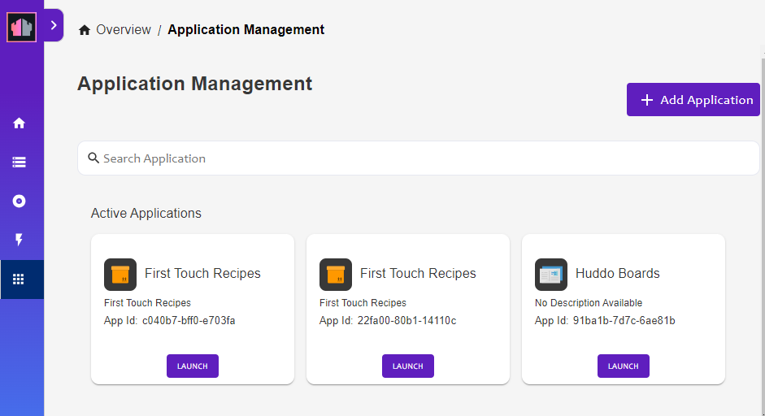
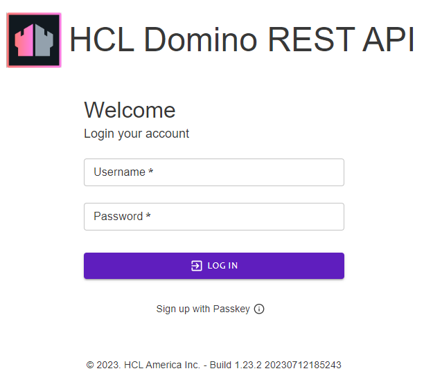
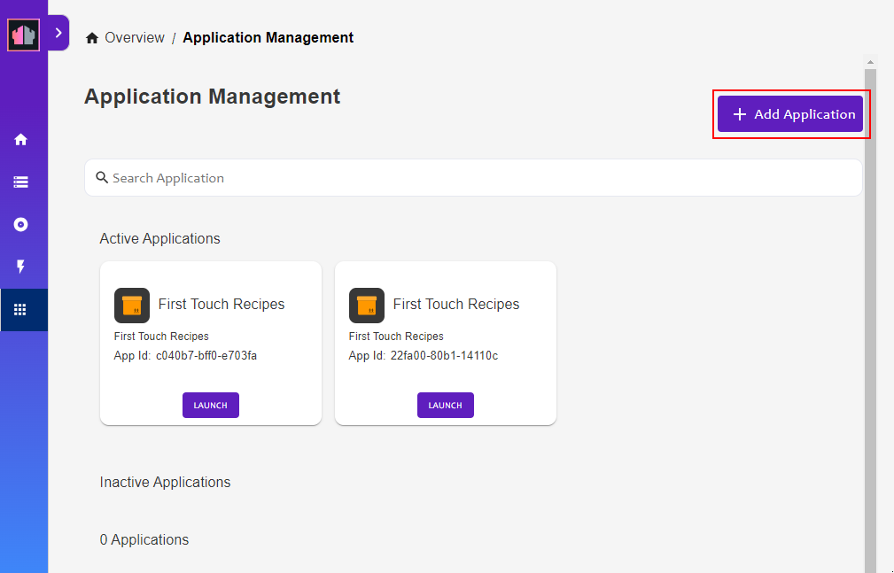
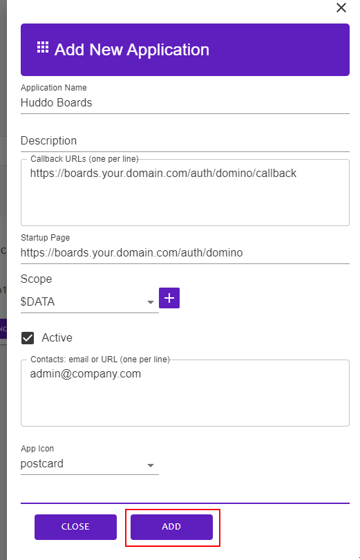
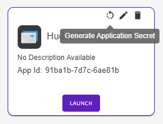

# Configure Domino OAuth

This guide will describe how to add a new OAuth application for Boards users to login via Domino.

## Steps

1.  Open the REST API and click `Configuration`

    

1.  Login

    

1.  Click `Application Management - OAUTH`

    

1.  Click `Add Application`

    

1.  Enter the following details and click `ADD`

    Determine the appropriate URL for your environment as per [our guide](../callback.md).

    - Application Name: `Huddo Boards`
    - Callback URL, e.g.

            https://<ON_PREM_BOARDS_URL>/auth/domino/callback
            https://boards.huddo.com/auth/domino/[encoded domain]/callback

    - Startup Page, e.g.

            https://<ON_PREM_BOARDS_URL>/auth/domino
            https://boards.huddo.com/auth/domino/[encoded domain]

    - Scope: `$DATA` (click `+` icon)
    - Contacts: `<YOUR_EMAIL>`

    

1.  Click the `generate application secret` icon.

    

1.  Copy both the `App Id` and `App Secret`

    These will be referred to later as `CLIENT_ID` and `CLIENT_SECRET`
