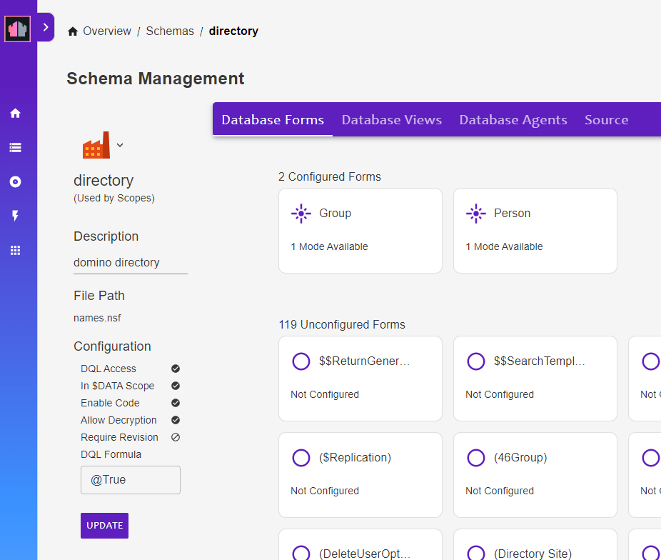
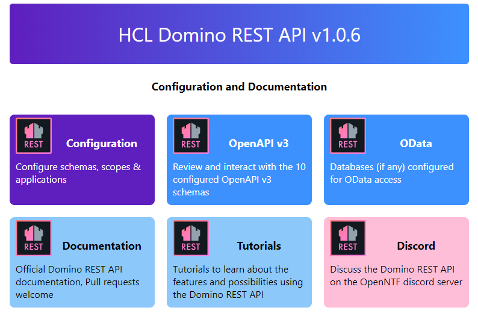
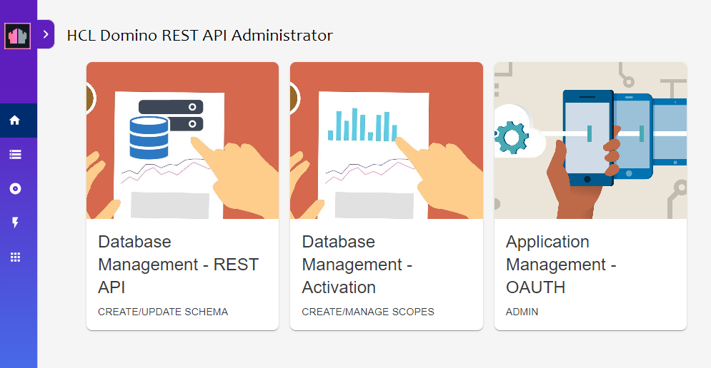
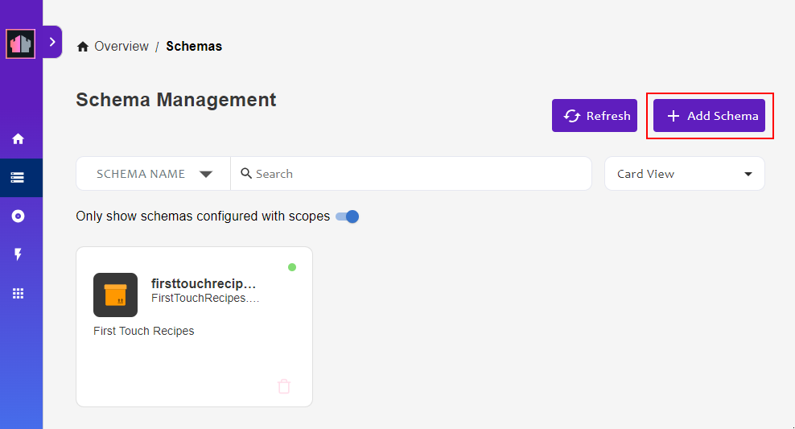
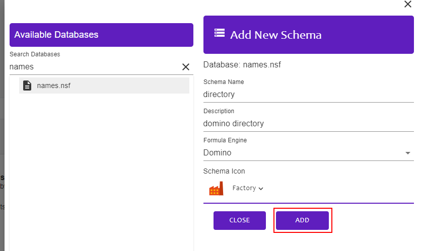
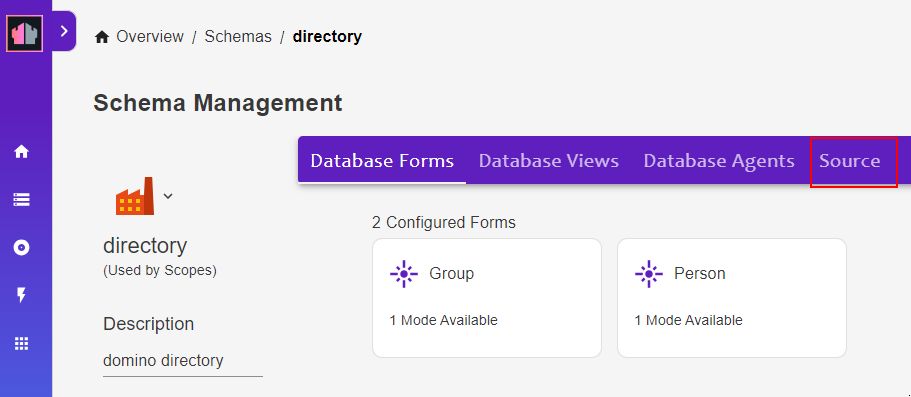

# Configure Domino Schema

This guide will describe how to add a new Schema called `directory` to access the `names.nsf` database. Boards uses the `$Users` & `$Groups` views of this database. This section will configure the database forms.

## Steps

1.  Open the REST API and click `Configuration`

    

1.  Click `Database Management - REST API`

    

1.  Click `Add Schema`

    

1.  Enter the following details and click `ADD`

    !!! tip
        If you cannot see `names.nsf` in the list, please see the [HCL documentation](https://opensource.hcltechsw.com/Domino-rest-api/howto/database/excludeddb.html?h=names.#procedure)

    - Search Databases for `names.nsf` and click it
    - Schema Name: `directory`
    - Description: `domino directory`
    - Formula Engine: `names.nsf`

    

1.  Open the new Schema and click the `Source` tab

    

1.  Download [this file](./schema.json) and paste the contents into the editor

    