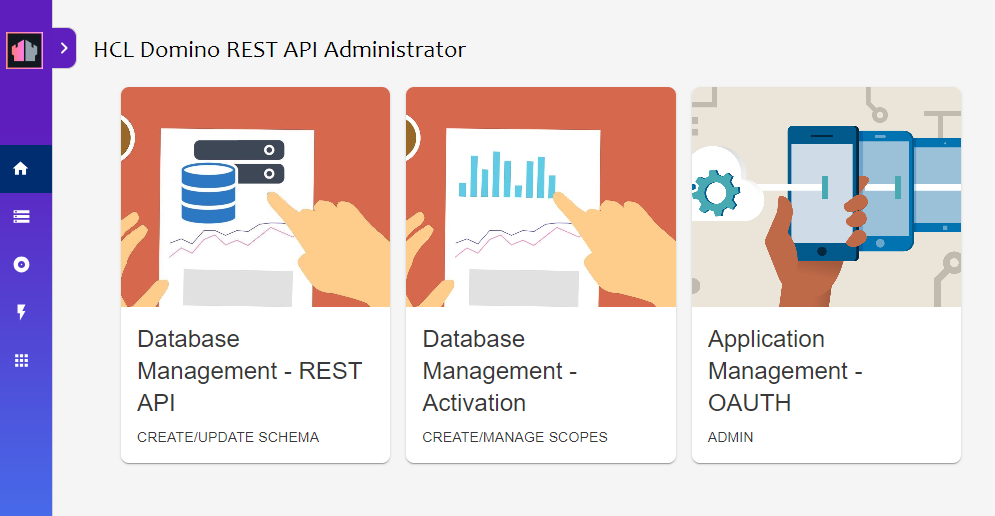

# Configure Domino Scope (REST API)

This guide will describe how to add a new Scope called `directorylookup` to allow reader access to the `names.nsf` database. Boards uses the `$Users` & `$Groups` views of this database.

## Steps

1.  Open the REST API and click `Configuration`

    

1.  Click `Database Management - REST API`

    

1.  Click the `Scopes` icon in the right menu, click `Add Scope`

    

1.  Enter the following details and click `ADD`

    -   Expand the Schemas => `names.nsf`. Click `directory`
    -   Scope Name: `directorylookup`
    -   Description: `Directory Lookup`
    -   Maximum Access Level: `Reader`

    
