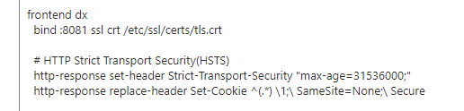

# Allow SSO for Boards

!!! tip

    This task is only required if Boards is hosted on a different domain to HCL DX

## Steps

Complete the following steps for your applicable Proxy Server

### haproxy

Edit the `haproxy.cfg` configuration using the following command

    kubectl edit configmap <DX_DEPLOYMENT>-haproxy -n <DX_NAMESPACE> -o yaml

For example:

    kubectl edit configmap hcl-dx-dev1-haproxy -n hcl-dx-dev1 -o yaml

Add the following line

    http-response replace-header Set-Cookie ^(.*) \1;\ SameSite=None;\ Secure

For example:

### httpd

Edit the `httpd.conf` configuration file to include the following:

    Header edit Set-Cookie ^(.*)$ "$1; Secure; SameSite=None"
