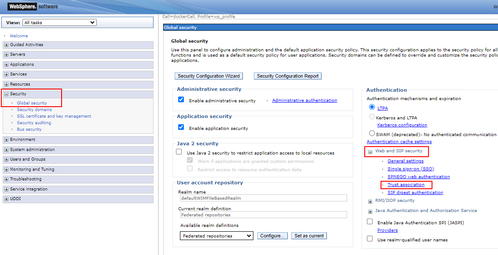
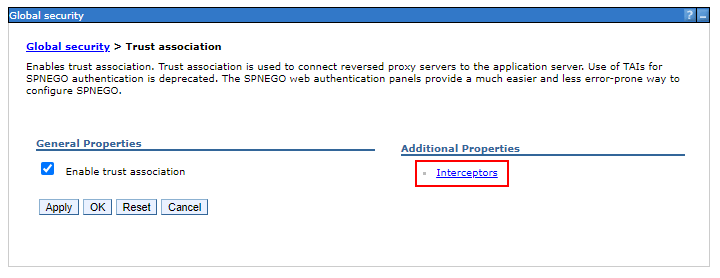
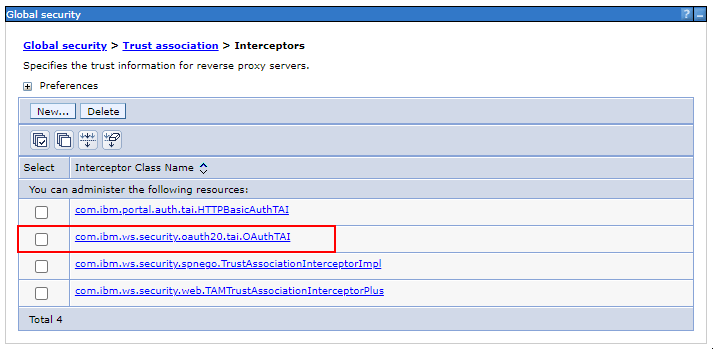
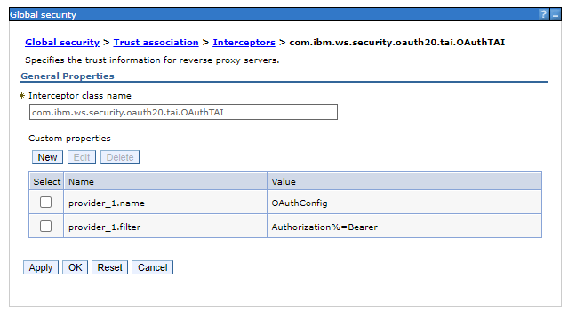

# WebSphere OAuth Config

OAuth must be configured in IBM WebSphere for Boards to authenticate with HCL DX.

!!! tip

    Remember to replace `<username>` & `<password>` with valid credentials

Connect to the core server, e.g on Kubernetes:

    kubectl exec -it hcl-dx-dev1-core-0 core -n hcl-dx-dev1 -- sh

## Create Service Provider

!!! note

    This step is based on the [IBM WebSphere documentation - Creating an OAuth service provider](https://www.ibm.com/docs/en/was/9.0.5?topic=services-creating-oauth-service-provider).

1.  Create the OAuth provider by using the wsadmin utility

        cd /opt/HCL/AppServer/bin
        ./wsadmin.sh -lang jython -username <username> -password <password>

        AdminTask.createOAuthProvider('[-providerName <OAuthProviderName> -fileName <ProviderConfigFile>]')

    Where:

    -   `<OAuthProviderName>` is the OAuth provider name (typically `OAuthConfig`)
    -   `<ProviderConfigFile>` is the full path to the OAuth provider configuration file. There should be a default file called `OAuthConfigSample.xml` in the `<app_server_root>/properties` directory. Please confirm the location of this file on your system.

    For example:

        AdminTask.createOAuthProvider('[-providerName OAuthConfig -fileName /opt/HCL/AppServer/properties/OAuthConfigSample.xml]')
        AdminConfig.save()
        quit

    This should copy the configuration file to `<was_profile_root>/config/cells/<cell_name>/oauth20`

    Please confirm this file exists, e.g. `/opt/HCL/wp_profile/config/cells/dockerCell/oauth20/OAuthConfig.xml`

1.  Enable Auto Authorize

    Edit the `OAuthConfig.xml` file which was just created. For a full list of supported options see the [IBM WebSphere documentation](https://www.ibm.com/docs/en/was/9.0.5?topic=services-defining-oauth-service-provider).

    `vi <was_profile_root>/config/cells/<cell_name>/oauth20`

    For example:

    `vi /opt/HCL/wp_profile/config/cells/dockerCell/oauth20/OAuthConfig.xml`

    Add/update the following parameters:

        <parameter name="oauth20.autoauthorize.param" type="ws" customizable="false">
            <value>autoauthz</value>
        </parameter>
        <parameter name="oauth20.autoauthorize.clients" type="ws" customizable="true">
            <value>huddoboards</value>
        </parameter>

1.  Restart the WebSphere Application Server

        cd /opt/HCL/AppServer/bin
        ./stopServer.sh WebSphere_Portal -profileName wp_profile -username <username> -password <password>
        ./startServer.sh WebSphere_Portal -profileName wp_profile

### Configure TAI properties

1.  Open the ISC

    Click `Global security`, expand `Web and SIP security`, click `Trust association`

    

1.  Click `Interceptors`

    

1.  Ensure that `com.ibm.ws.security.oauth20.tai.OAuthTAI` exists

    

    If not, click `New` enter the Interceptor class name `com.ibm.ws.security.oauth20.tai.OAuthTAI`, and click `OK`

1.  Update the custom properties to match:

        provider_1.name=OAuthConfig
        provider_1.filter=Authorization%=Bearer

    For example:

    

## Register OAuth Client

!!! note

    This step is based on the [IBM WebSphere documentation - Creating an OAuth service provider](https://www.ibm.com/docs/en/was/9.0.5?topic=services-creating-oauth-service-provider).

1.  Copy default client definitions

        cp <app_server_root>/properties/base.clients.xml <was_profile_root>/config/cells/<cell_name>/oauth20oauth20/

    For example:

        cp /opt/HCL/AppServer/properties/base.clients.xml /opt/HCL/wp_profile/config/cells/dockerCell/oauth20/

1.  Edit file to include Huddo Boards client

    `vi /opt/HCL/wp_profile/config/cells/dockerCell/oauth20/base.clients.xml`

        <client id="huddoboards" component="<OAUTH_PROVIDER_NAME>" secret="<OAUTH_SECRET>" displayname="Huddo Boards" redirect="https://<BOARDS_URL>/auth/dx/<BASE_64_ENCODED_DX_HOSTNAME>/callback" enabled="true">
        </client>

    Where:

    -   `<OAUTH_PROVIDER_NAME>` is the name of the Provider specified above, typically `OAuthConfig`
    -   `<OAUTH_SECRET>` is a complex, random secret, e.g. a [UUID](https://www.uuidgenerator.net/). This will be required later.
    -   `<BOARDS_URL>` is the URL of the Boards deployment, e.g. `company.example.com/boards` or `boards.company.com`
    -   `<BASE_64_ENCODED_DX_HOSTNAME>` is a base64(dx-hostname) encoded string

    For example:

        <client id="huddoboards" component="OAuthConfig" secret="a2e3d8c3-7875-4512-a0da-8b5fd61f2245" displayname="Huddo Boards" redirect="https://boards.huddo.com/auth/dx/ZHguY29tcGFueS5jb20=callback" enabled="true">
        </client>

## Install OAuth Application

!!! note

    This step is based on the [IBM documentation - Enabling your system to use the OAuth 2.0 feature](https://www.ibm.com/docs/en/was/9.0.5?topic=services-enabling-your-system-use-oauth-20-feature).

1.  Install the OAuth 2.0 service provider application

        cd /opt/HCL/AppServer/bin
        ./wsadmin.sh -f ./installOAuth2Service.py install dockerNode WebSphere_Portal -profileName wp_profile -username <username> -password <password>

1.  Enable OAuth 2.0 TAI

        cd /opt/HCL/AppServer/bin
        ./wsadmin.sh -lang jython -username <username> -password <password>
        AdminTask.enableOAuthTAI()
        AdminConfig.save()
        quit

1.  Restart the WebSphere Application Server

        cd /opt/HCL/AppServer/bin
        ./stopServer.sh WebSphere_Portal -profileName wp_profile -username <username> -password <password>
        ./startServer.sh WebSphere_Portal -profileName wp_profile

---

## Troubleshooting

**Issue**: SSL Error

    ServletWrapper service CWSRV0014E: Uncaught service() exception root cause OAuth20EndpointServlet: javax.net.ssl.SSLHandshakeException: com.ibm.jsse2.util.j: PKIX path building failed: com.ibm.security.cert.IBMCertPathBuilderException: unable to find valid certification path to requested target

**Resolution**: Import the self-signed certificate into the WebSphere ISC
