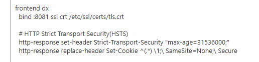

# Boards for HCL DX

## Prerequisites

1.  HCL DX environment
1.  Kubernetes environment
1.  `kubectl` installed & authenticated

## WebSphere OAuth Config

Please follow the instructions in [WebSphere OAuth Config](./oauth/websphere.md)

## Install Boards portlet

Please follow the instructions in [Install Boards portlet](./portlet/index.md)

### Allow SSO inside Boards frame

Edit the config to include the following,

1.  haproxy.cfg

    Edit the config using the following command

    `kubectl edit configmap <DX_DEPLOYMENT>-haproxy -n <DX_NAMESPACE> -o yaml`

    For example:

    `kubectl edit configmap hcl-dx-dev1-haproxy -n hcl-dx-dev1 -o yaml`

    Add the following line

        http-response replace-header Set-Cookie ^(.*) \1;\ SameSite=None;\ Secure

    For example:

    

1.  httpd.conf

        Header edit Set-Cookie ^(.*)$ "$1; Secure; SameSite=None"
