# Boards Portlet

## Overview

The steps below install the Boards Portlet as an application in DX.

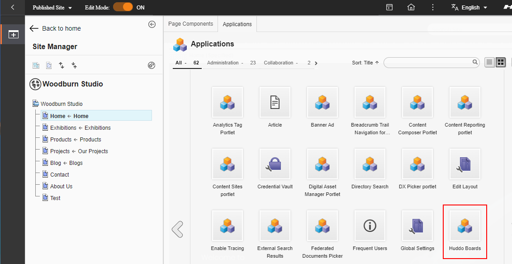

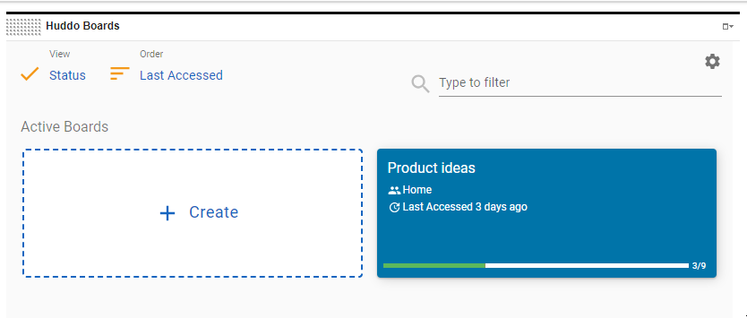

## Steps

To install the Huddo Boards portlet, follow these steps:

### Install

1. Download the [Boards Portlet WAR file](./boards-portlets.war)

1. Open the DX `Administration` => `Web Modules`. Select the war file and click `Next`

    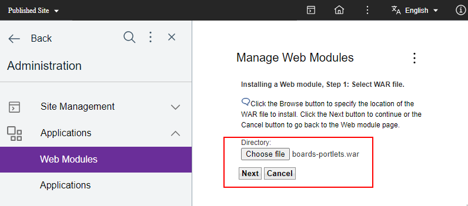

1. Click `Finish` to complete the installation

    

### ACL

#### Web Module

1. Find the newly installed `Boards` portlet, click `Assign access to Web module`

    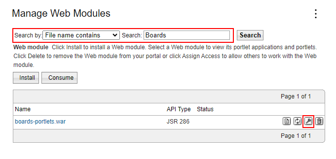

1. Click `User` => `Edit Role`

    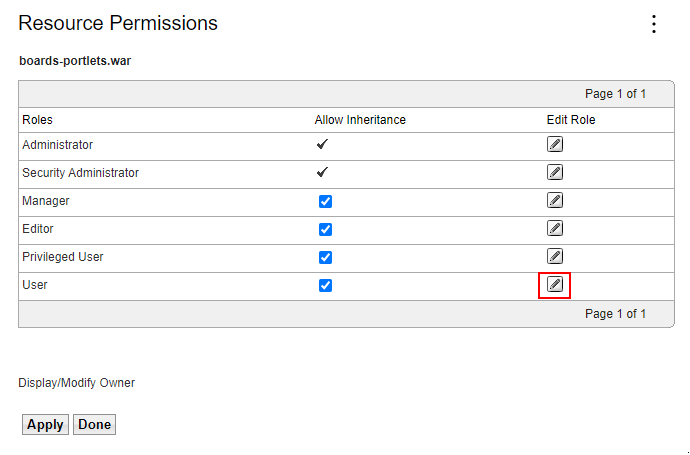

1. Click `Add`

    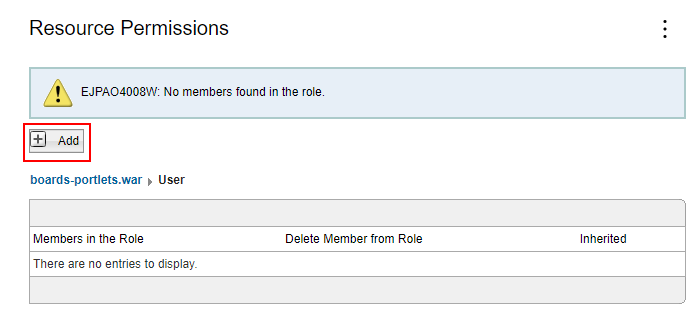

1. Check `All Authenticated Portal Users` and click `OK`

    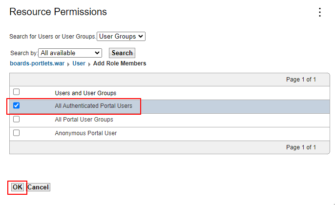

#### Application

1. Open `Applications`, search by title for `boards`, click `Assign access to Web module`

    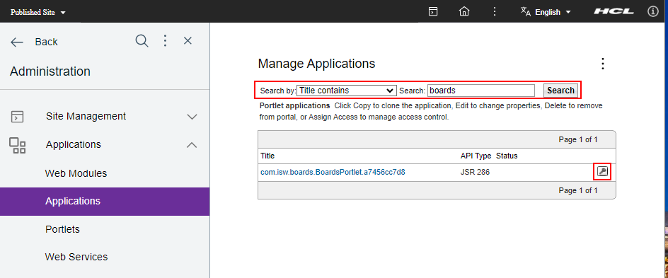

1. Click `User` => `Edit Role`

    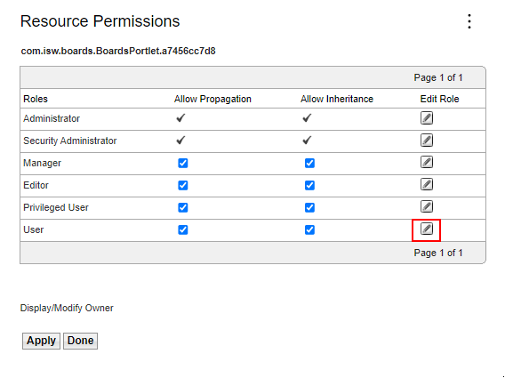

1. Click `Add`

    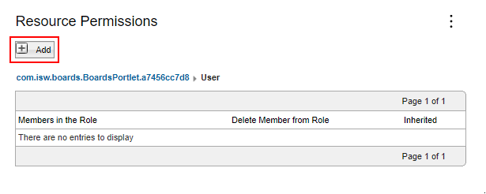

1. Check `All Authenticated Portal Users` and click `OK`

    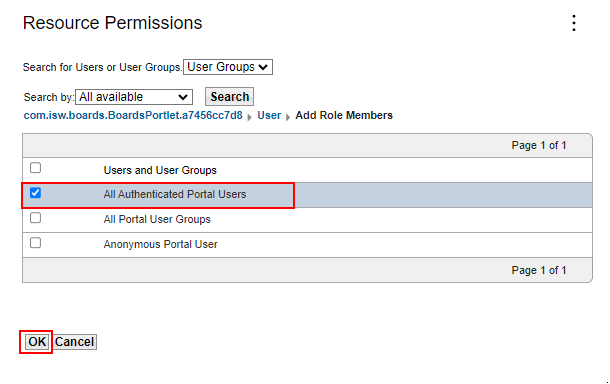

### Configure

1. Open the `Portlets` page, find Huddo Boards, click `Configure Portlet`

    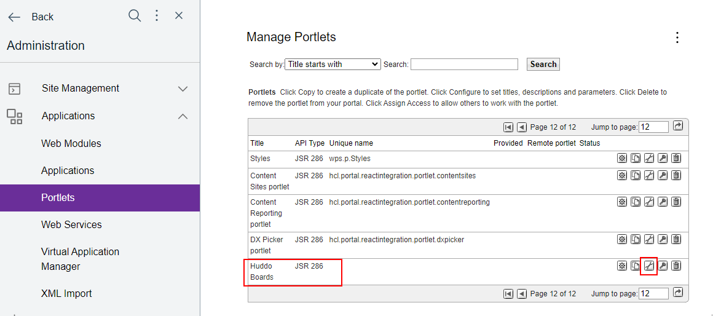

1. Edit the cfg.BaseURL to `https://<BOARDS_URL>`.

    For example:

    - `https://boards.company.com` or
    - `https://company.example.com/boards`
    - `https://boards.huddo.com` (hybrid customers)

    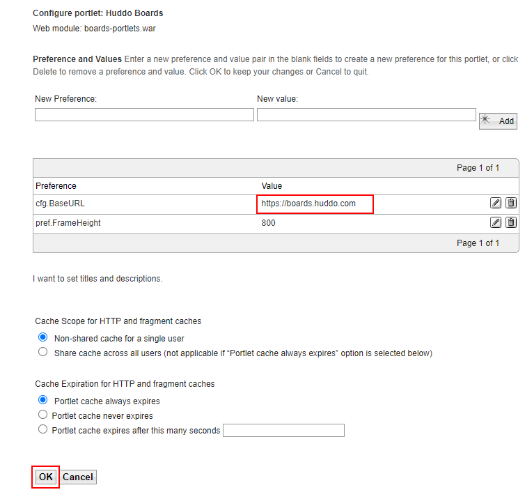

    Click `OK`

1. The `Huddo Boards` Portlet should now be accessible at

    `Edit mode` => `Add` => `Applications`

    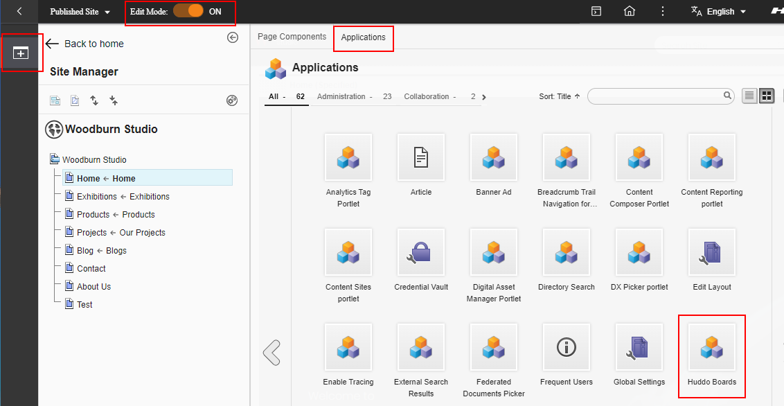

1. Add it to any page to get started!

    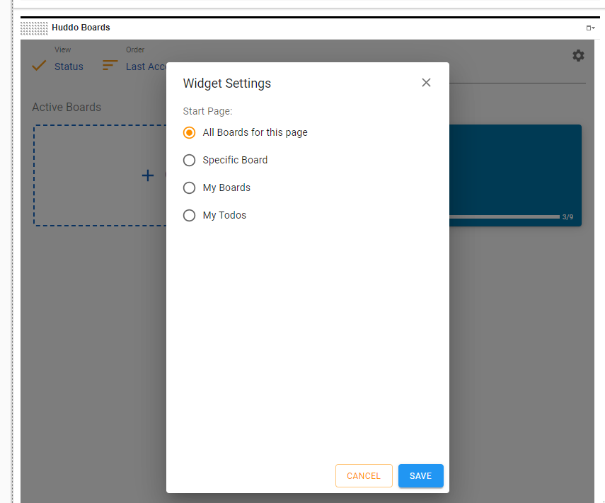
