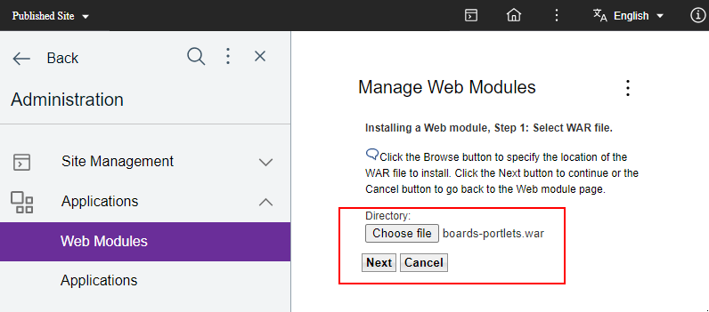
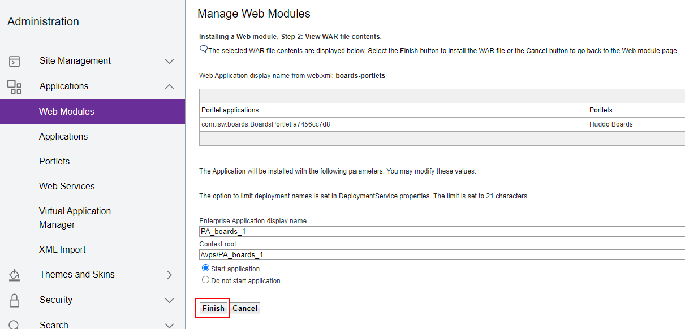
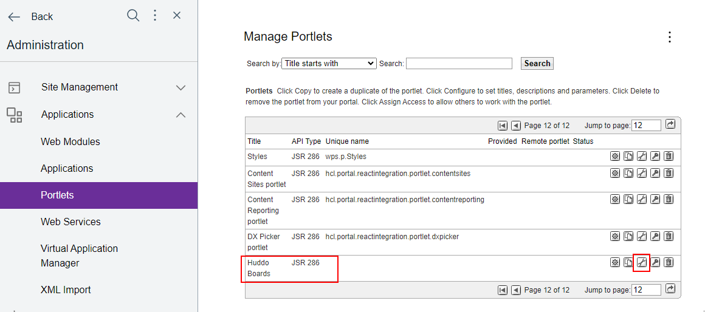

# Boards Portlet

## Overview

The steps below install the Boards Portlet as an application in DX.

## Steps

To install the Huddo Boards portlet, follow these steps:

1. Download the [Boards Portlet WAR file](./boards-portlets.war)

1. Open the DX `Administration` => `Web Modules`. Select the war file and click `Next`

    

1. Click `Finish` to complete the installation

    

1. Open the `Portlets` page, find Huddo Boards, click `Configure Portlet`

    

1. Edit the cfg.BaseURL to `https://<BOARDS_URL`.

    For example `https://boards.company.com` or `https://company.example.com/Boards`

    

    Click OK

1. The `Huddo Boards` Portlet should now be accessible under `Edit mode` => `Add` => `Applications`

    

1. Add it to any page to get started!

    
