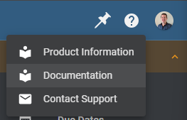
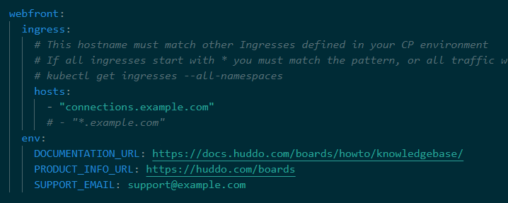

# Customise Help Links

You can customise the help links that appear in the header of the Boards application.

---

The following `webfront` environment variables are used to customise the help links:

| Variable            | Default                                              | Description                          |
| ------------------- | ---------------------------------------------------- | ------------------------------------ |
| `DOCUMENTATION_URL` | `https://docs.huddo.com/boards/howto/knowledgebase/` | URL of the documentation             |
| `PRODUCT_INFO_URL`  | `https://huddo.com/boards`                           | URL of the product information page  |
| `SUPPORT_EMAIL`     | `support@example.com`                                | Email address of the support contact |

For example:

