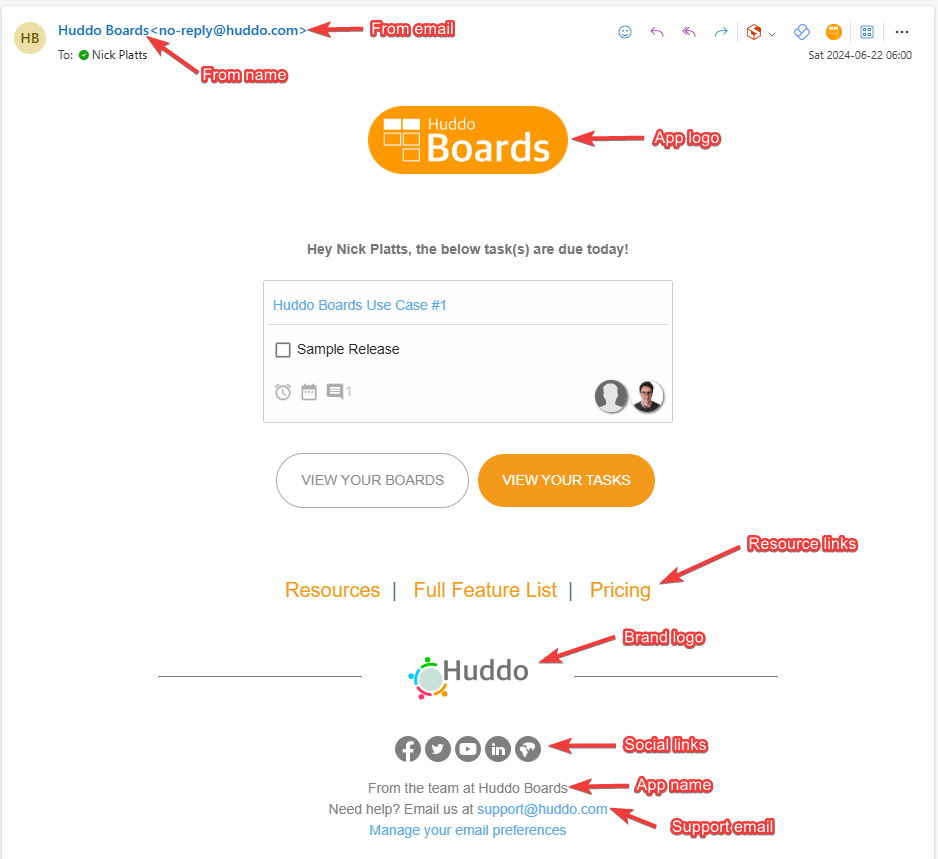

The notifications sent out from Huddo Boards can be customised to include company logos, links and support email addresses. 
The custom values are set as ENV variables in the config file.


The image below shows the items that can be customised within notifications:
<br/>



### From Name
Use `events.env.NOTIFIER_EMAIL_FROM_NAME` to set the from name for emails <br/>Default: `Huddo Boards`

### From Email
Use `events.env.NOTIFIER_EMAIL_FROM_EMAIL` to set the sent from email address <br/>Default: `no-reply@huddo.com`

### App Logo
Specify a URL to point to a hosted logo image by specifying `events.env.APP_LOGO_URL` in the config. 
For example: `https://company.com/assets/logo.png`


Note that an inline base64 encoded data URL can also be used for this variable.

### Brand Logo
Specify a URL to point to a hosted logo image by specifying `events.env.BRAND_LOGO_URL` in the config. 
For example: `https://company.com/assets/logo.png`

Note that an inline base64 encoded data URL can also be used for this variable.

### Social Links
The links below the brand logo can be customised. These do not necessarily need to be displayed as images/icons and can be text based links.

The standard/default Huddo social links can be replaced by setting the `events.env.SOCIAL_LINKS` variable. Specifying an empty array will remove all social links.

The links are specified in a JSON array of objects with the format:
```json
 {
  name: "Link Name/Text", 
  link: "Link URL", 
  icon: "(Optional) Hosted Icon URL or data URL"
}
```

e.g.:
```json
"[{\"name\": \"Intranet\",\"link\":\"https://company.com/intranet/\"}, 
  { \"name\": \"Support\", \"link\": \"https://company.com/support\", 
    \"icon\": \"https://company.com/assets/support_icon.png\"}]"
``` 

### App Name
Use `events.env.APP_NAME` to specify the app name.<br/>Default: `Huddo Boards`

### Support Email
The support email address can be specified in `events.env.NOTIFIER_EMAIL_SUPPORT_EMAIL`<br/>Default: `support@huddo.com`

## Email Config Example (YAML)
```yaml
events:
  env:
    NOTIFIER_EMAIL_FROM_NAME: My Company
    NOTIFIER_EMAIL_FROM_EMAIL: boards@company.com
    APP_LOGO_URL: https://company.com/assets/company_logo.png
    BRAND_LOGO_URL: https://company.com/assets/logo.png
    SOCIAL_LINKS: "[{\"name\": \"Intranet\",\"link\":\"https://company.com/intranet/\"}, { \"name\": \"Support\", \"link\": \"https://company.com/support\", 
    \"icon\": \"https://company.com/assets/support_icon.png\"}]"
    APP_NAME: Boards for My Company
    NOTIFIER_EMAIL_SUPPORT_EMAIL: support@company.com
```
