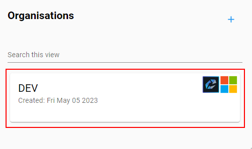
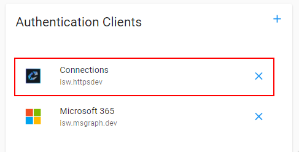
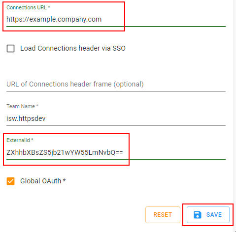
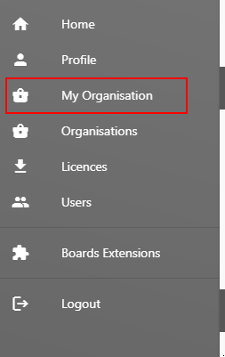
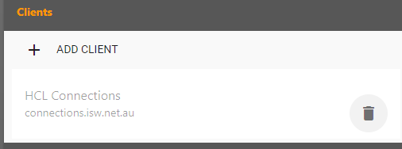
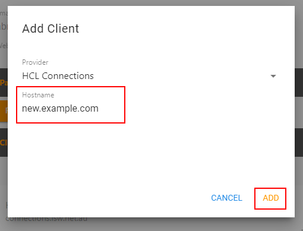
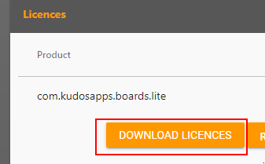
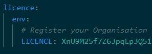

# Changing Domain/URL

If you need to change the URL of the provider you login to Huddo Boards with (and possibly your Huddo Boards deployment along with it), you must perform the following steps **in order** to maintain access to existing content:

1. Update the client definition by the admin UI or database
1. Obtain updated licence
1. Update the YAML configuration
1. Deploy the changes

## Client Definition

!!! warning

    This step must be performed before updating the licence and YAML configuration. Otherwise you may end up with duplicate clients in the licence and/or configuration.

### via the admin UI

!!! tip

    If the deployment is still accessible, use this method to change the URL

1.  Log in to your Huddo Boards deployment as an administrator

1.  Click on the `Admin Settings` icon in the top right menu

    

1.  Click on your Organisation

    

1.  Click on the Client (authentication provider) you are changing

    

1.  Update the URL to the new URL. This is labelled slighlty differently depending on the provider, e.g. `Connection URL`, `Domino URL`, `DX URL` etc.

    Click `Save` to apply the changes

    !!! note

        This should be automatically reflected in the `ExternalId` as `<base64(new-url-hostname)>`

    

### via the database

!!! tip

    If the deployment is no longer accessible, use this method to change the URL by updating the database directly

1.  Follow [this guide](../../troubleshooting/mongo.md) to access the database for your Huddo Boards deployment
1.  Switch to the user database

        use boards-user

1.  Update the client url & externalId

        db.clients.update({ 'oAuth.baseURL': 'https://<OLD_URL>'}, { $set: { 'oAuth.baseURL' : 'https://<NEW_URL>', externalId: '<BASE_64_ENCODED_NEW_URL_HOSTNAME>'}})

    Where:

    -   `<OLD_URL>` is the old URL of your deployment
    -   `<NEW_URL>` is the new URL of your deployment
    -   `<BASE_64_ENCODED_NEW_URL_HOSTNAME>` is the [base64 encoded](https://www.base64encode.org/) hostname of the new URL of your deployment

        !!! warning

            Ensure you only encode the hostname, not the full URL. For example if your `https://new-url.com` would mean encoding just `new-url.com`, which equals `bmV3LXVybC5jb20=`

## Licence

After updating the URL in the Client, you also need to update the licence to reflect the new URL:

1. login to the [Huddo Store](https://store.huddo.com)
1. open your Organisation definition

    

1. delete the client for the old URL

    

1. add a new client for the new URL

    

1. download the updated licence file

    

1. copy the licence key from the new licence file to the `licence.env.LICENCE` field

    

## YAML Config

Please review the [configuration](../../env/common.md) documentation for variables which need to be updated. For example:

-   `global.env.APP_URI`
-   `global.env.API_GATEWAY`
-   `webfront.ingress.hosts`
-   `core.ingress.hosts`
-   `user.env.CONNECTIONS_URL` | `user.env.DOMINO_AUTH_URL` | `user.env.DX_URL`

!!! tip

    You may also need to update the callback URL defined in your [authentication provider](../../kubernetes/index.md#oauth).

## Deploy

After updating the configuration, you need to deploy the changes to your Huddo Boards deployment. This can be done as per the [How To Update](../../releases.md#how-to-upgrade) process.

## Troubleshooting

If you have any issues with this process, please contact [Huddo Support](mailto:support@huddo.com) for assistance.
