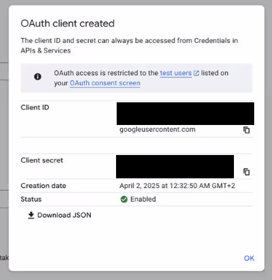

# Google OAuth Configuration

1.  Open [Google Credentials](https://console.cloud.google.com/apis/credentials)

1.  Click `Create credentials` > `OAuth client ID`

    

1.  Select **Web application** and enter applicable details for your instance of Huddo Boards

    -   Name: `Huddo Boards`
    -   Authorized JavaScript origins: `https://boards.company.com`
    -   Authorized redirect URIs: `https://boards.company.com/auth/google/callback`

        

1.  Click `Create`

1.  Copy the `Client ID` and `Client secret`

    

1.  Add the values to your boards.yaml config file;

    ```yaml
    user:
        env:
            GOOGLE_CLIENT_ID: <YOUR_CLIENT_ID>
            GOOGLE_CLIENT_SECRET: <YOUR_CLIENT_SECRET>
    ```
