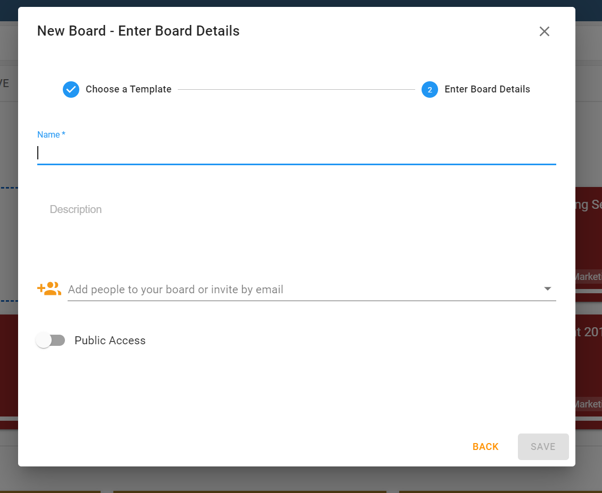
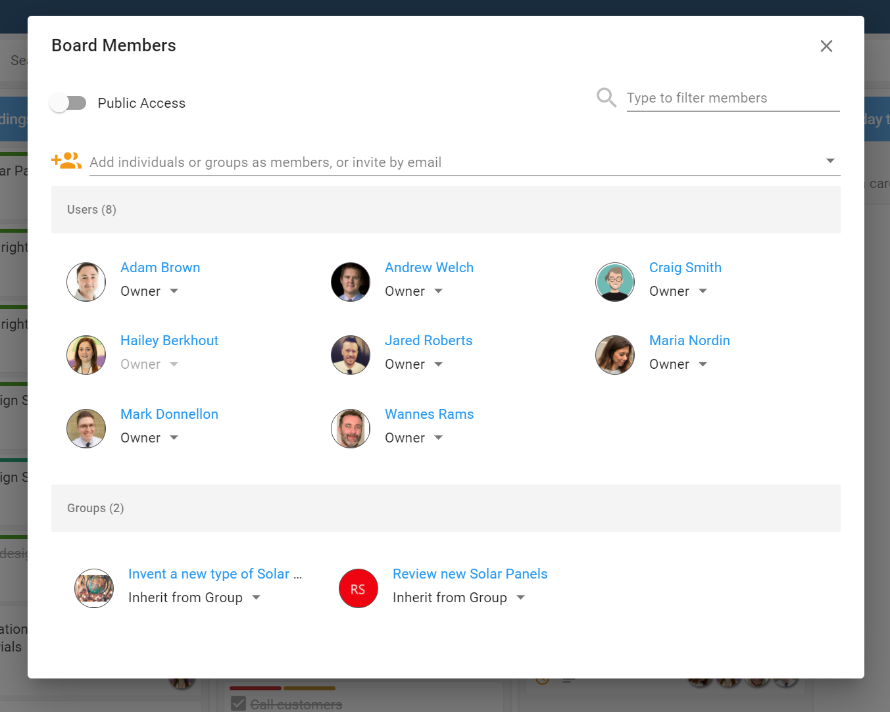
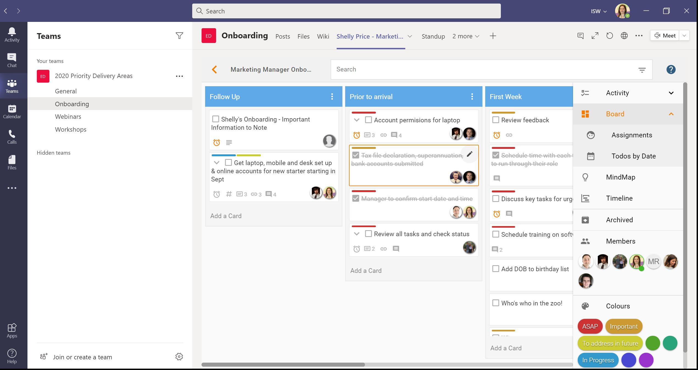

Adding members to your board allows you to collaborate with your team, your whole organisation and even external parties outside of your company. There is no limit to the number of people you can have as members of a board.

### Adding Members to a New Board

You can add members when you first create a board.

In the *New Board* creation phase, type in the name of any colleague or group in your organisation in the Add People field, or type in an email address of someone who is external to your organisation.

You can also decide if you would like the board to have Public Access, meaning anyone in your organisation will be able to view the board and participate depending on what level of permission you have set (reader, author, editor.)

### Adding Members to an Existing Board

At any stage of your work, you can add members to a board.

From within your board, select `Members` from the menu on the right-hand side. From here, you’ll be able to see current members or add new ones. Type in the name of any colleague or group in your organisation in the add members field, or type in an email address of someone who is external to your organisation.

Don’t forget to click the `Add Members` button before closing the window.

New members will be notified that they have been invited to your board.  

### Managing Members in a Microsoft Team Channel and Board

[A board can be added to a channel within Teams](../teams/adding-boards.md) to help track progress on tasks and create a collaborative work environment.

Members of a Team or a Channel will be inherited automatically in to your Huddo Board. 

You can also add members directly to the board by searching them in the `Members` area on the right hand side of the board. Adding members this way, be they in your organisation or external to your organisation, will add them just to the board. Not to the Channel or Team. 

