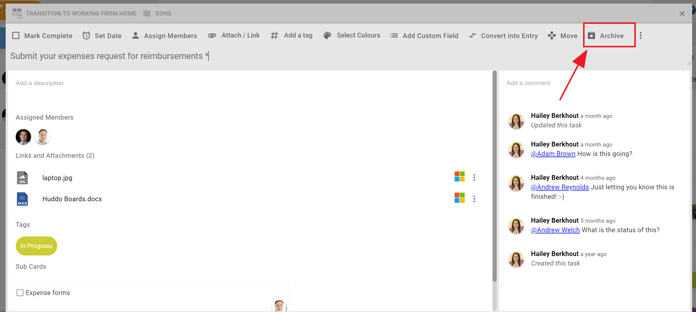
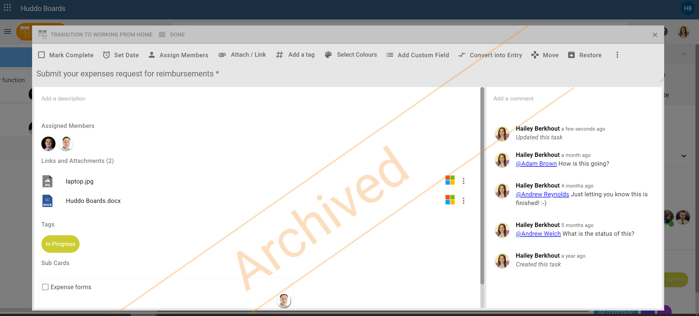
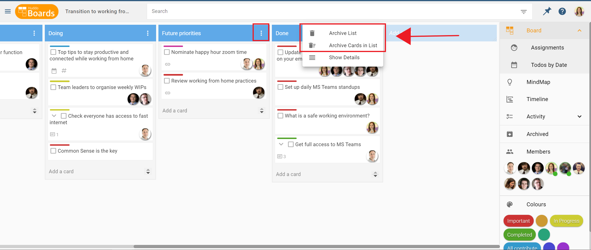
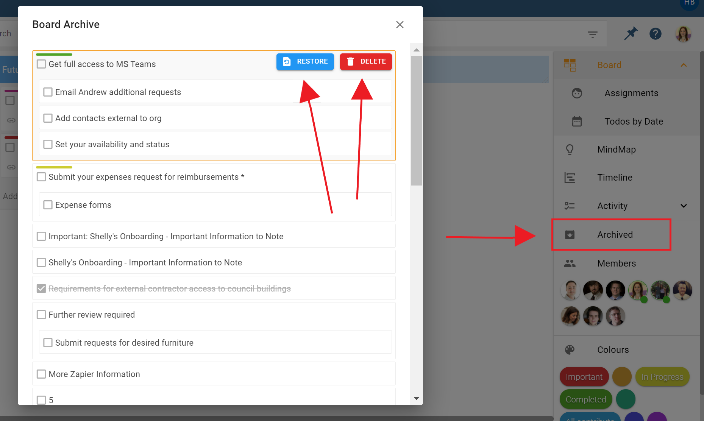
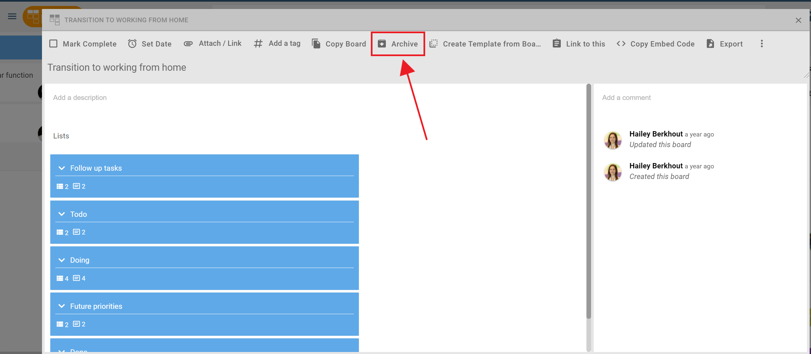
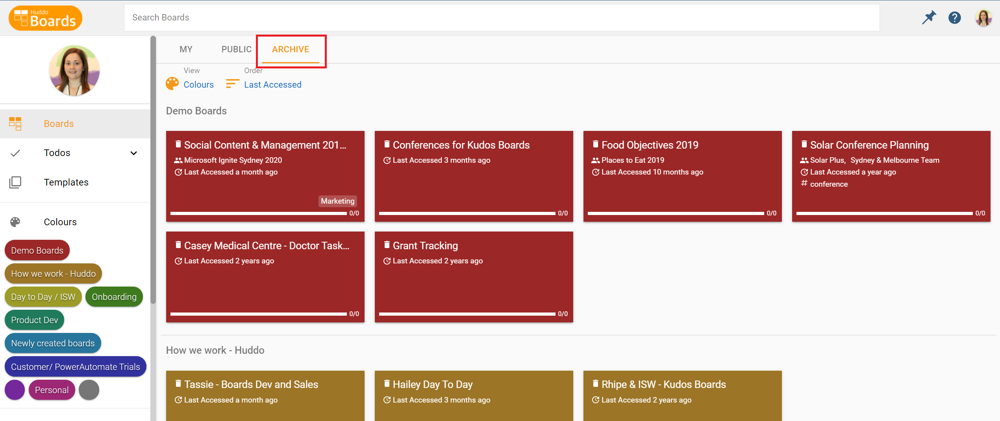

# Archiving and Restoring

### Archiving vs Permanently Deleting

Archiving gives you the ability to remove a card, list or board from your screen. Cards, lists and boards that have been archived, can be restored.

Permanently deleting a card, list or board will remove them completely from the system. They cannot be retrieved if you change your mind. Only use this option if you are sure you want to delete an item forever.

### How do I Archive a Card?

Click in to the card you want to archive. Use the `Archive` button at the top of the right-hand corner to archive the card. The screen will show it has been archived and when you click away from it, it will disappear from the board.

Example of an archived card:

Archived the card by mistake? If you're still in archived card screen, use the `Restore` button in the top right corner to bring the card back to the board.

### How do I Archive a List?

To Archive a list, click the vertical `...` icon on the right-hand side of the blue list header and select `Archive.`

  

  You'll notice that you also have options to archive the list and cards, or just the cards in the list.

### How do I Restore / Permanently Delete a Card or a List?

If you’ve moved away from the archiving window above, but need to restore / delete a card or list, click the `Archived` button in the right-hand side menu. It will bring up a window where you can see your archived cards and lists. Hover over the card or list then click the `Restore` button to return it to the board or the `Delete` to permanently delete it.

Only use the Delete option if you don't need to access the card or list ever again. For example, if you made a mistake. ***You cannot retrieve permanently deleted items.***

### How do I Archive a Board?

Open the board you intend to archive. Navigate to `Open Board Options` found in the title of your board, to the left of the search bar. Here you’ll see the `Archive` button at the bottom of the right-hand menu. Click this button to archive the board.

The board will change appearance to indicate it has been archived.

### How do I permanently delete a board?

**Option 1:** If you’re still within the screen above, you can use the `Delete` button to delet the board. If you’ve navigated out of that screen but remain in the board, click the pencil to `Open Board Options` and use the `Delete` button.

**Option 2:** Delete any board you’ve archived by navigating to the `Archive` tab on your My Boards dashboard page. Click in to the board you want to delete, click the pencil to `Open Board Options,` and click `Delete.`

***Remember, you can’t restore or retrieve the board or any of the cards in it, if you delete permanently.***

### How to restore a board

**Option 1:** If you’re still within the screen above, you can use the `Restore` button to restore the board. If you’ve navigated out of that screen but remain in the board, click the pencil to `Open Board Options` and use the `Restore` button.

**Option 2:** Restore any board you’ve archived by navigating to the `Archive` tab on your My Boards dashboard page. Click in to the board you want to restore, click the pencil to `Open Board Options,` and click `Restore.`

  
