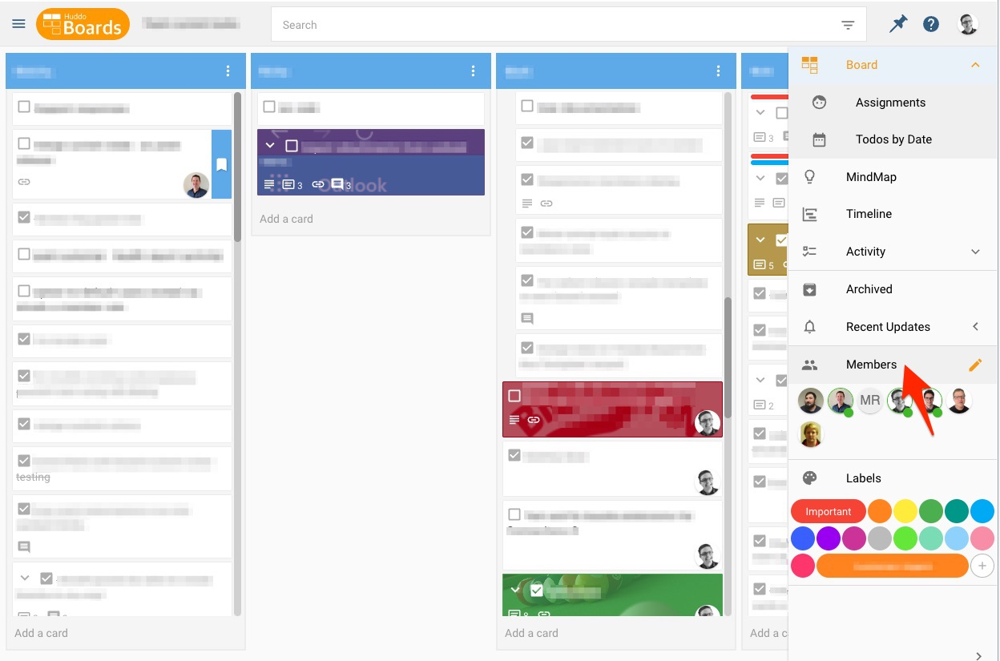
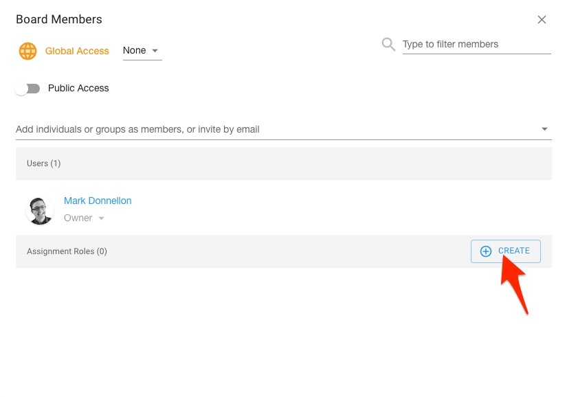
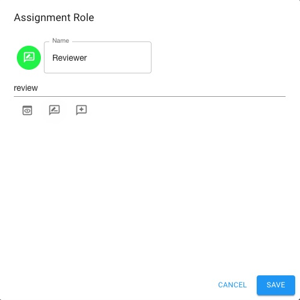
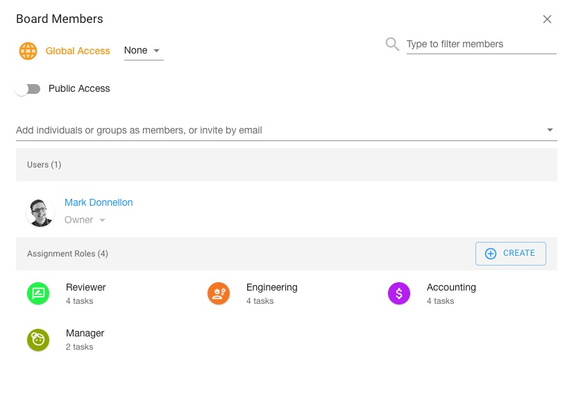
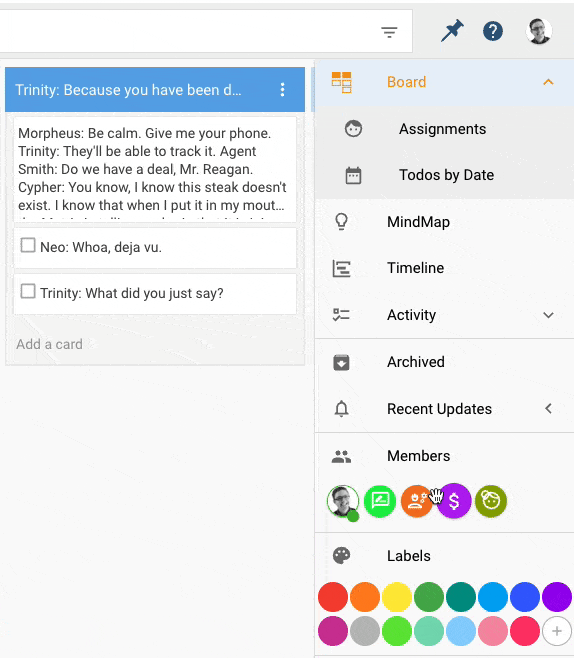

# Assignment Roles
Within a template, you can create Assignment Roles that can be assigned to tasks just like members. When creating a board from this template, you can assign the members of this new board to these roles and they will be responsible for completing the tasks the role had been assigned.

## Create a Template with Assignment Roles
Start off by creating a template following the steps in the [Create a Template](/docs/boards/howto/templates/creating/#create-a-new-template-from-scratch) article. 

<!-- !!! Note

    In the future, we expect to add a step during template creation where you can create assignment roles. -->

Once your template has been created and opened, open the Members dialog by clicking on *Members* in the right side bar.

{ style="border: 1px lightgrey solid;"}

In the dialog that opens, there will be a section for Assignment Roles. Click the *Create* button to create a new role.

{ style="border: 1px lightgrey solid;"}

Give your role a name and select an icon. A color will be automatically assigned to the role. Click *Save* to create the role.

{ style="border: 1px lightgrey solid;"}

Now in the members dialog, you can see the roles that have been created. You can click these roles if you need to edit them.

{ style="border: 1px lightgrey solid;"}

You can assign roles to tasks just as you would a board member.

{ style="border: 1px lightgrey solid;"}

See the section on [using a template](/boards/howto/templates/global/#assign-to-roles) to see how Assignment Roles are used when creating a board from a template.