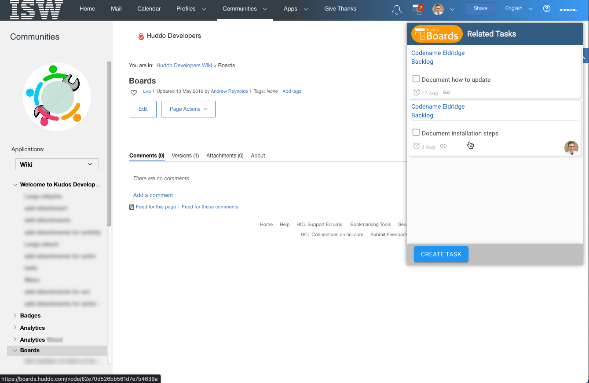
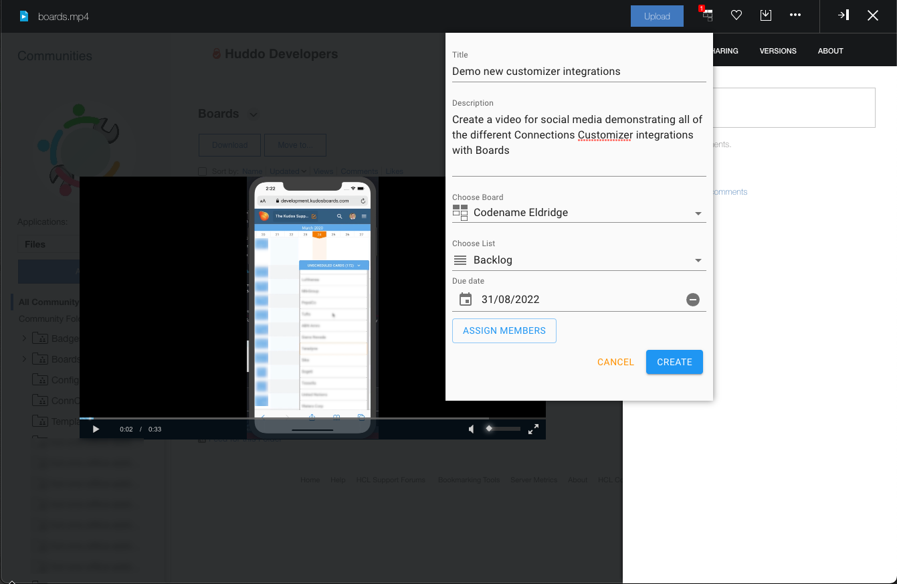
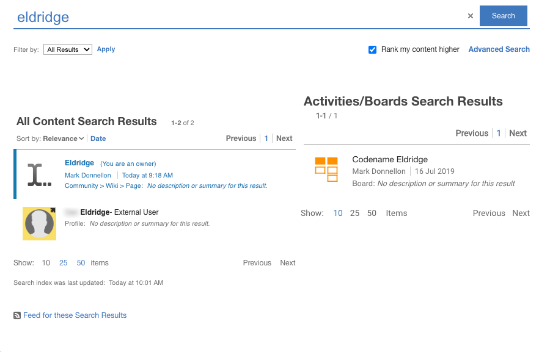
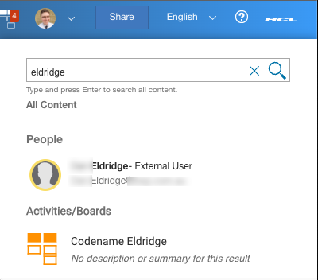

# HCL Connections UI Integrations

Huddo Boards can integrate features directly in to HCL Connections user interface that enable you to:

-   see tasks related to the current HCL Connections content
-   share pages from HCL Connections to Huddo Boards
-   show Huddo Boards data in search results

If you're an administrator looking for how to set this up, see the [install documentation here](../../connections/customizer/integrations.md).

## Related Tasks

You can create and view tasks related to the HCL Connections page you're currently viewing. Look for the Huddo Boards icon in the Connections header and file viewer.

|  |
| :-----------------------------------------------------------: |
|           _Huddo Boards in the Connections Header_            |

|  |
| :---------------------------------------------------------: |
|              _Huddo Boards in the file viewer_              |

## Huddo Boards in Search Results

Search results from Huddo Boards can be included in HCL Connections search results. Just search as normal and results from Huddo Boards will appear if there are any.

|     |
| :-----------------------------------------------: |
| _Huddo Boards results when searching all content_ |

|                 |
| :----------------------------------------------------: |
| _Huddo Boards results when searching from the sidebar_ |
