{ style="float: right" width=200 }

# Custom Fields in Huddo Boards

Every team tracks a little something extra. A budget. A priority. A ticket number, a client name, a percent-complete. Custom Fields let you capture exactly that information on your cards — and then sort, total, filter and group by it — so your board holds the whole picture, not just a title and a due date.

This guide walks you through creating custom fields, the field types on offer, and the handy ways to view your data once it's in there.

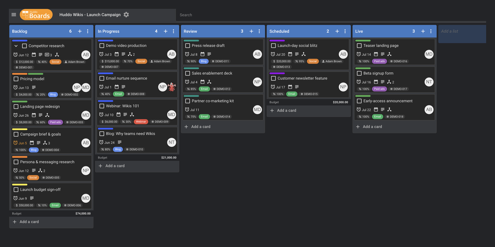

---

## Where to find Custom Fields

Custom fields are defined per board, in the board settings.

1. Open your board and click the settings (gear) icon next to the board name.
1. Select the _Custom Fields_ tab.

    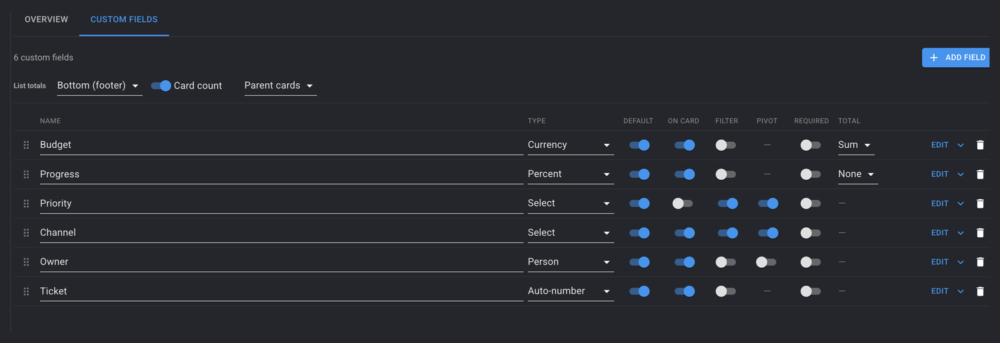

Here you'll see every field defined on the board, along with a row of switches that control how each field behaves. We'll cover those next.

---

## Adding a field

1. Click `Add field`.
1. Give the field a clear name — for example _Priority_, _Budget_, or _Ticket #_.
1. Choose a **Type** from the dropdown (see [Field types](#field-types) below).
1. Flip on any of the switches to control where and how the field appears.

    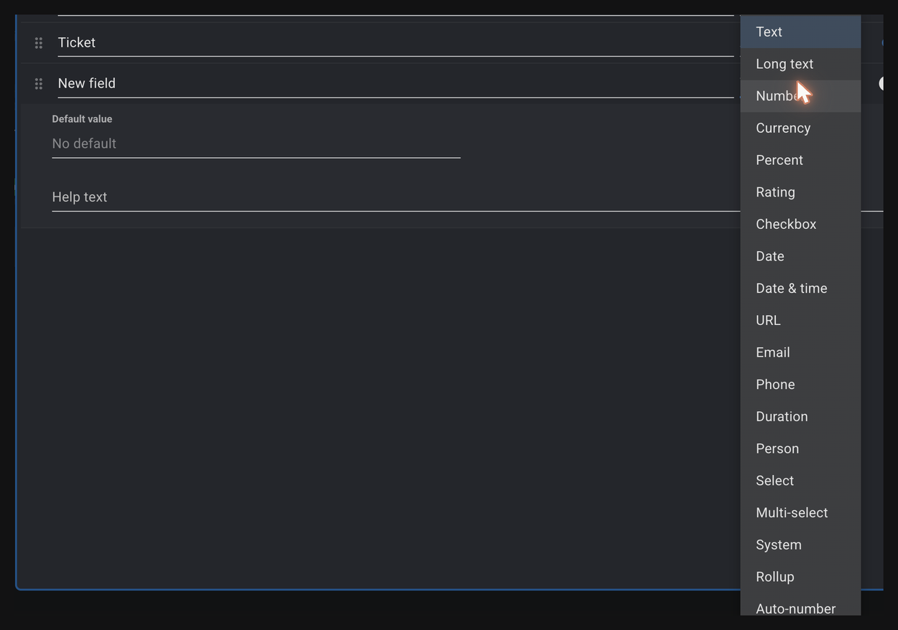

!!! tip

    Pick the type that matches your data. A _Currency_ field formats nicely with a currency symbol, a _Date_ field gives you a date picker, and a _Select_ field keeps everyone choosing from the same tidy list of options. The right type makes the data easier to read _and_ easier to total and filter later.

### Field options

Each field has a set of switches:

| Option | What it does |
| --- | --- |
| _Default_ | Adds the field to every card on the board, pre-filled with the field's default value. Great for information you want on every card. |
| _On card_ | Shows the field's value as a small badge on the front of the card, so you can see it without opening the card. |
| _Filter_ | Lets you filter the board by this field. |
| _Pivot_ | Lets you regroup (pivot) the board by this field. |
| _Required_ | Marks the field as required, prompting people to fill it in. |
| _Total_ | Shows a total (sum, average or count) for the field at the foot of each list. Available for number-style fields. |

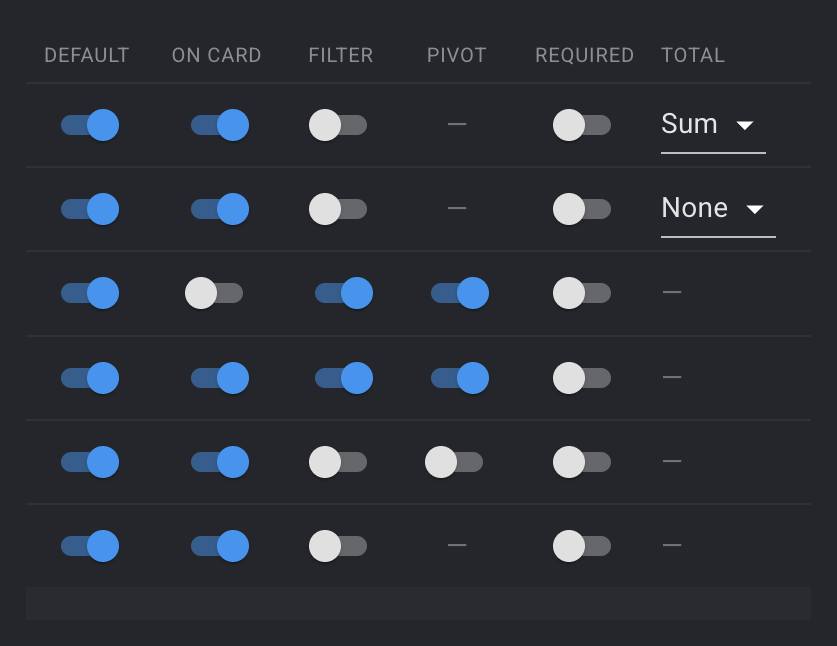

---

## Field types

Huddo Boards offers a rich set of field types. You don't need a separate field for everything under the sun — just pick the one that best fits your data.

### Text

| Type | Best for |
| --- | --- |
| **Text** | Short single-line text — a code, a name, a reference. |
| **Long text** | Multi-line notes and descriptions. |
| **URL** | Web links. |
| **Email** | Email addresses. |
| **Phone** | Phone numbers. |

### Numbers

| Type | Best for |
| --- | --- |
| **Number** | Any plain number — quantities, scores, counts. |
| **Currency** | Money. Displays with a currency symbol (you choose the currency). |
| **Percent** | A 0–100 value, shown as a value, bar or ring. |
| **Rating** | A score out of a maximum you choose (e.g. 5 stars). |
| **Duration** | A length of time, shown neatly as hours and minutes. |

### Dates

| Type | Best for |
| --- | --- |
| **Date** | A calendar date. |
| **Date & time** | A date together with a time of day. |

### Choices

| Type | Best for |
| --- | --- |
| **Select** | Choose one option from a list you define (e.g. _Low / Medium / High_). |
| **Multi-select** | Choose several options from your list. |
| **Checkbox** | A simple yes / no tick. |

For a _Select_ or _Multi-select_ field, click `Edit` to add your options. Use `Add option` for each choice you want to offer.

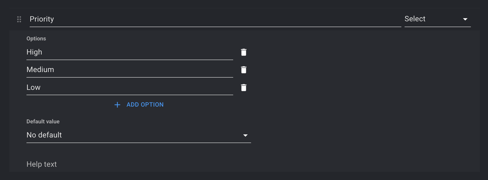

### People

| Type | Best for |
| --- | --- |
| **Person** | Pick a person — handy for an owner, reviewer or point of contact. Their name is shown on the card. |

### Automatic fields

These fields fill themselves in — you don't type their values.

| Type | Best for |
| --- | --- |
| **Auto-number** | Gives every card a unique, sequential number (e.g. `WEB-0001`). Perfect for ticket or reference numbers. See [Auto-number](#auto-number) below. |
| **Rollup** | Summarises a field across a card's sub-cards — for example, total the _Budget_ of all sub-cards. See [Rollups](#rollups). |
| **System** | Shows built-in card information: _Created date_, _Updated date_, _Created by_ or _Updated by_. |

---

## Auto-number

An _Auto-number_ field stamps each card with the next number in a sequence. It's ideal for ticket numbers, work-item IDs or any reference your team quotes.

After choosing the _Auto-number_ type, click `Edit` on the field to set its format:

- **Prefix** — text placed in front of the number, e.g. `DEMO-`.
- **Digits (zero-pad)** — pads the number with leading zeros so they line up neatly. With 3 digits, `1` becomes `001`.

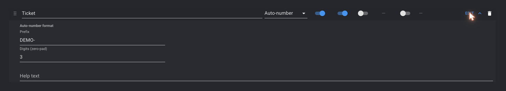

So a prefix of `DEMO-` and 3 digits produces `DEMO-001`, `DEMO-002`, and so on. Numbers are assigned automatically and don't change — turn on _On card_ to show them on the card front.

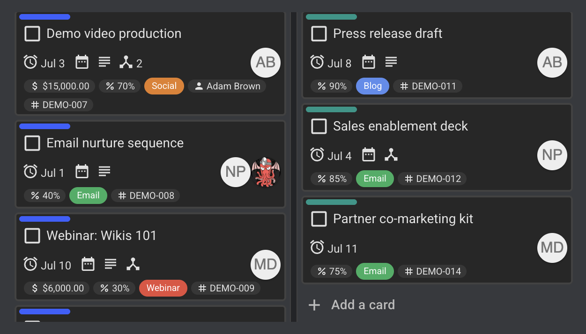

---

## Rollups

A _Rollup_ field rolls a number _up_ from a card's sub-cards to the parent. For example, if each sub-task has a _Budget_, a rollup on the parent can show the total of those budgets — kept up to date automatically as the sub-cards change.

When you add a _Rollup_ field, choose:

- the **field** to summarise (any number-style field on the board), and
- the **aggregation**: _Sum_, _Average_, _Minimum_, _Maximum_ or _Count_.

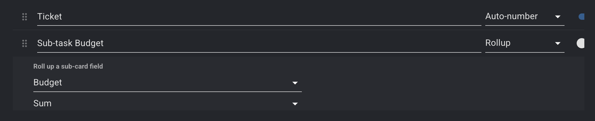

!!! info

    A rollup works across a card's sub-card tree, so it's most useful on boards where you break larger items down into smaller ones.

---

## Seeing your data

Once your fields hold data, Huddo Boards gives you several ways to make sense of it.

### On the card front

Turn on _On card_ for a field and its value appears as a compact badge on the card — colours, ratings, currencies, people and more — so the key facts are visible at a glance.

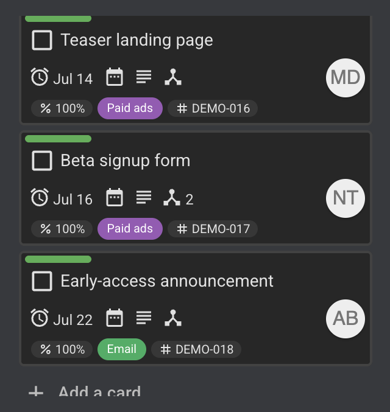

### List totals

For number-style fields, turn on _Total_ to show a running total at the foot of each list. You choose where totals sit using the _List totals_ control (header or footer), and the totals update live as cards move.

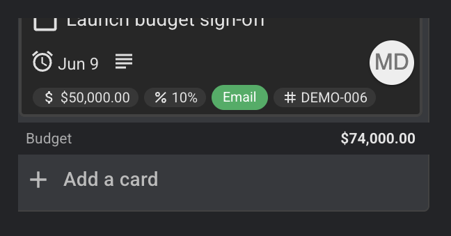

### Card count

The _Card count_ toggle shows how many cards are in each list. Use the accompanying dropdown to count either:

- _Parent cards_ — just the top-level cards, or
- _All cards (incl. sub-cards)_ — every card beneath them too.

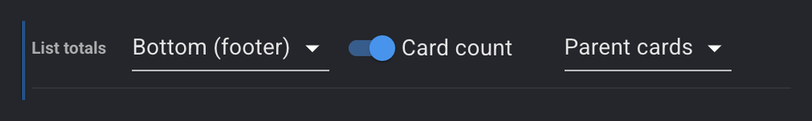

### Filtering

Turn on _Filter_ for a field and its values appear in the sidebar on the right-hand side of the board. Click a value to filter by it — here we've clicked _High_ on the _Priority_ field (the selected value is highlighted):

The board immediately narrows to show only the matching cards:

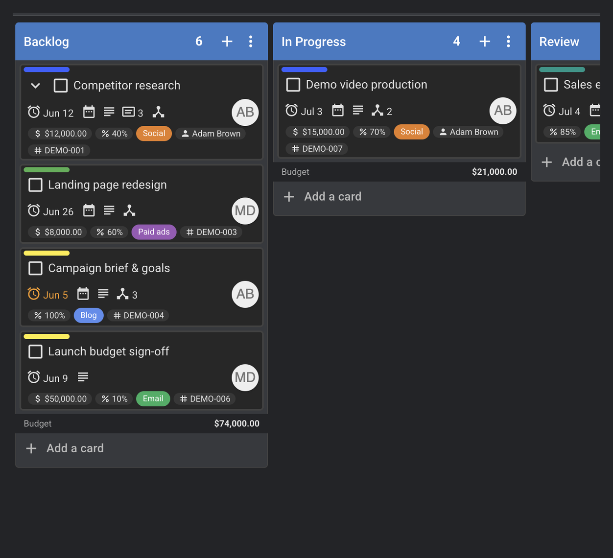

### Pivoting

Turn on _Pivot_ for a field and it becomes a view in the _Board_ menu on the right-hand side. Select it to regroup the whole board by that field's values — see all your cards arranged by _Channel_, _Priority_ or _Owner_ instead of by list. It's a quick way to look at the same work from a different angle.

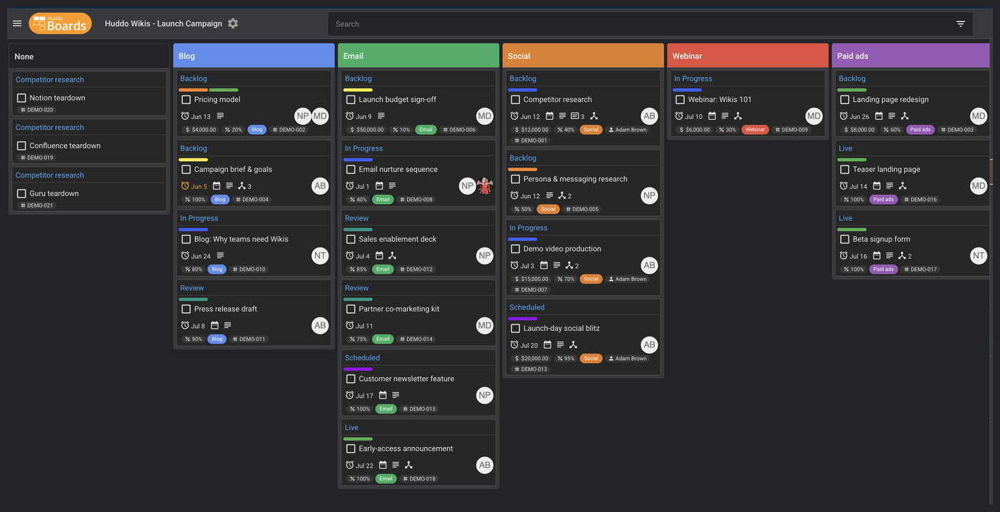

---

## Editing, reordering and removing fields

- **Edit** — click `Edit` on any field to rename it, change its type, or adjust its options.
- **Reorder** — drag the handle on the left of a field to change the order fields appear in.
- **Remove** — click the bin icon to delete a field.

!!! warning

    Deleting a field removes its stored values from every card on the board, and can't be undone. If you only want to tidy up the card front, turn off _On card_ instead of deleting the field.

---

Custom Fields turn a board from a simple task list into a place that holds _all_ the detail your team needs. Start with one or two fields that matter most — a priority, an owner, a budget — and build from there. Have a question that isn't covered here? [Contact us](mailto:support@huddo.com) — we're happy to help.
