# Task Dependencies in Huddo Boards

Huddo Boards supports the use of task dependencies within boards. A task dependency is where a task relies on another task or tasks to be completed before it can be completed itself.
A single task can be dependant on multiple tasks and multiple tasks can be dependant on a single task.

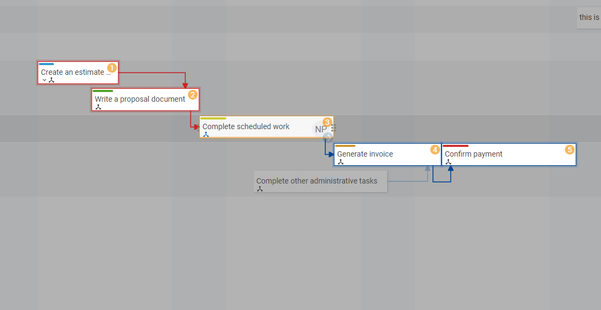

## Creating a Task Dependency
Task dependencies can be created in several ways:

### Within an open task
1. Click on a task to open its details.
2. Find and click the `Add Dependency` button in the task bar:

    
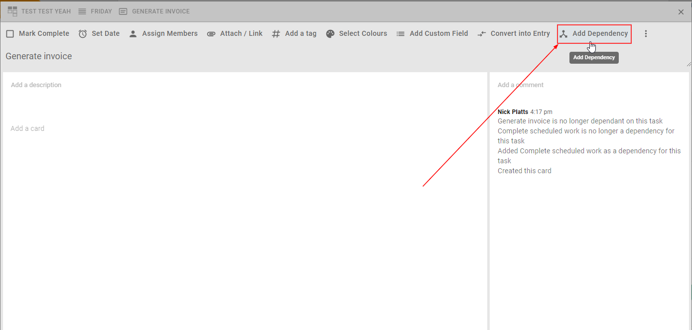

    
    - Note that depending on your screen size, you may need to use the *More...* menu to access the `Add Dependency` Button:

    
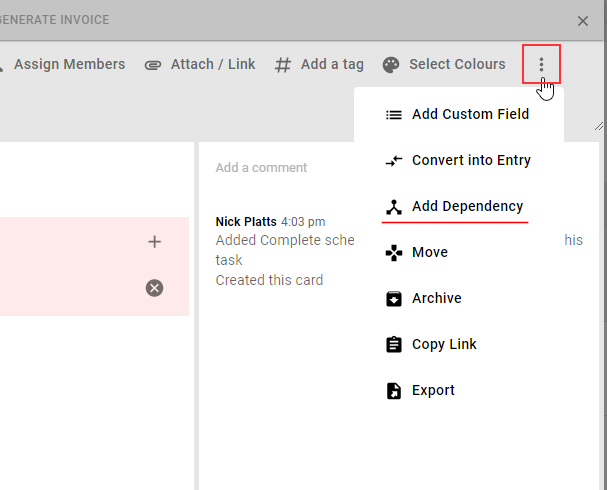

    - Once dependencies have been added to a task, `Add Dependency` buttons will also be available within the task details view here:

    
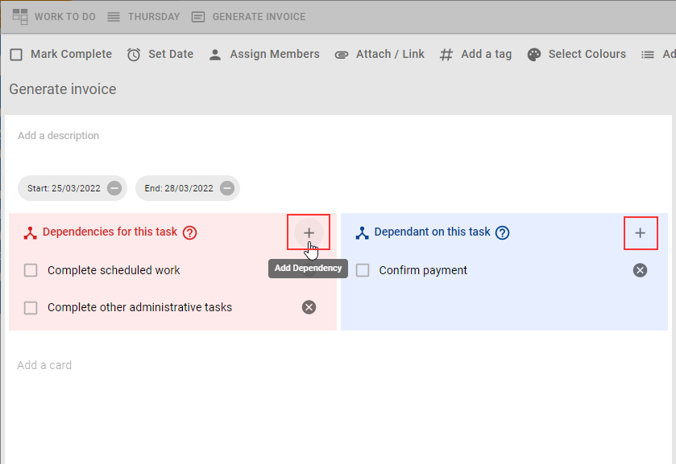

3. The Add Dependency Dialog will be shown:

    
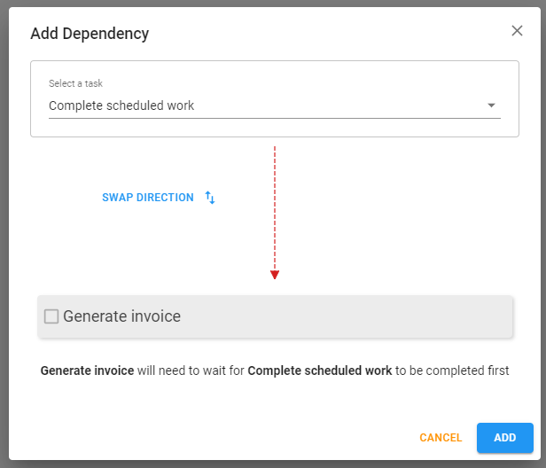

4. Select a task that you want to add as a dependency for the current task. The dependency you choose will need to be completed before the current task can be completed. 
    - Note that this relationship can be reversed by clicking the `Swap Direction` button 
5. Click the `Add` button to create the task dependency.

### Drag from task to task in the Timeline view

1. Open the `Timeline` view of your board.
2. Ensure that the parent and child tasks for the dependency you want to create are scheduled and appear on the timeline.
3. Dependencies can be created from child (starting task) to parent (ending task). The parent waits for child to be completed first. To create a new dependency, first hover the cursor over a task to see the add dependency drag icon appear on the bottom right edge (a blue arrow).
4. Hover over the arrow icon, then click and drag it to the intended parent dependency task. An arrow will be drawn as you drag, and the task you have dragged onto will have a blue highlighted border.
5. Drop the icon onto the intended task and the dependency relationship will be created.
    - Note that if the icon is dragged and dropped onto a task that is already a dependency of the originating task, then nothing will happen.

    
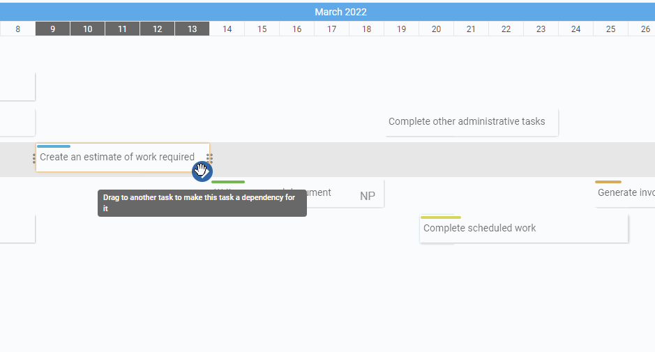

6. Once the dependency has been created then dependency icons can be observed on both the parent and child of the dependency.

    
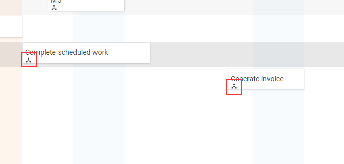

## Showing dependencies on a task

Opening a (either a child or parent) task with dependencies will list those dependencies on the task details view.

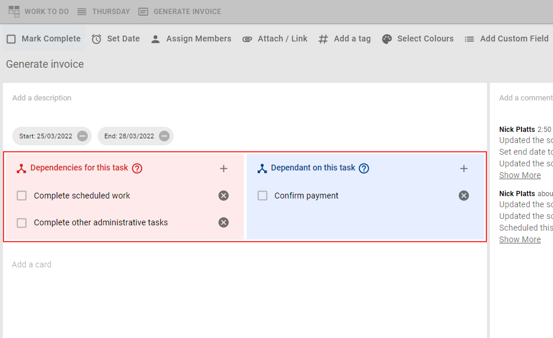

- From this view, it is possible to remove a dependency by clicking the remove icon .

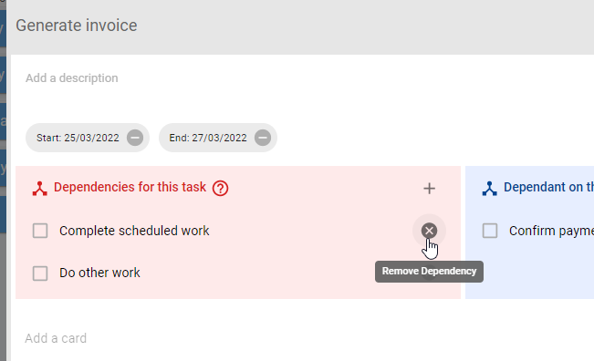

- Dependant tasks can be completed in this view by clicking the complete task checkbox.

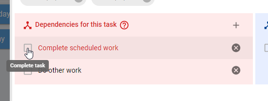

- Clicking anywhere else on the dependant task will open up its task details.

## Visualising task dependencies on a board
Dependencies for a particular task can be displayed/visualised in various ways depending on what view you are using to display your board.

### Board view
- Hover on the dependencies icon on a task card for a moment to highlight its dependencies.
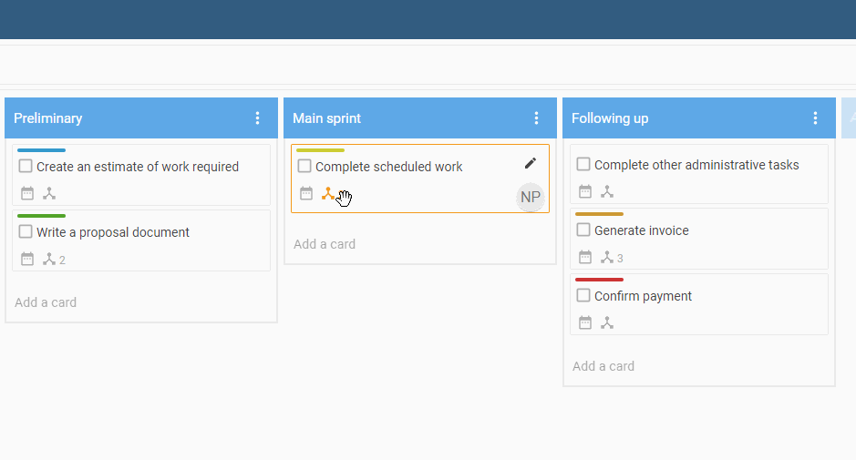
Note that numbers appear in the top right of the highlighted cards to indicate the order that they need to be completed. 

### Activity view
- Hover on the dependencies icon on a task card for a moment to highlight its dependencies.
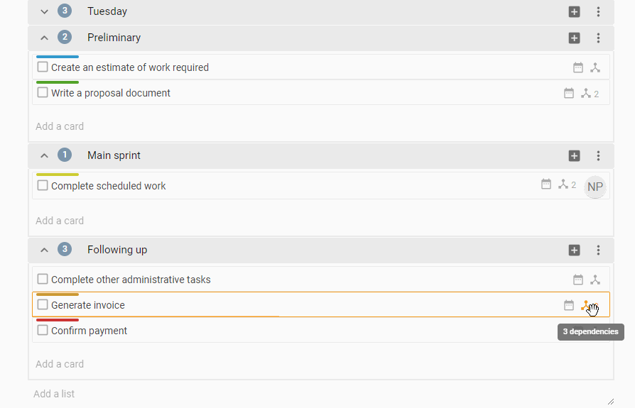
Note that numbers appear in the top right of the highlighted cards to indicate the order that they need to be completed. 

### Mindmap
- Hover on the dependencies icon on a task card for a moment to highlight its dependencies.
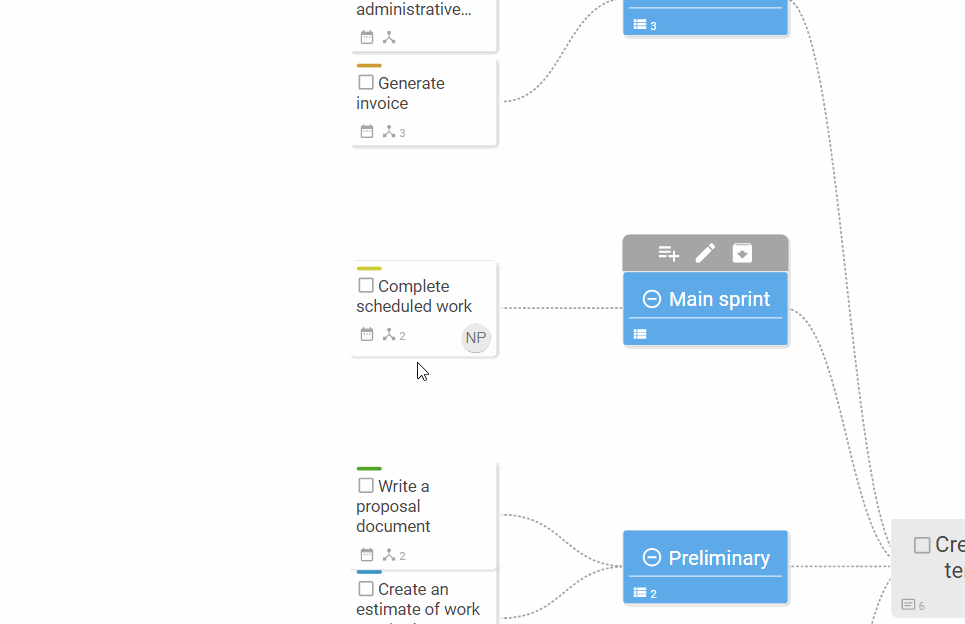
Note that numbers appear in the top right of the highlighted cards to indicate the order that they need to be completed. 

### Timeline
Timeline view is the best way to visually observe dependencies as arrows drawn between scheduled tasks. 

There are several options available for showing dependency arrows in the timeline view, controlled by settings in the right hand sidebar:

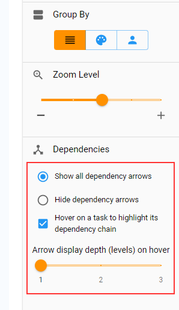

#### Show all dependency arrows
This is the default setting and will show all dependencies as blue arrows at all times. The arrows will recalculate themselves if tasks are moved or resized, or if dependencies are added or removed.
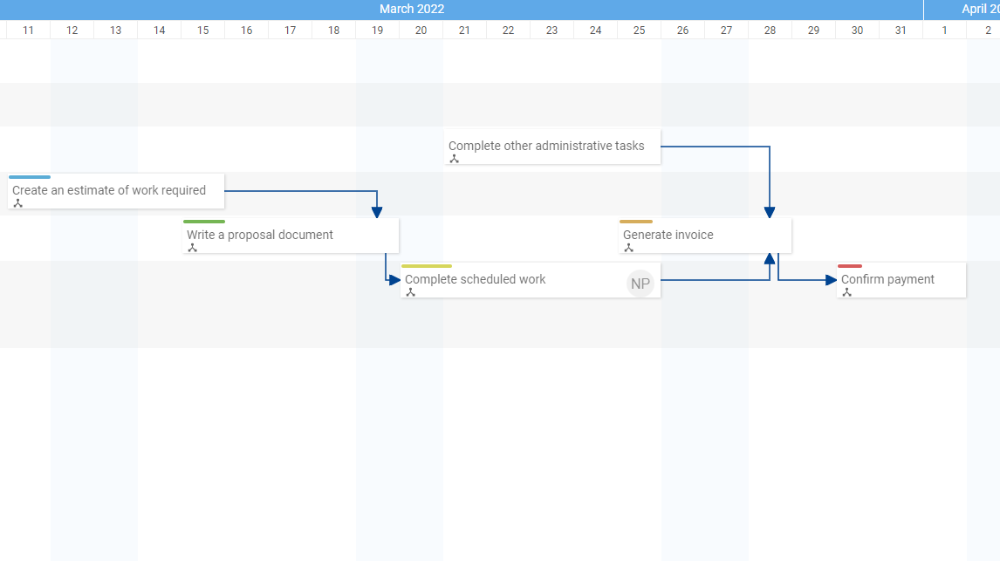

#### Hide dependency arrows
Use this option to hide all dependency arrows in Timeline. Hovering on a task to show its dependency chain can still be achieved when arrows are hidden, depending on the setting below.

#### Hover on a task to highlight its dependency chain
Hover anywhere for a few moments on a task/card that has dependencies to highlight dependent tasks and also visualise the chain of dependency links as arrows to and from the dependant cards. Note that numbers also appear in the top right of the highlighted cards to indicate the order that they need to be completed. 

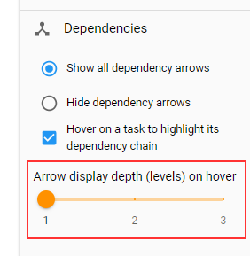{: style="float: left"} When `Hover on a task to highlight its dependency chain` is enabled, the arrow display depth slider will be shown, and can be used to increase the number of "levels" (backwards and forwards from the hovered card) to show a chain of dependency link arrows in the Timeline view, originating from the card that is being hovered on. 

   
See the animation below as an example of 2 levels of dependency depth.

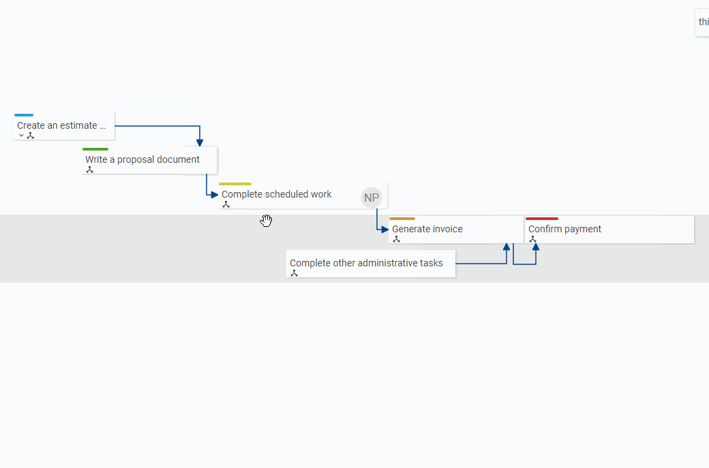

## Completing a task that has dependencies
Attempting to complete a task that has incomplete dependencies will trigger the following dialog:

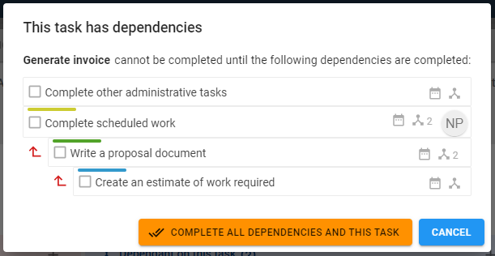

*Note that individual tasks cannot be completed from this view.

### Available actions
#### Complete all Task Dependencies and this task
Click this to complete the task after completing **all** of its preceding dependencies as displayed in the dialog.

#### Cancel
Close the dialog without taking an action.
