{ style="float: right" width=200 }

#Getting Started

Huddo Boards is a intutive to learn and easy to master. It is a powerful addition to any business, whether you're looking to increase your personal productivity, super charge your teams', or collaborate with external parties. Learn quick tips and tricks from our help guides to get the most out of boards. Let's get started!

If you have signed in to Huddo Boards for the very first time as an individual user without a licence, see [Starting a trial of Huddo Boards](../start-a-trial/index.md)

Here are some quick instructions to help you get started with Huddo Boards.

---

### Create A Board

1. From the My Boards homepage, click on the `New Board` button, or use the `+` buttons as indicated below.

   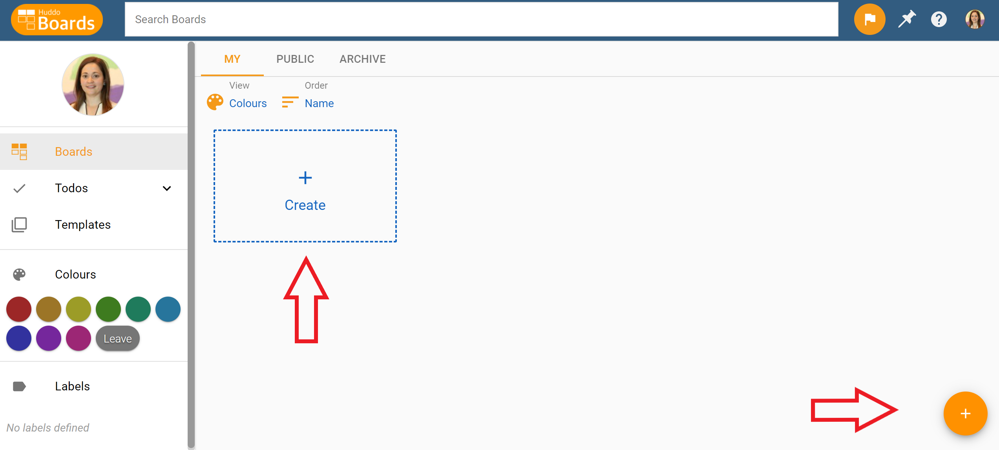

1. Enter a name and description for your new board. Don't worry you can edit these later.

1. Select any users or groups you would like to add to your board. Also select if you would like to share this board with the rest of your team. These settings can be changed after a board has been created as well.

   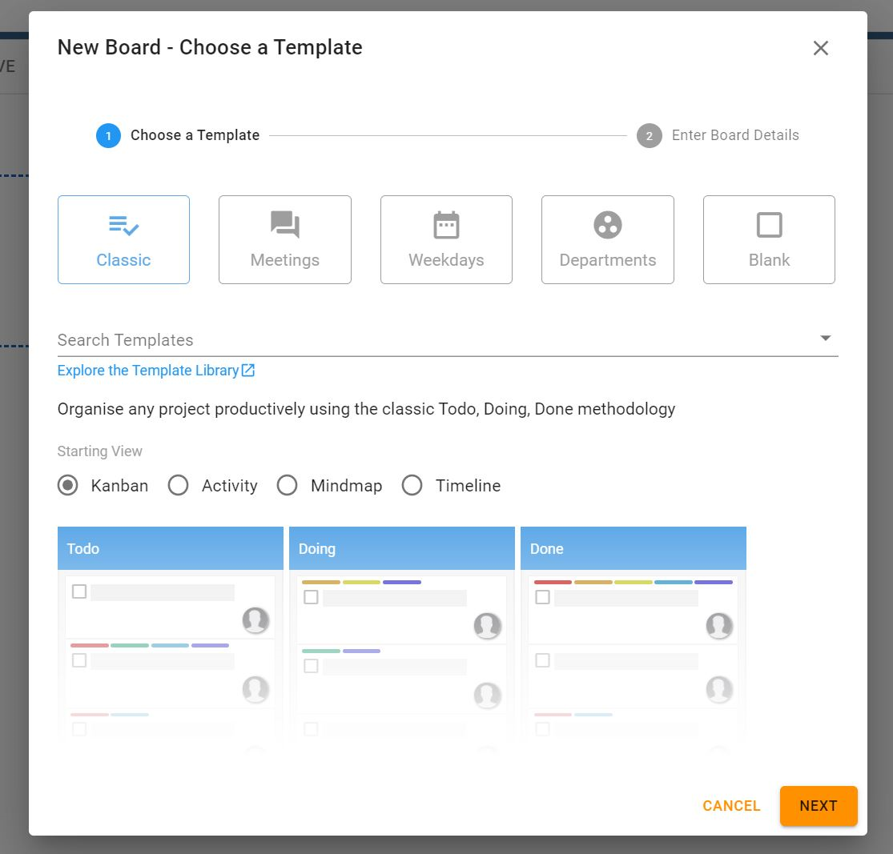

1. Select from our range of quick templates; Search the template library for a more sophisticated template; Or Select `Blank` to choose your own adventure!
1. Select the starting view for your board from the three available options: `Kanban`, `Mindmap` and `Timeline`. Note that the view of the board can be switched at any point in time.

   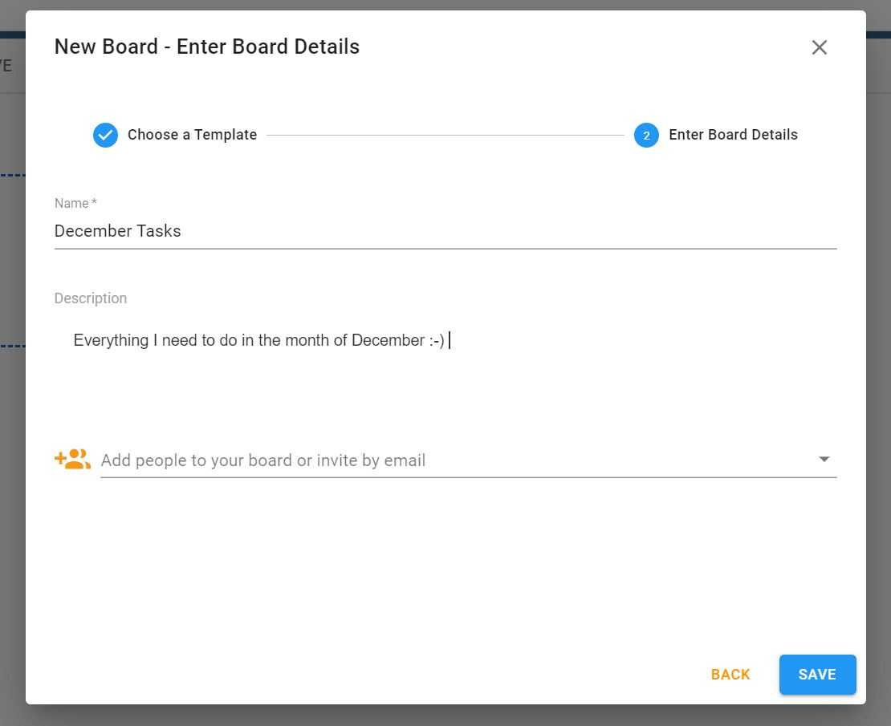

1. Click `Create`
1. The board is now ready to use!

---

### Kanban View - Add Lists and Cards

Add lists to a board to categorise todos and entries.
Click on _Add a list_ to add a new list to your board.

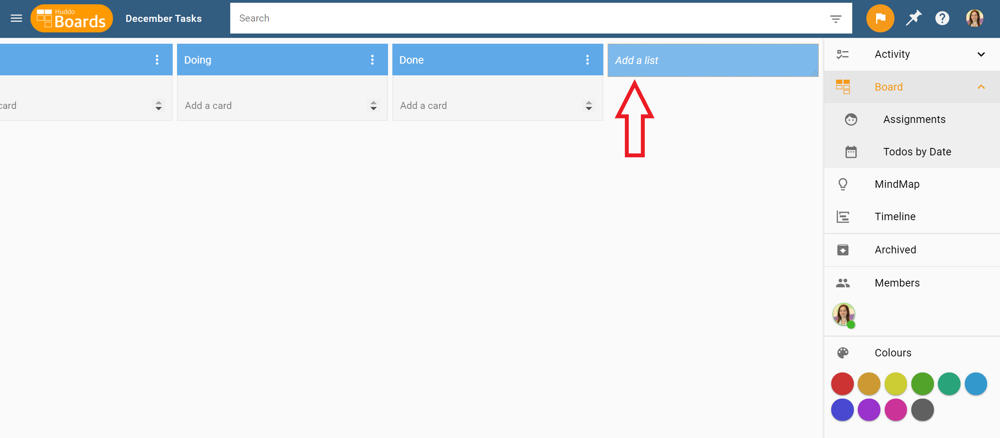

Click on _Add a card_ in any list to add a card to that list.

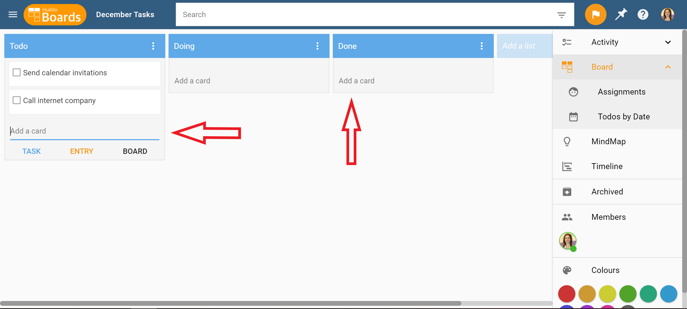

Add cards to your lists to represent Tasks, Work Items, Decisions, Ideas, Notes, Options, Sub-lists - Really anything you need them to represent.
The beauty of this design is that you can use lists and cards to mean anything you need to for the task at hand.

---

### Assign Tasks To Others

Assign Tasks to people in the board by either dragging their photo from the members panel in the right side bar. Or use the _Assign Users_ control from the card details view.
When you assign a card to a person, they are notified of the assignment via email and also via any news feeds that board has access to (Workspace chat, Connections activity stream, etc.).

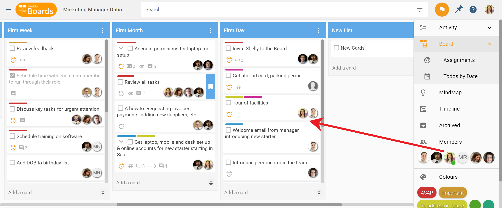

---

### Plan Your Tasks

Boards lets you assign due dates to a card, as well as start and end dates, to help you better plan your tasks. Go to the Timeline View in a board to view the cards according to their start and end dates. To modify the start/end/duration of a card, simply drag the card to a new date, or drag the edges to individually change the start or end date.

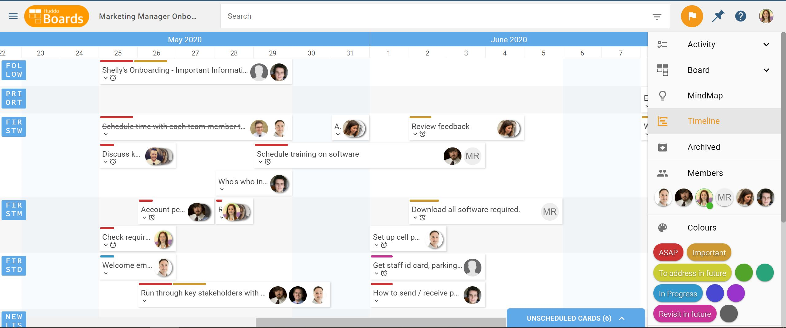

---

### View Card Details

Click on a card to _open_ it. The card details popup gives you access to a whole range of information and controls for the card. It lets you view and edit the card's name, completion status, description, tags, attachments, comments, due date, colour labels, fields and much more!

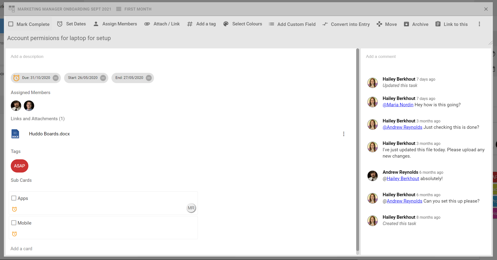

---

### Edit Board Options

Click on the Edit icon on the top right of the board to open the Board details view. This view lets you edit the board's name, description, tags, due date and more. It also let's you create a templates and archive the board.

---

### Add and Remove Board Members

Click on _Members_ in the right sidebar to open the Board Members view. You can view all the orgs, individuals and groups who have access to this board. If you have _Owner_ role for the board, you can also add and remove members from this view. It is also possible to invite a user to the board using their email address.

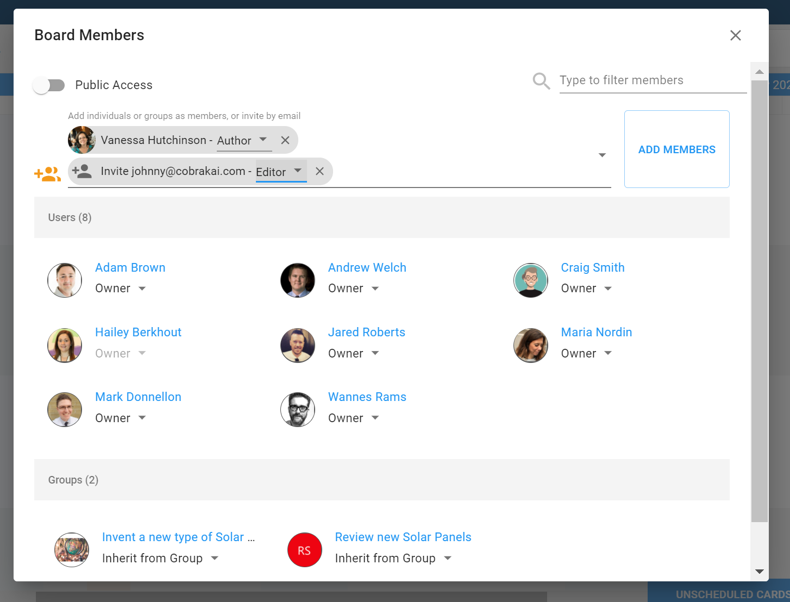

---

### Colour Code Your Cards

Huddo Boards allows you to colour code your tasks by simply dragging and dropping the colours from the right sidebar onto cards. You can also assign custom text labels to each of the colours by simply clicking the edit icon in the _Colour Labels_ section in the right sidebar. These labels are set at the board level and everyone in the board will see the same labels.

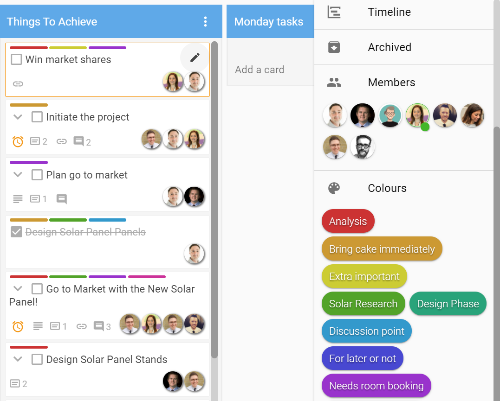
---

### Colour Code Your Boards in MyBoards Dashboard

Huddo Boards let's you colour code all your boards to help you personally manage and categorise your work. To colour code a board tile in the _MyBoards Dashboard_, simply drag a colour from the left sidebar and drop it on a board. Much like card colour labels, you can also add custom text labels to these colours, however, this is for your personal organisation and as such will only be visible to you. To edit the board colour labels, click the edit icon in the _Colours_ section in the left sidebar. Filter to see boards from one or more specific colours by clicking on the colour. 

To see your boards organised by colour, set your `View` to Colours.

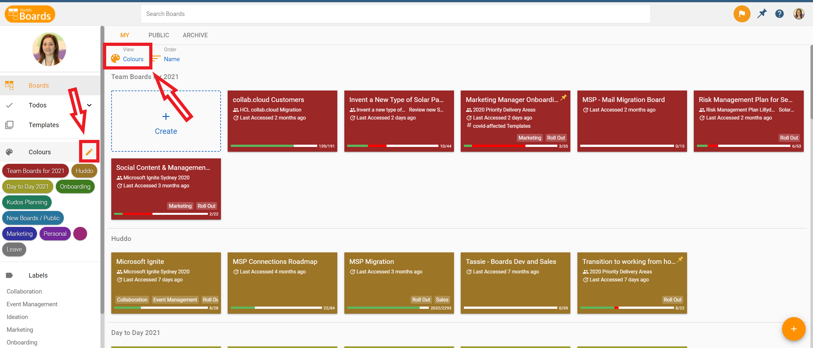

